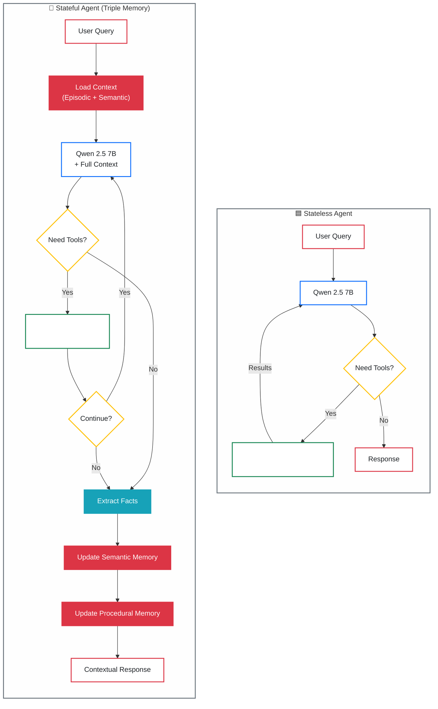

# Redis Wellness 🏥

[](https://www.python.org/downloads/)
[](https://www.typescriptlang.org/)
[](https://redis.io/)
[](https://fastapi.tiangolo.com/)
[](LICENSE)
[](#-privacy)


# Redis Wellness 🧠

Can AI agents be intelligent without memory?

This project compares **Stateless** and **Stateful (Redis-powered)** AI agents using **Apple Health data**, showing how memory transforms reasoning, recall, and conversation quality.

Built with **FastAPI**, **TypeScript**, **Redis**, **RedisVL**, and **Ollama (Qwen 2.5 7B)**, all running **100% locally** for privacy.

🔒 *Your health data never leaves your machine.*

## Why This Demo?

We wanted to see how memory affects AI reasoning using real health data that changes day by day.

You can chat with two versions of the same agent:
- 🟦 **Stateless** — No memory; forgets everything each turn
- 🔴 **Stateful (Redis)** — Remembers, recalls, and reasons over your past context


---

## 🎯 The Difference

### Core Architecture
|| Component | Stateless Agent | Stateful Agent | Technology |
|-----------|-----------------|----------------|------------|
| **LLM** | Qwen 2.5 7B | Qwen 2.5 7B | Ollama (local inference) |
| **Orchestration** | Simple tool loop | Simple tool loop with state | No LangGraph - direct tool calling |
| **Episodic Memory** | None | Conversation history (7-month TTL) | Redis LIST (`episodic:{session_id}:history`) |
| **Semantic Memory** | None | Long-term context with vector search | RedisVL (HNSW index, 1024-dim embeddings) |
| **Procedural Memory** | None | Goals and preferences tracking | Redis Hash (`procedural:{user_id}:goals`) |
| **Health Data** | Redis read-only access | Redis read-only access | Redis Hashes + JSON (O(1) lookups) |
| **Tool Calling** | 9 health tools | 11 tools (9 health + 2 memory) | LangChain tool integration |

### Conversation Capabilities

| Capability | Stateless Agent | Stateful Agent | How It Works |
|------------|-----------------|----------------|---------------|
| **Follow-up Questions** | Treats each as new query | Maintains conversation flow | Prior exchanges in LLM prompt |
| **Pronoun Resolution** | Cannot resolve "it", "that", "those" | Resolves references from context | Message history retrieval |
| **Multi-turn Reasoning** | Isolated single-turn responses | Coherent multi-turn conversations | Triple memory system (episodic + semantic + procedural) |
| **Example** | **You:** "What was my average heart rate last week?"<br>**Bot:** "87 bpm"<br><br>**You:** "Is that good?"<br>**Bot:** "What are you referring to?" | **You:** "What was my average heart rate last week?"<br>**Bot:** "87 bpm"<br><br>**You:** "Is that good?"<br>**Bot:** "87 bpm is within normal range for your age group..." | Stateful uses conversation history + semantic memory |

---

## 🏗️ Architecture

### Side-by-Side Comparison



### Triple Memory Architecture

The stateful agent uses **three types of memory** inspired by human cognition:

1. **📝 Episodic Memory (Short-term Conversation)**
   - Stores recent conversation turns within a session
   - Redis key: `episodic:{session_id}:history`
   - Managed by `episodic_memory_manager.py`
   - Enables context awareness and pronoun resolution
   - 7-month TTL for long-running conversations

2. **🔍 Semantic Memory (Long-term Context)**
   - Stores important facts extracted from conversations
   - Redis key: `semantic:{user_id}:{timestamp}` with RedisVL
   - Managed by `semantic_memory_manager.py`
   - 1024-dim embeddings (mxbai-embed-large) for similarity search
   - Enables recall of past information across sessions

3. **🎯 Procedural Memory (Goals & Preferences)**
   - Stores user goals, preferences, and learned patterns
   - Redis key: `procedural:{user_id}:goals`
   - Managed by `procedural_memory_manager.py`
   - Enables personalized responses based on objectives

4. **📊 Health Data Store (Redis Hashes + JSON)**
   - Hash sets for O(1) workout lookups
   - JSON blobs for metrics and aggregates
   - Indexed by date, type, and user ID

---

## 🛠️ Tech Stack

### Backend
- **FastAPI** - High-performance async API framework
- **Redis 7.0+** - Primary data store and memory layer
- **RedisVL** - Vector search for semantic memory
- **LangChain** - Tool calling and LLM integration
- **Ollama** - Local LLM runtime (Qwen 2.5 7B)
- **Python 3.11+** - Modern async Python with type hints
- **uv** - Fast Python package manager

### Frontend
- **TypeScript** - Type-safe frontend code
- **Server-Sent Events (SSE)** - Real-time streaming responses
- **Vanilla JS** - Lightweight, no framework dependencies

### Infrastructure
- **Docker & Docker Compose** - Containerized deployment
- **Redis** - Single source of truth for all data
- **Ollama** - Runs on host for LLM inference

### Development
- **pytest** - Comprehensive test suite
- **Ruff** - Lightning-fast linting and formatting
- **pre-commit** - Git hooks for code quality

---

## ⚙️ How It Works

### 1. Stateless Agent (Simple Tool Loop)

```python
# No memory - every query starts fresh
while True:
    user_input = get_user_message()

    # LLM decides which tool to call
    tool_call = llm.generate(user_input)

    # Execute tool against Redis health data
    result = execute_tool(tool_call)

    # Return result (no memory saved)
    return result
```

**Limitations:**
- ❌ Cannot answer follow-up questions
- ❌ Cannot understand pronouns ("that", "it", "those")
- ❌ Cannot learn from past interactions
- ❌ Every query is independent

### 2. Stateful Agent (Simple Loop with Triple Memory)

```python
# Simple tool-calling loop with triple memory system
def stateful_agent(user_input: str, session_id: str):
    # 1. Load episodic memory (recent conversation)
    history = episodic_memory.get_history(session_id)

    # 2. Search semantic memory (relevant past facts)
    semantic_context = semantic_memory.search(user_input, top_k=3)

    # 3. Load procedural memory (user goals)
    goals = procedural_memory.get_goals(session_id)

    # 4. Build context-aware prompt
    messages = build_prompt(user_input, history, semantic_context, goals)

    # 5. Tool-calling loop (up to 8 iterations)
    for iteration in range(8):
        response = llm.generate(messages, tools=health_tools + memory_tools)

        if response.tool_calls:
            results = execute_tools(response.tool_calls)
            messages.append(results)
        else:
            break  # LLM decided it's done

    # 6. Extract and store facts in semantic memory
    facts = extract_facts(messages)
    semantic_memory.store(facts, session_id)

    # 7. Update procedural memory (goals, preferences)
    procedural_memory.update(messages, session_id)

    # 8. Save to episodic memory
    episodic_memory.add(messages, session_id)

    return response.content
```

**Capabilities:**
- ✅ Remembers conversation history (episodic memory)
- ✅ Retrieves semantic context across sessions (semantic memory)
- ✅ Tracks user goals and preferences (procedural memory)
- ✅ Understands references and pronouns
- ✅ Autonomous tool selection and chaining

### 3. Tool Calling System

**Both agents** use the same **9 health tools**. **Stateful agent** adds **2 memory tools**:

| Tool | Purpose | Redis Data Structure | Agent |
|------|---------|---------------------|-------|
| `get_health_metrics` | Query health metrics with optional statistics (weight, BMI, heart rate, steps) | Redis JSON | Both |
| `get_workouts` | Workout details with heart rate zones and day-of-week tracking | Redis JSON | Both |
| `get_trends` | Trend analysis and period comparisons (any metric, including weight trends) | Redis JSON + Time-series | Both |
| `get_activity_comparison` | Comprehensive activity comparison (steps, energy, workouts, distance) | Multi-metric aggregation | Both |
| `get_workout_patterns` | Workout patterns by day (schedule analysis OR intensity comparison) | Aggregation + grouping | Both |
| `get_workout_progress` | Progress tracking between time periods | Time-series comparison | Both |
| `search_semantic_memory` | Search long-term semantic memory for past facts | RedisVL vector search | Stateful only |
| `store_semantic_memory` | Store important facts for future recall | RedisVL vector storage | Stateful only |

**Tool Selection:**
- LLM autonomously chooses which tools to call
- Can chain multiple tools together (up to 8 iterations)
- Tools return structured data from Redis
- Agent synthesizes results into natural language
- Stateful agent stores important facts in semantic memory
- Goals and preferences tracked in procedural memory

### 4. Redis Data Patterns

**Workout Indexing:**
```python
# O(1) lookup by workout ID
HSET user:wellness_user:workout:abc123
  type "Walking"
  startDate "2025-10-20T14:30:00Z"
  duration "3600"
  calories "250"
  day_of_week "Monday"
```

**Triple Memory Storage:**
```python
# Episodic memory (conversation history)
LPUSH episodic:session_abc:history
  '{"role": "user", "content": "What was my heart rate?"}'
  '{"role": "assistant", "content": "Your average was 87 bpm"}'

# Semantic memory (long-term facts with embeddings)
HSET semantic:user123:1698765432
  text "User's target BMI is 22"
  embedding [0.123, 0.456, ...]  # 1024-dim vector
  metadata '{"timestamp": 1698765432, "source": "conversation"}'

# Procedural memory (goals and preferences)
HSET procedural:user123:goals
  bmi_target "22"
  workout_goal "Run 3x per week"
  preferred_metrics '["heart_rate", "steps", "calories"]'
```

---

## 🚀 How to Run

### Prerequisites

1. **Docker & Docker Compose** - For running services
2. **Ollama** - For local LLM inference

### Step 1: Install Ollama & Models

**Why Ollama + Qwen?**
- 🔒 **100% Privacy**: Runs locally, no cloud APIs
- ⚡ **Fast Setup**: One-command install
- 🧠 **Smart Tool Calling**: Qwen 2.5 7B excels at function calling
- 📊 **Reasonable Size**: 4.7 GB model, runs on most laptops

```bash
# Install Ollama (macOS)
brew install ollama

# Or download from https://ollama.ai

# Start Ollama service
ollama serve

# Pull required models (in another terminal)
ollama pull qwen2.5:7b              # Main LLM (4.7 GB)
ollama pull mxbai-embed-large       # Embeddings (669 MB)
```

### Step 2: Start the Application

**Quick Start (Recommended):**

```bash
# 1. Clone the repo
git clone https://github.com/AllieRays/redis-wellness.git
cd redis-wellness

# 2. Run the startup script
chmod +x start.sh
./start.sh
```

The script automatically:
- ✅ Checks Docker and Ollama are running
- ✅ Verifies models are installed
- ✅ Starts all services
- ✅ Opens UI at http://localhost:3000

**Manual Start:**

```bash
# Install dependencies
make install

# Start Redis
make redis-start

# Start development servers (backend + frontend)
make dev
```

### Step 3: Import Health Data

**Using Make commands:**

```bash
# Import Apple Health data
make import

# Verify data loaded correctly
make verify

# View statistics
make stats

# Run health check
make health
```

**Manual import:**

```bash
# From XML export
uv run --directory backend import-health apple_health_export/export.xml

# From pre-parsed JSON (faster)
uv run --directory backend import-health parsed_health_data.json
```

### Step 4: Try the Demo

1. **Open the UI**: http://localhost:3000
2. **Ask both agents**: "What was my average heart rate last week?"
3. **Follow up with**: "Is that good?"
4. **Watch the difference**:
   - ❌ Stateless: "What are you referring to?"
   - ✅ Stateful: "87 bpm is within normal range..."

### Available Commands

```bash
make help              # Show all available commands
make install           # Install dependencies
make dev               # Start development servers
make health            # Check all services
make import            # Import Apple Health data
make verify            # Verify data is indexed
make stats             # Show health data statistics
make test              # Run all tests
make lint              # Run code linting
make redis-start       # Start Redis
make redis-stop        # Stop Redis
make redis-clean       # Clear Redis data
make fresh-start       # Clean + reimport + dev
make demo              # Prepare for demo
```

### Access Points

- **Frontend UI**: http://localhost:3000
- **API Swagger Docs**: http://localhost:8000/docs
- **API ReDoc**: http://localhost:8000/redoc
- **Health Check**: http://localhost:8000/api/health/check
- **Demo Info**: http://localhost:8000/api/chat/demo/info
- **RedisInsight** (optional): http://localhost:8001

---

## 📚 Learn More

### Documentation

#### Getting Started
- **[01_QUICKSTART.md](./docs/01_QUICKSTART.md)** - Get running in 5 minutes
- **[02_THE_DEMO.md](./docs/02_THE_DEMO.md)** - Understand the side-by-side comparison
- **[07_APPLE_HEALTH_DATA.md](./docs/07_APPLE_HEALTH_DATA.md)** - Import your own health data

#### Redis + AI Patterns
- **[03_MEMORY_ARCHITECTURE.md](./docs/03_MEMORY_ARCHITECTURE.md)** - How Redis powers agent memory
- **[04_AUTONOMOUS_AGENTS.md](./docs/04_AUTONOMOUS_AGENTS.md)** - Autonomous tool calling patterns
- **[05_REDIS_PATTERNS.md](./docs/05_REDIS_PATTERNS.md)** - Redis data structures for AI
- **[06_ARCHITECTURE_DECISIONS.md](./docs/06_ARCHITECTURE_DECISIONS.md)** - Design decisions explained

#### Advanced Topics
- **[08_EXTENDING.md](./docs/08_EXTENDING.md)** - Build on this demo
- **[TEST_PLAN.md](./backend/TEST_PLAN.md)** - Testing strategy
- **[WARP.md](./WARP.md)** - Development workflow guide

### API Documentation

Full API docs available at:
- **Swagger UI**: http://localhost:8000/docs (interactive testing)
- **ReDoc**: http://localhost:8000/redoc (clean reference docs)

### Key Endpoints

```bash
# Health check
GET /api/health/check

# Demo information
GET /api/chat/demo/info

# Stateless chat
POST /api/chat/stateless/stream

# Stateful chat (LangGraph)
POST /api/chat/stateful/stream

# Memory stats
GET /api/memory/{thread_id}/stats
```

### External Resources

- **Redis Documentation**: https://redis.io/docs
- **RedisVL Guide**: https://redisvl.com
- **LangGraph Tutorial**: https://langchain-ai.github.io/langgraph
- **Ollama Models**: https://ollama.ai/library

---

## 🐛 Troubleshooting

### Services not starting?

```bash
# Check logs
docker compose logs -f backend
docker compose logs -f frontend

# Check service status
docker compose ps
make health
```

### Ollama issues?

```bash
# Check Ollama is running
curl http://localhost:11434/api/version

# List installed models
ollama list

# Restart Ollama
brew services restart ollama
```

### Redis issues?

```bash
# Check Redis status
docker compose ps redis
redis-cli -h localhost -p 6379 ping

# View Redis data
make redis-keys
make verify
```

### Port conflicts?

```bash
# Check what's using ports
lsof -i :3000 :8000 :6379 :11434

# Stop conflicting services
docker compose down
```

### Import issues?

```bash
# Verify Redis has data
make verify

# Check import status
make stats

# Re-import from scratch
make fresh-start
```

---

## 🔒 Privacy

**Your health data never leaves your machine.**

- ✅ Ollama runs locally (no OpenAI/Anthropic API calls)
- ✅ Redis stores data locally (no cloud sync)
- ✅ All processing happens on your computer
- ✅ No telemetry, no tracking, no external requests

This is a **fully local AI system** - perfect for sensitive health data.

---

## 📚 Learn More

Dive deeper into the architecture and patterns:

### Getting Started
- **[01_QUICKSTART.md](./docs/01_QUICKSTART.md)** - Get running in 5 minutes
- **[02_THE_DEMO.md](./docs/02_THE_DEMO.md)** - Understand what you're seeing
- **[07_APPLE_HEALTH_DATA.md](./docs/07_APPLE_HEALTH_DATA.md)** - Import your own health data

### Deep Dives
- **[03_MEMORY_ARCHITECTURE.md](./docs/03_MEMORY_ARCHITECTURE.md)** - How Redis powers agent memory
- **[04_AUTONOMOUS_AGENTS.md](./docs/04_AUTONOMOUS_AGENTS.md)** - Agentic tool calling patterns
- **[05_REDIS_PATTERNS.md](./docs/05_REDIS_PATTERNS.md)** - Redis data structures for AI
- **[06_ARCHITECTURE_DECISIONS.md](./docs/06_ARCHITECTURE_DECISIONS.md)** - Why we made each choice

### Extending
- **[08_EXTENDING.md](./docs/08_EXTENDING.md)** - Build on this demo
- **[WARP.md](./WARP.md)** - Full development guide

---

## 📄 License

MIT License - see [LICENSE](LICENSE) for details.

---

<p align="center">
  <strong>Redis + RedisVL • Demonstrating why memory matters in AI</strong><br>
  Built with ❤️ by <a href="https://www.linkedin.com/in/allierays/">@AllieRays</a>
</p>
