# Redis Wellness 🏥

[](https://www.python.org/downloads/)
[](https://www.typescriptlang.org/)
[](https://redis.io/)
[](https://fastapi.tiangolo.com/)
[](#-testing)
[](LICENSE)
[](https://github.com/astral-sh/ruff)
[](https://github.com/pre-commit/pre-commit)
[](#-privacy-first)

> Why memory matters for personalized private wellness conversations using Redis, health data, and local AI

A **side-by-side demo** comparing **stateless chat** vs. **agentic RAG chat** powered by Redis and RedisVL. Built with FastAPI and local LLMs (Ollama) - your health data never leaves your machine.

## 🎯 The Demo: Stateless vs. Memory-Powered Chat

This project demonstrates the transformative power of memory in AI conversations through a live comparison:

### Stateless Chat (No Memory)
- ❌ Forgets context between messages
- ❌ Can't answer follow-up questions
- ❌ Repeats the same information
- ❌ No conversation continuity

### Agentic RAG Chat (Redis + RedisVL)
- ✅ Remembers entire conversation history
- ✅ Understands pronouns and references ("it", "that", "then")
- ✅ Semantic memory with vector search
- ✅ Context-aware, personalized responses
- ✅ Autonomous agentic tool calling

## 🏗️ Architecture: The Demo Comparison



```mermaid
graph LR
    subgraph Stateless["Stateless Chat - NO MEMORY"]
        SUser[User Query] --> SAgent[Stateless Agent]
        SAgent --> STools[Health Tools]
        STools --> SLLM[Ollama LLM]
        SLLM --> SResponse[Response]
        SResponse -.->|Forgets| SUser
    end

    subgraph RAG["RAG Chat - WITH MEMORY"]
        RUser[User Query] --> RAgent[RAG Agent]
        RAgent --> RMemory[Redis Memory]
        RMemory --> RShort[Short-Term]
        RMemory --> RLong[Long-Term Semantic]
        RAgent --> RTools[Health Tools]
        RTools --> RLLM[Ollama LLM]
        RLLM --> RResponse[Response]
        RResponse --> RMemory
        RResponse -.->|Remembers| RUser
    end

    Redis[(Redis + RedisVL)] --> RMemory
    Ollama[Ollama Host] --> SLLM
    Ollama --> RLLM

    style Stateless fill:#ffebee,stroke:#c62828,stroke-width:3px
    style RAG fill:#e8f5e9,stroke:#2e7d32,stroke-width:3px
    style Redis fill:#dc382d,stroke:#333,stroke-width:2px
    style Ollama fill:#000,stroke:#333,stroke-width:2px
```

### The Key Difference

| | Stateless Chat | RAG Chat |
|---|---|---|
| **Memory** | ❌ None | ✅ Redis + RedisVL |
| **Follow-ups** | ❌ Forgets context | ✅ Remembers conversation |
| **Pronouns** | ❌ "What?" | ✅ Understands "it", "that" |
| **User Goals** | ❌ Lost after query | ✅ Stored semantically |
| **Response** | Generic | Personalized |

## ✨ Key Features

### Agentic RAG with Simple Tool Loop
- **Simple tool-calling loop**: Lightweight, maintainable agent architecture
- **9 specialized tools**: Health records, workouts, comparisons, trends, patterns
- **Qwen 2.5 7B**: Optimized local LLM for function calling
- **Tool-first policy**: Factual queries use tools, semantic memory for context only

### Dual Memory System (RedisVL)
- **Short-term memory**: Recent conversation (Redis LIST)
- **Long-term memory**: Semantic search (RedisVL HNSW index)
- **Vector embeddings**: `mxbai-embed-large` for semantic retrieval
- **7-month TTL**: Persistent health context

### Privacy-First
- **100% local**: Ollama LLM + Redis on your machine
- **Zero cloud APIs**: No data leaves your environment
- **Apple Health integration**: Import your own XML exports

## 🚀 Quick Start

### Prerequisites

1. **Docker & Docker Compose** - For running all services
2. **Ollama** - For local LLM inference (runs on host)

### Install Ollama & Models

**Why Ollama + Qwen?**
- 🔒 **100% Privacy**: Runs locally, your health data never leaves your machine
- ⚡ **Fast Setup**: One-command install, no API keys or cloud accounts
- 🧠 **Smart Tool Calling**: Qwen 2.5 7B excels at function calling for agentic workflows
- 📊 **Reasonable Size**: 4.7 GB model runs on most modern laptops
- 🎯 **Optimized for Tools**: Better tool selection than larger general-purpose models

```bash
# Install Ollama (macOS)
brew install ollama

# Or download from https://ollama.ai

# Start Ollama service
ollama serve

# In another terminal, pull the models
ollama pull qwen2.5:7b              # Main LLM - optimized for tool calling (4.7 GB)
ollama pull mxbai-embed-large       # Embeddings - for semantic search (669 MB)
```

> **Note**: First run will download models (~5.4 GB total). Subsequent runs are instant.

### Start Everything

**Option 1: Use the start script (recommended)**

```bash
chmod +x start.sh
./start.sh
```

**Option 2: Manual start**

```bash
docker-compose up --build
```

### Access the Application

- **Frontend UI**: http://localhost:3000
- **Backend API Docs**: http://localhost:8000/docs
- **RedisInsight**: http://localhost:8001

## 📊 Try the Demo

### 1. Load Health Data

Export from Apple Health (or use sample data):

```bash
# Upload your Apple Health export.xml
curl -X POST http://localhost:8000/api/health/upload \
  -F "file=@export.xml"
```

### 2. Compare Stateless vs. RAG Chat

#### Test Scenario: Follow-up Questions

**Stateless Chat** (`POST /api/chat/stateless`):
```
You: "What was my average heart rate last week?"
Bot: "87 bpm"

You: "Is that good?"
Bot: ❌ "What are you referring to?" (forgot context!)
```

**RAG Chat** (`POST /api/chat/redis`):
```
You: "What was my average heart rate last week?"
Bot: "87 bpm"

You: "Is that good?"
Bot: ✅ "87 bpm is within normal range..." (remembers "that" = heart rate!)
```

#### Test Scenario: Pronoun Resolution

**Stateless**:
```
You: "When did I last work out?"
Bot: "2 days ago - Running, 30 minutes"

You: "What was my heart rate during that?"
Bot: ❌ "During what?" (no memory!)
```

**RAG Chat**:
```
You: "When did I last work out?"
Bot: "2 days ago - Running, 30 minutes"

You: "What was my heart rate during that?"
Bot: ✅ "During your run 2 days ago, average was 145 bpm" (remembers context!)
```

### 3. Try Agentic Tool Calling

The RAG agent intelligently selects tools:

```bash
# Aggregation query → calls aggregate_metrics tool
curl -X POST http://localhost:8000/api/chat/redis \
  -H "Content-Type: application/json" \
  -d '{"message": "What was my AVERAGE heart rate last week?"}'

# Retrieval query → calls search_health_records_by_metric tool
curl -X POST http://localhost:8000/api/chat/redis \
  -H "Content-Type: application/json" \
  -d '{"message": "Show me my weight in September"}'

# Workout query → calls search_workouts_and_activity tool
curl -X POST http://localhost:8000/api/chat/redis \
  -H "Content-Type: application/json" \
  -d '{"message": "When did I last work out?"}'
```

## 🧠 How Memory Works

### Short-Term Memory (Conversation History)

Recent messages stored in Redis LIST:

```python
conversation:{session_id} → [msg1, msg2, msg3...]
TTL: 7 months
```

- Last 10 messages retrieved for context
- Enables pronoun resolution ("it", "that")
- Maintains conversation flow

### Long-Term Memory (Semantic Search)

Important insights stored in RedisVL vector index:

```python
# Vector embedding stored
memory:{user_id}:{timestamp} → {
    "text": "User's BMI goal is 22",
    "embedding": [0.234, -0.123, ...],  # 1024 dimensions
    "metadata": {...}
}
```

- Semantic search via HNSW index
- Retrieves relevant past conversations
- Powers contextual recall

### Tool Calling with Simple Loop

1. **Query Analysis**: LLM understands intent autonomously
2. **Tool Selection**: Qwen 2.5 7B chooses optimal tools natively
3. **Tool Execution**: Simple loop (up to 8 iterations) for multi-step workflows
4. **Memory Update**: Store results in CoALA memory (episodic, procedural, semantic, short-term)

## 🔧 Project Structure

**Clean Architecture with Proper Separation of Concerns:**

> **Recent Refactoring**: The project structure was recently reorganized for better separation of concerns. All files are now properly categorized into `/agents` (actual AI agents), `/services` (data layer), `/utils` (pure utilities), and `/tools` (LangChain tools). All tests have been moved to `/backend/tests/` for proper monorepo structure.

```
.
├── backend/
│   ├── src/
│   │   ├── agents/                      # AI agents for demo comparison
│   │   │   ├── stateless_agent.py       # Baseline (NO memory)
│   │   │   ├── stateful_rag_agent.py    # Redis + RedisVL (FULL memory)
│   │   │   └── __init__.py              # Agent exports
│   │   ├── services/                    # Data layer services
│   │   │   ├── redis_chat.py            # RAG chat with memory
│   │   │   ├── stateless_chat.py        # No-memory baseline
│   │   │   ├── memory_manager.py        # RedisVL dual memory
│   │   │   ├── redis_connection.py      # Redis connection management
│   │   │   ├── redis_health_tool.py     # Health data operations
│   │   │   └── health_vectorizer.py     # Embedding generation
|│   │   ├── utils/                       # Pure utilities & helpers
|│   │   │   ├── agent_helpers.py         # Shared agent utilities
|│   │   │   ├── numeric_validator.py     # LLM hallucination detection
|│   │   │   ├── math_tools.py            # Mathematical analysis
|│   │   │   ├── base.py                  # Base classes & decorators
|│   │   │   ├── stats_utils.py           # Statistical calculations
|│   │   │   ├── time_utils.py            # Time parsing utilities
|│   │   │   └── conversion_utils.py      # Unit conversions
│   │   ├── tools/                       # LangChain tools for agents
│   │   │   ├── agent_tools.py           # Creates user-bound tools
│   │   │   ├── health_insights_tool.py  # AI-callable insights
│   │   │   └── health_parser_tool.py    # AI-callable XML parsing
│   │   ├── api/                         # HTTP API layer
│   │   │   ├── chat_routes.py           # Chat endpoints
│   │   │   ├── agent_routes.py          # Tool endpoints
│   │   │   └── routes.py                # Router aggregation
│   │   ├── models/                      # Data models
│   │   │   └── health.py                # Pydantic health models
│   │   ├── parsers/                     # Data parsers
│   │   │   └── apple_health_parser.py   # XML parsing with validation
│   │   ├── main.py                      # FastAPI application
│   │   └── config.py                    # Configuration
│   ├── tests/                           # All backend tests
│   │   ├── unit/                        # Unit tests (no dependencies)
│   │   │   ├── test_math_tools.py       # Mathematical functions
│   │   │   ├── test_numeric_validator.py # Validation logic
│   │   │   └── test_stateless_isolation.py # Pure function tests
│   │   ├── test_redis_chat_rag.py       # RAG memory integration
│   │   └── test_redis_chat_api.py       # HTTP API tests
│   ├── Dockerfile
│   └── pyproject.toml
│
├── frontend/
│   ├── src/
│   │   ├── main.ts                      # Side-by-side chat UI
│   │   ├── api.ts                       # Backend API client
│   │   ├── types.ts                     # TypeScript interfaces
│   │   └── style.css                    # Modern UI styling
│   ├── Dockerfile
│   └── package.json
│
├── docs/                                # Technical documentation
│   ├── QWEN_TOOL_CALLING_IMPLEMENTATION_PLAN.md
│   ├── INTELLIGENT_HEALTH_TOOLS_PLAN.md
│   └── RAG_IMPLEMENTATION.md
│
├── scripts/                             # Utility scripts
│   ├── load_health_to_redis.py         # Health data loading
│   └── parse_apple_health.py           # XML parsing scripts
│
├── demos/                               # Demo scripts
│   ├── demo_chat_comparison.py         # Chat comparison demo
│   └── demo_health_insights.py         # Health insights demo
│
├── docker-compose.yml
├── start.sh
└── WARP.md                              # Development guidance
```

## 📚 API Endpoints

### Chat Endpoints (The Demo!)

- `POST /api/chat/stateless` - Stateless chat (no memory)
- `POST /api/chat/redis` - RAG chat (full memory)
- `GET /api/chat/history/{session_id}` - View conversation history
- `GET /api/chat/memory/{session_id}` - Memory statistics
- `DELETE /api/chat/session/{session_id}` - Clear session

### Demo Comparison Endpoint

- `GET /api/chat/demo/info` - Get full demo documentation

Returns:
```json
{
  "demo_title": "Apple Health RAG: Stateless vs. RedisVL Memory",
  "stateless_chat": {...},
  "redis_chat": {...},
  "comparison_scenarios": [...]
}
```

## 🛠️ Technology Stack

| Component | Technology | Purpose |
|-----------|-----------|---------|
| **Agent Framework** | Simple Tool Loop | Lightweight agentic workflow |
| **LLM** | Qwen 2.5 7B (Ollama) | Local tool calling |
| **Embeddings** | mxbai-embed-large | Semantic vectors |
| **Memory** | Redis + RedisVL | Short + long-term memory |
| **Vector Search** | RedisVL HNSW | Semantic retrieval |
| **Backend** | FastAPI | Async Python API |
| **Frontend** | TypeScript + Vite | Modern UI |

## 🔒 Privacy & Security

- **100% local processing**: Ollama runs on your machine
- **No external APIs**: Zero data sent to cloud services
- **Your data, your control**: Redis runs locally
- **7-month TTL**: Automatic data expiration
- **Apple Health privacy**: Import your own data securely

## 🧪 Testing

**91+ tests** with comprehensive coverage and anti-hallucination strategies.

### Quick Start

```bash
cd backend

# Run all unit tests (fast, no dependencies)
uv run pytest tests/unit/ -v

# Run all tests
uv run pytest tests/ -v

# Run with coverage
uv run pytest --cov=src --cov-report=html tests/
```

### Test Categories

- **Unit Tests (53 tests)**: Pure functions, no external dependencies
  - NumericValidator (24 tests) - LLM hallucination detection
  - Statistical utilities (29 tests) - Mathematical functions
  - **Status**: ✅ All passing in 0.31s

- **Integration Tests (9 tests)**: Redis operations and data layer
  - Redis connection management
  - Memory manager (dual memory system)
  - Health data CRUD

- **Agent Tests (13 tests)**: LLM behavior validation
  - Structural validation (not exact text matching)
  - Tool selection and execution
  - Response numeric validation

- **API Tests (16 tests)**: HTTP endpoints
  - Chat routes
  - Memory management
  - Error handling

### Anti-Hallucination Testing Strategy

✅ **What We Test:**
- Response **structure** (fields present, correct types)
- Response **validity** (numbers match tool results)
- Tool **selection** (agent calls appropriate tools)
- **Semantic** validation (keywords present, not errors)

❌ **What We DON'T Test:**
- Exact LLM response text (non-deterministic)
- LLM creativity or phrasing

### Documentation

- [Test Plan](./backend/TEST_PLAN.md) - Comprehensive test strategy (900+ lines)
- [Test README](./backend/tests/README.md) - Running instructions
- [Implementation Summary](./backend/tests/IMPLEMENTATION_SUMMARY.md) - Test statistics

## 📚 Learn More

### Documentation

- [Qwen Tool Calling Implementation Plan](./docs/QWEN_TOOL_CALLING_IMPLEMENTATION_PLAN.md)
- [Intelligent Health Tools Plan](./docs/INTELLIGENT_HEALTH_TOOLS_PLAN.md)

### Tech Resources

- [RedisVL Documentation](https://redisvl.com)
- [LangChain Documentation](https://python.langchain.com) - For tool definitions
- [Ollama Documentation](https://ollama.ai)
- [FastAPI Documentation](https://fastapi.tiangolo.com/)

## 🐛 Troubleshooting

**Services not starting?**

```bash
# Check Docker is running
docker ps

# View logs
docker-compose logs -f backend
```

**Ollama not responding?**

```bash
# Check if Ollama is running
curl http://localhost:11434

# Check installed models
ollama list

# Pull missing models
ollama pull qwen2.5:7b
ollama pull mxbai-embed-large
```

**Tool calling not working?**

Check backend logs for classification:
```bash
docker-compose logs backend | grep "🎯 Query classified"
```

## 🤝 Contributing

This is a demo project showcasing Redis + RedisVL capabilities. Feel free to:

- Report issues
- Suggest improvements
- Share your own examples

## 📄 License

MIT

---

**Built with ❤️ to demonstrate why memory matters in AI conversations**

*A Redis + RedisVL demonstration project showcasing tool-first agentic architecture*
