# Redis Wellness 🏥

[](https://www.python.org/downloads/)
[](https://www.typescriptlang.org/)
[](https://redis.io/)
[](https://fastapi.tiangolo.com/)
[](#-testing)
[](LICENSE)
[](https://github.com/astral-sh/ruff)
[](https://github.com/pre-commit/pre-commit)
[](#-privacy--security)

> **Can AI agents be intelligent without memory?** This demo answers that question through a live side-by-side comparison

A **production-ready demo** comparing **stateless chat** vs. **agentic RAG chat** powered by Redis and RedisVL. Experience how memory transforms AI from forgetful to intelligent using **100% local processing** - your health data never leaves your machine.

**Built for Redis interviews and demonstrations** - clean architecture, comprehensive testing, and modern best practices.

## 🎯 The Demo: Stateless vs. Memory-Powered Chat

Watch the same AI agent with and without memory - **the difference is dramatic**.

### Stateless Chat (No Memory)
- ❌ Forgets context immediately after responding
- ❌ Can't answer follow-up questions ("Is that good?")
- ❌ Doesn't understand pronouns ("What was my heart rate during that?")
- ❌ No conversation continuity or personalization
- ❌ Every query starts from scratch

### Redis RAG Chat (Full Memory)
- ✅ **Short-term memory**: Recent conversation history (Redis LIST)
- ✅ **Long-term memory**: Semantic search with vector embeddings (RedisVL HNSW)
- ✅ **Episodic memory**: Personal health events and patterns
- ✅ **Procedural memory**: User preferences and learned behaviors
- ✅ Understands pronouns, references, and follow-up questions
- ✅ Autonomous agentic tool calling with context awareness

## 🏗️ Architecture: The Demo Comparison



```mermaid
graph LR
    subgraph Stateless["Stateless Chat - NO MEMORY"]
        SUser[User Query] --> SAgent[Stateless Agent]
        SAgent --> STools[Health Tools]
        STools --> SLLM[Ollama LLM]
        SLLM --> SResponse[Response]
        SResponse -.->|Forgets| SUser
    end

    subgraph RAG["RAG Chat - WITH MEMORY"]
        RUser[User Query] --> RAgent[RAG Agent]
        RAgent --> RMemory[Redis Memory]
        RMemory --> RShort[Short-Term]
        RMemory --> RLong[Long-Term Semantic]
        RAgent --> RTools[Health Tools]
        RTools --> RLLM[Ollama LLM]
        RLLM --> RResponse[Response]
        RResponse --> RMemory
        RResponse -.->|Remembers| RUser
    end

    Redis[(Redis + RedisVL)] --> RMemory
    Ollama[Ollama Host] --> SLLM
    Ollama --> RLLM

    style Stateless fill:#ffebee,stroke:#c62828,stroke-width:3px
    style RAG fill:#e8f5e9,stroke:#2e7d32,stroke-width:3px
    style Redis fill:#dc382d,stroke:#333,stroke-width:2px
    style Ollama fill:#000,stroke:#333,stroke-width:2px
```

### The Key Difference

| | Stateless Chat | RAG Chat |
|---|---|---|
| **Memory** | ❌ None | ✅ Redis + RedisVL |
| **Follow-ups** | ❌ Forgets context | ✅ Remembers conversation |
| **Pronouns** | ❌ "What?" | ✅ Understands "it", "that" |
| **User Goals** | ❌ Lost after query | ✅ Stored semantically |
| **Response** | Generic | Personalized |

## ✨ Key Features

### 🤖 Agentic Architecture (Simple Tool Loop)
- **Simple tool-calling loop**: Lightweight, maintainable (replaced LangGraph)
- **9 specialized health tools**: Search, aggregate, workouts, patterns, trends, comparisons
- **Qwen 2.5 7B**: Optimized local LLM for function calling (4.7 GB)
- **Tool-first policy**: Facts from tools, context from memory
- **Autonomous decision-making**: LLM chooses tools and chains operations

### 🧠 Dual Memory System (RedisVL)
- **Short-term memory**: Last 10 messages (Redis LIST, 7-month TTL)
- **Long-term semantic memory**: Vector search (RedisVL HNSW index, 1024 dimensions)
- **Episodic memory**: Personal health events with temporal context
- **Procedural memory**: User preferences and interaction patterns
- **Smart retrieval**: Top-3 semantic results per query
- **Vector embeddings**: `mxbai-embed-large` via Ollama (669 MB)

### 🔒 Privacy-First Design
- **100% local processing**: Ollama LLM + Redis + RedisVL on your machine
- **Zero external APIs**: No OpenAI, no cloud dependencies
- **Apple Health integration**: Secure XML parsing with validation
- **Docker isolation**: All services containerized
- **7-month TTL**: Automatic data expiration

## 🚀 Quick Start

### Prerequisites

1. **Docker & Docker Compose** - For running all services
2. **Ollama** - For local LLM inference (runs on host)

### Install Ollama & Models

**Why Ollama + Qwen?**
- 🔒 **100% Privacy**: Runs locally, your health data never leaves your machine
- ⚡ **Fast Setup**: One-command install, no API keys or cloud accounts
- 🧠 **Smart Tool Calling**: Qwen 2.5 7B excels at function calling for agentic workflows
- 📊 **Reasonable Size**: 4.7 GB model runs on most modern laptops
- 🎯 **Optimized for Tools**: Better tool selection than larger general-purpose models

```bash
# Install Ollama (macOS)
brew install ollama

# Or download from https://ollama.ai

# Start Ollama service
ollama serve

# In another terminal, pull the models
ollama pull qwen2.5:7b              # Main LLM - optimized for tool calling (4.7 GB)
ollama pull mxbai-embed-large       # Embeddings - for semantic search (669 MB)
```

> **Note**: First run will download models (~5.4 GB total). Subsequent runs are instant.

### Start the Application

**Option 1: Quick start (recommended)**

```bash
chmod +x start.sh
./start.sh
```

This script:
1. Checks Docker and Ollama are running
2. Verifies required models are installed
3. Starts all services with `docker-compose`
4. Opens the UI at http://localhost:3000

**Option 2: Manual start**

```bash
# Build and start all services
docker-compose up --build

# Or run in detached mode
docker-compose up -d --build
```

### Access Points

- **Frontend Demo UI**: http://localhost:3000 (side-by-side chat comparison)
- **Backend API Docs (Swagger)**: http://localhost:8000/docs
- **Backend API Docs (ReDoc)**: http://localhost:8000/redoc
- **RedisInsight**: http://localhost:8001 (visualize Redis data)
- **Health Check**: http://localhost:8000/api/health/check
- **Demo Info**: http://localhost:8000/api/chat/demo/info

## 📊 Try the Demo

### 1. Load Health Data

Export from Apple Health (or use sample data):

```bash
# Upload your Apple Health export.xml
curl -X POST http://localhost:8000/api/health/upload \
  -F "file=@export.xml"
```

### 2. Compare Stateless vs. RAG Chat

#### Test Scenario: Follow-up Questions

**Stateless Chat** (`POST /api/chat/stateless`):
```
You: "What was my average heart rate last week?"
Bot: "87 bpm"

You: "Is that good?"
Bot: ❌ "What are you referring to?" (forgot context!)
```

**RAG Chat** (`POST /api/chat/redis`):
```
You: "What was my average heart rate last week?"
Bot: "87 bpm"

You: "Is that good?"
Bot: ✅ "87 bpm is within normal range..." (remembers "that" = heart rate!)
```

#### Test Scenario: Pronoun Resolution

**Stateless**:
```
You: "When did I last work out?"
Bot: "2 days ago - Running, 30 minutes"

You: "What was my heart rate during that?"
Bot: ❌ "During what?" (no memory!)
```

**RAG Chat**:
```
You: "When did I last work out?"
Bot: "2 days ago - Running, 30 minutes"

You: "What was my heart rate during that?"
Bot: ✅ "During your run 2 days ago, average was 145 bpm" (remembers context!)
```

### 3. Try Agentic Tool Calling

The RAG agent intelligently selects tools:

```bash
# Aggregation query → calls aggregate_metrics tool
curl -X POST http://localhost:8000/api/chat/redis \
  -H "Content-Type: application/json" \
  -d '{"message": "What was my AVERAGE heart rate last week?"}'

# Retrieval query → calls search_health_records_by_metric tool
curl -X POST http://localhost:8000/api/chat/redis \
  -H "Content-Type: application/json" \
  -d '{"message": "Show me my weight in September"}'

# Workout query → calls search_workouts_and_activity tool
curl -X POST http://localhost:8000/api/chat/redis \
  -H "Content-Type: application/json" \
  -d '{"message": "When did I last work out?"}'
```

## 🧠 How Memory Works

### Short-Term Memory (Conversation History)

Recent messages stored in Redis LIST:

```python
conversation:{session_id} → [msg1, msg2, msg3...]
TTL: 7 months
```

- Last 10 messages retrieved for context
- Enables pronoun resolution ("it", "that")
- Maintains conversation flow

### Long-Term Memory (Semantic Search)

Important insights stored in RedisVL vector index:

```python
# Vector embedding stored
memory:{user_id}:{timestamp} → {
    "text": "User's BMI goal is 22",
    "embedding": [0.234, -0.123, ...],  # 1024 dimensions
    "metadata": {...}
}
```

- Semantic search via HNSW index
- Retrieves relevant past conversations
- Powers contextual recall

### Tool Calling with Simple Loop

1. **Query Analysis**: LLM understands intent autonomously
2. **Tool Selection**: Qwen 2.5 7B chooses optimal tools natively
3. **Tool Execution**: Simple loop (up to 8 iterations) for multi-step workflows
4. **Memory Update**: Store results in CoALA memory (episodic, procedural, semantic, short-term)

## 🔧 Project Structure

**Production-ready architecture with clean separation of concerns:**

```
.
├── backend/                         # FastAPI backend
│   ├── src/
│   │   ├── agents/                  # AI agents (simple tool loop)
│   │   │   ├── stateless_agent.py   # Baseline agent (NO memory)
│   │   │   ├── stateful_rag_agent.py # Redis RAG agent (FULL memory)
│   │   │   └── __init__.py
│   │   ├── apple_health/            # Apple Health data processing
│   │   │   ├── models.py            # Pydantic models (HealthRecord, Workout)
│   │   │   ├── parser.py            # Secure XML parsing
│   │   │   ├── query_tools/         # 9 LangChain tools for AI queries
│   │   │   └── __init__.py
│   │   ├── services/                # Data layer & business logic
│   │   │   ├── redis_chat.py        # RAG chat with dual memory
│   │   │   ├── stateless_chat.py    # Baseline (no memory)
│   │   │   ├── memory_manager.py    # RedisVL dual memory system
│   │   │   ├── redis_connection.py  # Redis connection management
│   │   │   ├── redis_workout_indexer.py # Fast Redis indexes
│   │   │   ├── redis_apple_health_manager.py # Health CRUD
│   │   │   └── embedding_cache.py   # Embedding performance cache
│   │   ├── utils/                   # Pure utilities
│   │   │   ├── agent_helpers.py     # Shared agent utilities
│   │   │   ├── numeric_validator.py # Anti-hallucination validation
│   │   │   ├── workout_fetchers.py  # Workout data utilities
│   │   │   ├── metric_aggregators.py # Health metric aggregation
│   │   │   ├── base.py              # Base classes & decorators
│   │   │   ├── stats_utils.py       # Statistical calculations
│   │   │   ├── time_utils.py        # Time parsing
│   │   │   └── health_analytics.py  # Trend analysis
│   │   ├── api/                     # HTTP endpoints
│   │   │   ├── chat_routes.py       # Demo chat endpoints
│   │   │   └── system_routes.py     # Health & system routes
│   │   ├── main.py                  # FastAPI app
│   │   └── config.py                # Settings
│   ├── tests/                       # Comprehensive test suite
│   │   ├── unit/                    # Unit tests (no dependencies)
│   │   ├── test_redis_chat_rag.py   # RAG memory tests
│   │   └── test_redis_chat_api.py   # API integration tests
│   ├── Dockerfile
│   └── pyproject.toml               # uv dependencies
│
├── frontend/                        # TypeScript + Vite UI
│   ├── src/
│   │   ├── main.ts                  # Side-by-side chat UI
│   │   ├── api.ts                   # Backend API client
│   │   ├── streaming.ts             # SSE streaming handlers
│   │   ├── stats.ts                 # Performance stats tracking
│   │   ├── types.ts                 # TypeScript interfaces
│   │   ├── constants.ts             # App constants
│   │   ├── utils/
│   │   │   ├── sanitizer.ts         # XSS protection
│   │   │   └── ui.ts                # UI utilities
│   │   └── style.css                # Modern glassmorphism UI
│   ├── index.html
│   ├── Dockerfile                   # Nginx production build
│   ├── package.json
│   └── tsconfig.json
│
├── docs/                            # Technical documentation
│   ├── HEALTH_DATA_PIPELINE.md      # Apple Health → Redis
│   ├── LANGGRAPH_REMOVAL_PLAN.md    # Why simple loop > LangGraph
│   ├── INTELLIGENT_HEALTH_TOOLS_PLAN.md
│   ├── RAG_IMPLEMENTATION.md        # RedisVL memory architecture
│   └── linting.md                   # Code quality setup
│
├── import_health_data.py            # Apple Health import script
├── docker-compose.yml               # Full stack orchestration
├── start.sh                         # Quick start script
├── lint.sh                          # Run all linters
└── WARP.md                          # Development guidance for AI
```

**Key Architecture Decisions:**
- **Simple tool loop** instead of LangGraph (lighter, easier to debug)
- **Apple Health module** consolidates all health data processing
- **Services layer** handles Redis, memory, and business logic
- **Utils** contains only pure functions (no side effects)
- **Tests** in `/backend/tests/` for proper monorepo structure

## 📚 API Endpoints

### Core Demo Endpoints

**Chat Comparison:**
- `POST /api/chat/stateless/stream` - Stateless chat with SSE streaming (no memory)
- `POST /api/chat/redis/stream` - Redis RAG chat with SSE streaming (full memory)
- `POST /api/chat/stateless` - Stateless chat (JSON response)
- `POST /api/chat/redis` - Redis RAG chat (JSON response)

**Session Management:**
- `GET /api/chat/history/{session_id}` - View conversation history
- `GET /api/chat/memory/{session_id}` - Memory statistics and usage
- `DELETE /api/chat/session/{session_id}` - Clear session data

**System Health:**
- `GET /api/health/check` - Redis, Ollama, and system status
- `GET /api/chat/demo/info` - Complete demo documentation

### Example: Streaming Chat Request

```bash
# Stateless chat (forgets context)
curl -X POST http://localhost:8000/api/chat/stateless/stream \
  -H "Content-Type: application/json" \
  -d '{"message": "What was my average heart rate last week?"}'

# Redis RAG chat (remembers context)
curl -X POST http://localhost:8000/api/chat/redis/stream \
  -H "Content-Type: application/json" \
  -d '{"message": "What was my average heart rate last week?", "session_id": "demo-session"}'
```

### Response Format

**Streaming (SSE):**
```
data: {"type": "token", "content": "Your "}
data: {"type": "token", "content": "average "}
data: {"type": "done", "data": {"response": "...", "tools_used": [...], "memory_stats": {...}}}
```

**JSON Response:**
```json
{
  "response": "Your average heart rate last week was 87 bpm.",
  "session_id": "demo-session",
  "tools_used": [{"name": "aggregate_metrics", "args": {...}}],
  "tool_calls_made": 1,
  "memory_stats": {
    "semantic_hits": 2,
    "short_term_available": true,
    "memory_types": ["episodic", "semantic"]
  },
  "response_time_ms": 3421
}
```

## 🛠️ Technology Stack

| Component | Technology | Purpose | Details |
|-----------|-----------|---------|----------|
| **Agent Framework** | Simple Tool Loop | Lightweight agentic workflow | Replaced LangGraph for simplicity |
| **LLM** | Qwen 2.5 7B (Ollama) | Local tool calling | 4.7 GB, optimized for functions |
| **Embeddings** | mxbai-embed-large (Ollama) | Semantic vectors | 669 MB, 1024 dimensions |
| **Short-term Memory** | Redis LIST | Conversation history | Last 10 messages, 7-month TTL |
| **Long-term Memory** | RedisVL HNSW | Semantic search | Vector index, top-3 retrieval |
| **Backend** | FastAPI 0.115+ | Async Python API | SSE streaming, CORS middleware |
| **Frontend** | TypeScript 5.6 + Vite | Modern React-less UI | XSS protection, glassmorphism |
| **Package Manager** | uv (backend) + npm (frontend) | Fast dependency management | Rust-based Python package manager |
| **Orchestration** | Docker Compose | Full stack deployment | 4 services: frontend, backend, redis, redis-insight |
| **Code Quality** | Ruff + ESLint + Prettier | Linting & formatting | Pre-commit hooks enabled |

## 🔒 Privacy & Security

- **100% local processing**: Ollama runs on your machine
- **No external APIs**: Zero data sent to cloud services
- **Your data, your control**: Redis runs locally
- **7-month TTL**: Automatic data expiration
- **Apple Health privacy**: Import your own data securely

## 🧪 Testing

**Comprehensive test suite** with anti-hallucination strategies and 100% structure validation.

### Quick Start

```bash
cd backend

# Run all tests
uv run pytest tests/ -v

# Unit tests only (fast, no dependencies)
uv run pytest tests/unit/ -v

# Integration tests (require Redis)
uv run pytest tests/ -k "not unit" -v

# With coverage report
uv run pytest --cov=src --cov-report=html tests/
```

### Test Categories

**Unit Tests** - Pure functions, no external dependencies
- `test_numeric_validator.py` - LLM hallucination detection (24 tests)
- `test_stats_utils.py` - Statistical calculations (29 tests)
- `test_stateless_isolation.py` - Pure function validation
- **Fast**: Runs in <0.5s

**Integration Tests** - Redis operations
- `test_redis_chat_rag.py` - Dual memory system (episodic, semantic, procedural)
- `test_redis_chat_api.py` - HTTP endpoints and streaming
- `test_memory_manager.py` - RedisVL vector operations
- **Requires**: Redis + Ollama running

**Agent Tests** - LLM behavior validation
- Structural validation (fields, types, tool selection)
- Response validity (numbers match tool results)
- Semantic validation (keywords, no errors)
- **No exact text matching** (LLMs are non-deterministic)

### Anti-Hallucination Strategy

**✅ What We Test:**
```python
# Structure validation
assert "response" in result
assert isinstance(result["tools_used"], list)

# Validity checks
assert tool_result == numeric_in_response  # No hallucinated numbers
assert "error" not in response.lower()     # No error messages

# Semantic validation
assert "heart rate" in response.lower()    # Expected keywords
```

**❌ What We DON'T Test:**
- Exact LLM wording ("Your average heart rate was..." vs "You averaged...")
- Creative phrasing or tone
- Response length or formatting details

### Running Specific Tests

```bash
# Numeric validation tests
uv run pytest tests/unit/test_numeric_validator.py -v

# RAG memory tests
uv run pytest tests/test_redis_chat_rag.py -v

# API streaming tests
uv run pytest tests/test_redis_chat_api.py::test_streaming_response -v
```

### Code Quality

```bash
# Run all linters (Ruff + Prettier + ESLint)
./lint.sh

# Backend only (Python)
cd backend
uv run ruff check --fix src tests
uv run ruff format src tests

# Frontend only (TypeScript)
cd frontend
npm run lint        # ESLint + Prettier
npm run typecheck   # TypeScript compiler
```

## 📚 Documentation & Resources

### Project Documentation

**Architecture & Design:**
- [WARP.md](./WARP.md) - Complete development guide (for AI assistants)
- [HEALTH_DATA_PIPELINE.md](./docs/HEALTH_DATA_PIPELINE.md) - Apple Health → Redis pipeline
- [LANGGRAPH_REMOVAL_PLAN.md](./docs/LANGGRAPH_REMOVAL_PLAN.md) - Why simple loop > LangGraph
- [RAG_IMPLEMENTATION.md](./docs/RAG_IMPLEMENTATION.md) - RedisVL memory architecture
- [INTELLIGENT_HEALTH_TOOLS_PLAN.md](./docs/INTELLIGENT_HEALTH_TOOLS_PLAN.md) - Agentic tools design

**Development:**
- [linting.md](./docs/linting.md) - Code quality setup & pre-commit hooks
- [TEST_PLAN.md](./backend/TEST_PLAN.md) - Comprehensive testing strategy
- [tests/README.md](./backend/tests/README.md) - Running tests

### External Resources

**Core Technologies:**
- [Redis Stack](https://redis.io/docs/stack/) - In-memory data store
- [RedisVL](https://redisvl.com) - Vector library for Redis
- [Ollama](https://ollama.ai) - Local LLM runtime
- [Qwen 2.5](https://qwenlm.github.io/) - Function-calling LLM
- [FastAPI](https://fastapi.tiangolo.com/) - Modern Python web framework

**Developer Tools:**
- [uv](https://github.com/astral-sh/uv) - Fast Python package manager
- [Ruff](https://docs.astral.sh/ruff/) - Python linter & formatter
- [Vite](https://vitejs.dev/) - Frontend build tool

## 🐛 Troubleshooting

### Services Not Starting

```bash
# Check Docker is running
docker info
docker ps

# View all logs
docker-compose logs -f

# View specific service
docker-compose logs -f backend
docker-compose logs -f frontend

# Restart specific service
docker-compose restart backend

# Rebuild after code changes
docker-compose build backend
docker-compose up -d backend
```

### Ollama Issues

```bash
# Check if Ollama is running
curl http://localhost:11434/api/version

# Check installed models
ollama list

# Pull missing models
ollama pull qwen2.5:7b              # 4.7 GB
ollama pull mxbai-embed-large       # 669 MB

# Restart Ollama service
pkill ollama && ollama serve
```

### Redis Connection Issues

```bash
# Check Redis is running
docker-compose ps redis

# Test Redis connection
redis-cli -h localhost -p 6379 ping
# Expected: PONG

# View Redis data
redis-cli
> KEYS conversation:*
> KEYS memory:*

# Clear all Redis data (caution!)
redis-cli FLUSHALL
```

### Frontend Not Loading

```bash
# Check frontend logs
docker-compose logs frontend

# Check if frontend is running
curl http://localhost:3000

# Rebuild frontend
docker-compose build frontend
docker-compose up -d frontend
```

### Tool Calling Not Working

```bash
# Check backend logs for tool execution
docker-compose logs backend | grep "tool"

# Check health data is loaded
curl http://localhost:8000/api/health/check

# Test tools directly
curl -X POST http://localhost:8000/api/chat/redis \
  -H "Content-Type: application/json" \
  -d '{"message": "What was my heart rate yesterday?", "session_id": "test"}'
```

### Port Conflicts

```bash
# Check what's using ports
lsof -i :3000  # Frontend
lsof -i :8000  # Backend
lsof -i :6379  # Redis
lsof -i :11434 # Ollama

# Kill process on port
lsof -ti:8000 | xargs kill -9
```

### Memory/Performance Issues

```bash
# Check Docker resource usage
docker stats

# Check Ollama GPU usage (if available)
ollama ps

# Reduce memory usage: use smaller model
ollama pull qwen2.5:3b  # Smaller alternative (2.0 GB)
```

## 🤝 Contributing

This is a **demonstration project** built for Redis interviews and technical presentations.

**Ways to Contribute:**
- 🐛 Report bugs or issues
- 💡 Suggest improvements or new features
- 📝 Improve documentation
- ⭐ Star the repo if you find it useful!
- 👥 Share with others learning Redis + AI

**For Redis Employees:**
This project demonstrates best practices for:
- RedisVL vector search
- Dual memory architecture (short-term + long-term)
- Production-ready FastAPI + Redis integration
- Local-first AI with Ollama
- Comprehensive testing strategies

## 📄 License

MIT License - see [LICENSE](LICENSE) for details.

---

## 🎯 Why This Project Exists

**The Question:** Can AI agents be intelligent without memory?

**The Answer:** Watch the side-by-side demo and decide for yourself.

This project proves that memory — powered by Redis and RedisVL — transforms AI from forgetful chatbots into intelligent, context-aware assistants.

**Built for:**
- 👥 Redis technical interviews & demonstrations
- 🏫 Learning Redis + RedisVL + RAG architecture
- 🔒 Privacy-conscious AI applications (100% local)
- 🧪 Testing agentic workflows with real health data

---

<p align="center">
  <strong>Built with ❤️ by <a href="https://github.com/AllieRays">@AllieRays</a></strong><br>
  <em>Demonstrating why memory matters in AI conversations</em>
</p>

<p align="center">
  <strong>Tech Stack:</strong> Redis • RedisVL • Ollama • FastAPI • TypeScript • Docker
</p>
