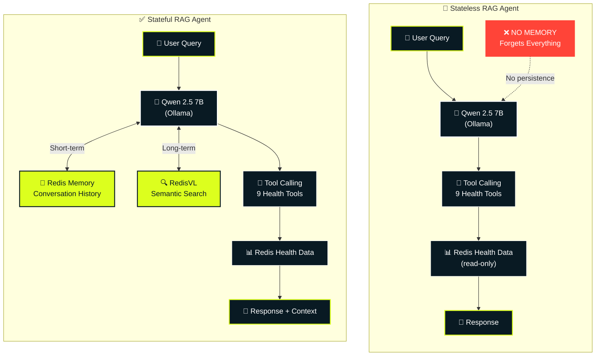

# Redis Wellness 🏥

[](https://www.python.org/downloads/)
[](https://www.typescriptlang.org/)
[](https://redis.io/)
[](https://fastapi.tiangolo.com/)
[](LICENSE)
[](#-privacy)

> **Can AI agents be intelligent without memory?**

A side-by-side demo comparing stateless chat vs. agentic RAG chat powered by **Redis + RedisVL**. Same AI, with and without memory - the difference is dramatic.

🔒 **100% local** - Your health data never leaves your machine (Ollama + Redis)

## 🎯 The Demo

| Component | Stateless Chat | Stateful Chat |
|-----------|----------------|---------------|
| **Architecture** | Simple tool loop | LangGraph orchestration |
| **Conversation History** | ❌ None | ✅ Redis LIST (checkpointing) |
| **Short-term Memory** | ❌ None | ✅ Redis conversation storage |
| **Long-term Memory** | ❌ None | ✅ RedisVL vector search (episodic) |
| **Semantic Search** | ❌ None | ✅ 1024-dim embeddings (mxbai-embed-large) |
| **Procedural Memory** | ❌ None | ✅ Learned tool-calling patterns |
| **Memory Persistence** | ❌ Forgets everything | ✅ 7-month TTL |
| **Context Awareness** | ❌ Can't answer "Is that good?" | ✅ Understands pronouns & references |
| **Health Data Access** | ✅ Redis read-only via tools | ✅ Redis read-only via tools |
| **Tool Calling** | ✅ 9 specialized health tools | ✅ 9 specialized health tools |
| **LLM** | ✅ Qwen 2.5 7B (Ollama) | ✅ Qwen 2.5 7B (Ollama) |
| **Response Quality** | Basic answers only | Context-rich, personalized |

**Try it yourself:**
```bash
You: "What was my average heart rate last week?"
Bot: "87 bpm"

You: "Is that good?"
❌ Stateless: "What are you referring to?"
✅ Redis RAG: "87 bpm is within normal range for your age group..."
```

## 🏭 Architecture

### Side-by-Side Agent Comparison



**The Key Difference:** Both agents retrieve health data from Redis, but only the stateful agent stores conversation memory. The stateless agent has zero persistence - every query is like meeting for the first time.

**Tech Stack:** FastAPI • Redis • RedisVL • Ollama (Qwen 2.5 7B) • TypeScript • Docker

## ✨ Features

- 🤖 **Agentic tool calling** - 9 specialized health tools with autonomous selection
- 🧠 **Dual memory system** - Short-term (Redis LIST) + long-term (RedisVL vector search)
- 📊 **Apple Health integration** - Import and analyze your health data
- 🔒 **100% private** - All processing local (Ollama + Redis)
- ⚡ **Real-time streaming** - SSE streaming responses
- 🧪 **Production-ready** - Comprehensive tests, code quality checks, Docker

## 🚀 Quick Start

### Prerequisites

1. **Docker & Docker Compose** - For running all services
2. **Ollama** - For local LLM inference (runs on host)

### Install Ollama & Models

**Why Ollama + Qwen?**
- 🔒 **100% Privacy**: Runs locally, your health data never leaves your machine
- ⚡ **Fast Setup**: One-command install, no API keys or cloud accounts
- 🧠 **Smart Tool Calling**: Qwen 2.5 7B excels at function calling for agentic workflows
- 📊 **Reasonable Size**: 4.7 GB model runs on most modern laptops
- 🎯 **Optimized for Tools**: Better tool selection than larger general-purpose models

```bash
# Install Ollama (macOS)
brew install ollama

# Or download from https://ollama.ai

# Start Ollama service
ollama serve

# In another terminal, pull the models
ollama pull qwen2.5:7b              # Main LLM - optimized for tool calling (4.7 GB)
ollama pull mxbai-embed-large       # Embeddings - for semantic search (669 MB)
```

> **Note**: First run will download models (~5.4 GB total). Subsequent runs are instant.

### Start the Application

**Option 1: Quick start (recommended)**

```bash
chmod +x start.sh
./start.sh
```

This script:
1. Checks Docker and Ollama are running
2. Verifies required models are installed
3. Starts all services with `docker-compose`
4. Opens the UI at http://localhost:3000

**Option 2: Manual start**

```bash
# Build and start all services
docker-compose up --build

# Or run in detached mode
docker-compose up -d --build
```

### Access Points

- **Frontend Demo UI**: http://localhost:3000 (side-by-side chat comparison)
- **Backend API Docs (Swagger)**: http://localhost:8000/docs
- **Backend API Docs (ReDoc)**: http://localhost:8000/redoc
- **RedisInsight**: http://localhost:8001 (visualize Redis data)
- **Health Check**: http://localhost:8000/api/health/check
- **Demo Info**: http://localhost:8000/api/chat/demo/info

## 📊 Using the Demo

Open http://localhost:3000 and try the side-by-side comparison. The UI shows memory stats in real-time.

**Example workflow:**
1. Ask both agents: "What was my average heart rate last week?"
2. Follow up with: "Is that good?"
3. Watch stateless forget, Redis RAG remember ✅

**Load your Apple Health data:**
```bash
python import_health_data.py apple_health_export/export.xml
```

See [docs/07_APPLE_HEALTH_DATA.md](./docs/07_APPLE_HEALTH_DATA.md) for detailed import instructions.

## 📚 Documentation

### Getting Started
- **[01_QUICKSTART.md](./docs/01_QUICKSTART.md)** - Get running in 5 minutes
- **[02_THE_DEMO.md](./docs/02_THE_DEMO.md)** - Understand what you're seeing

### Learning Redis + AI Patterns
- **[03_MEMORY_ARCHITECTURE.md](./docs/03_MEMORY_ARCHITECTURE.md)** - How Redis powers agent memory
- **[04_AUTONOMOUS_AGENTS.md](./docs/04_AUTONOMOUS_AGENTS.md)** - Autonomous tool calling patterns
- **[05_REDIS_PATTERNS.md](./docs/05_REDIS_PATTERNS.md)** - Redis data structures for AI workloads
- **[06_ARCHITECTURE_DECISIONS.md](./docs/06_ARCHITECTURE_DECISIONS.md)** - Why we made each choice

### Advanced Topics
- **[07_APPLE_HEALTH_DATA.md](./docs/07_APPLE_HEALTH_DATA.md)** - Using your own health data
- **[08_EXTENDING.md](./docs/08_EXTENDING.md)** - Build on this demo
- **[TEST_PLAN.md](./backend/TEST_PLAN.md)** - Testing strategy
- **[WARP.md](./WARP.md)** - Development guide

## 🔧 Development

### API Docs

API documentation available at:
- **Swagger**: http://localhost:8000/docs
- **ReDoc**: http://localhost:8000/redoc

### Testing

```bash
cd backend
uv run pytest tests/ -v              # All tests
uv run pytest tests/unit/ -v         # Unit tests only
```

### Code Quality

```bash
./lint.sh                            # Run all linters
```


## 🐛 Troubleshooting

```bash
# Services not starting?
docker-compose logs -f backend
docker-compose logs -f frontend

# Ollama not running?
curl http://localhost:11434/api/version
ollama list

# Redis issues?
docker-compose ps redis
redis-cli -h localhost -p 6379 ping

# Port conflicts?
lsof -i :3000 :8000 :6379 :11434
```

## 📄 License

MIT License - see [LICENSE](LICENSE) for details.

---

<p align="center">
  <strong>Redis + RedisVL • Demonstrating why memory matters in AI</strong><br>
  Built with ❤️ by <a href="https://www.linkedin.com/in/allierays/">@AllieRays</a>
</p>
