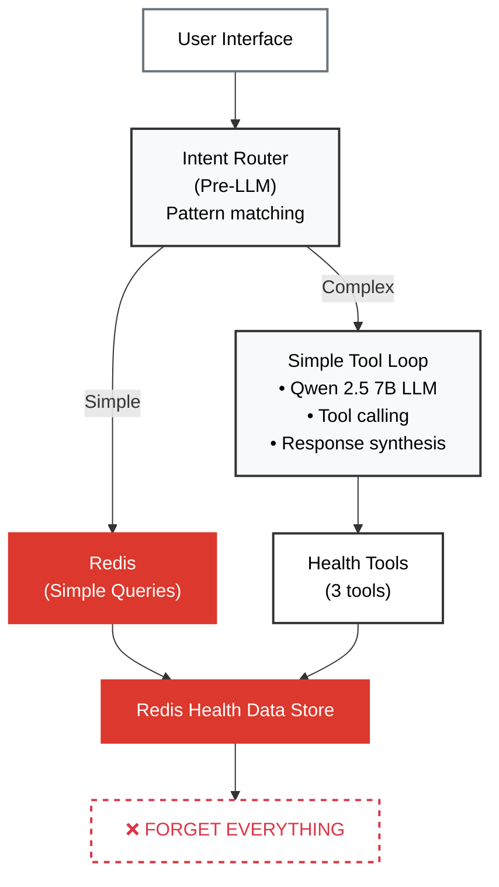
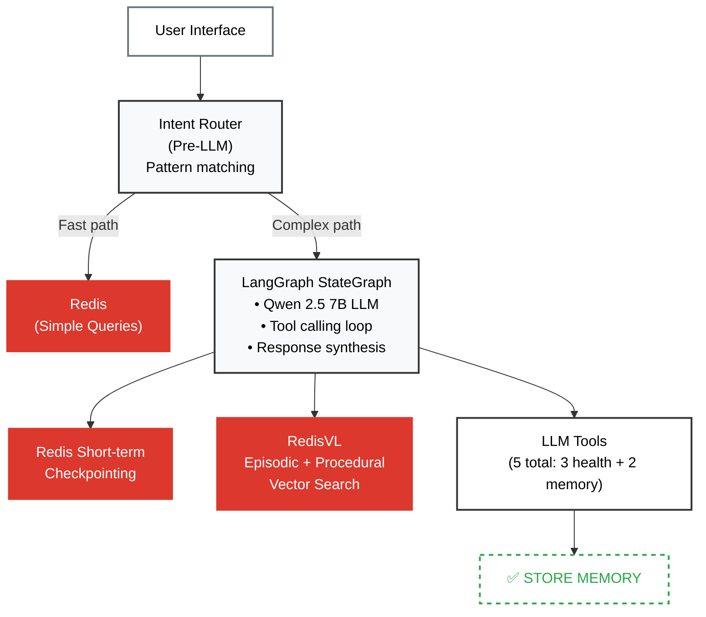

# Redis Wellness 🧠💾

[](https://www.python.org/downloads/)
[](https://www.typescriptlang.org/)
[](https://redis.io/)
[](https://fastapi.tiangolo.com/)
[](#privacy)

> **Can AI be intelligent without memory?**

Compare two identical AI agents side-by-side. Same LLM. Same tools. One difference: **Redis memory**.

See how Redis + RedisVL transforms stateless Q&A into intelligent conversation with context awareness, goal recall, and pattern learning.

🔒 **100% local** - Your health data never leaves your machine.

---

## 🎯 The Difference

### Stateless Agent (No Memory)



### Stateful Agent (With Memory)



**Key difference:** Redis memory enables follow-up questions, goal recall, and pattern learning.

**[📖 See detailed comparison →](docs/05_STATELESS_VS_STATEFUL_COMPARISON.md)**

---

## 🚀 Quick Start

```bash
# 1. Start services
make up

# 2. Import Apple Health data
make import

# 3. Open http://localhost:3000
```

**Try it:**
- Ask both agents: *"How many workouts do I have?"* → Both answer correctly ✅
- Follow up: *"What's the most common type?"*
  - ❌ Stateless: *"What are you referring to?"*
  - ✅ Stateful: *"Traditional Strength Training (40 workouts, 26%)\"*

**[📖 Full setup guide →](docs/02_QUICKSTART.md)**

---

## 📚 Documentation

**Quick Start:**
- [Prerequisites](docs/01_PREREQUISITES.md) - Docker, Ollama, Apple Health export
- [Quickstart](docs/02_QUICKSTART.md) - Running in 5 minutes
- [Example Queries](docs/09_EXAMPLE_QUERIES.md) - Try these to see memory in action

**Architecture Deep Dives:**
- [Stateless vs Stateful Comparison](docs/05_STATELESS_VS_STATEFUL_COMPARISON.md) - Side-by-side breakdown
- [Memory Architecture](docs/10_MEMORY_ARCHITECTURE.md) - Four-layer memory system
- [Agentic RAG](docs/06_AGENTIC_RAG.md) - How tool calling works
- [LangGraph Checkpointing](docs/12_LANGGRAPH_CHECKPOINTING.md) - Conversation state

**[📖 All 13 docs →](docs/)**

---

## 🛠️ Tech Stack

- **Backend:** FastAPI + Python 3.11
- **Frontend:** TypeScript + Vite
- **AI:** Ollama (Qwen 2.5 7B) + LangChain
- **Memory:** Redis + RedisVL (HNSW vector search)
- **Privacy:** 100% local processing

---

## 🤝 Contributing

This is a demo project showcasing Redis + RedisVL for AI agent memory. Feel free to:
- Open issues for bugs or questions
- Submit PRs for improvements
- Use as reference for your own projects

---

## 📄 License

MIT License - See [LICENSE](LICENSE)

---

**Built to showcase Redis + RedisVL for intelligent AI agents** 🧠💾
