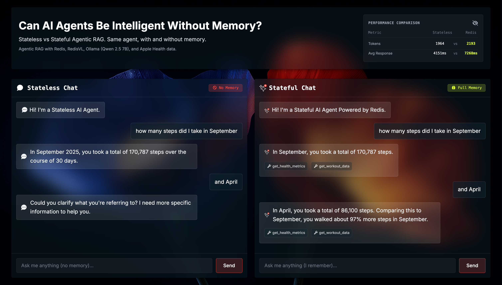
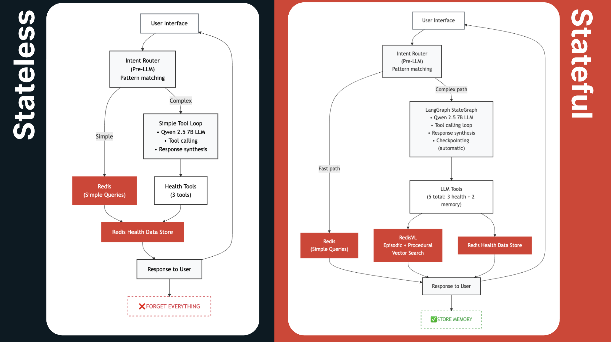

# Redis Wellness ❤️

[](https://www.python.org/downloads/)
[](https://www.typescriptlang.org/)
[](https://redis.io/)
[](https://fastapi.tiangolo.com/)
[](#privacy)

> **Can AI agents be intelligent without memory?**

This project compares **Stateless** and **Stateful (Redis-powered)** AI agents using **Apple Health data**, showing how memory changes the way an agent understands and responds over time.

Built with **FastAPI**, **TypeScript**, **Redis**, **RedisVL**, and **Ollama (Qwen 2.5 7B)**, all running **100% locally** for privacy.  
🔒 *Your health data never leaves your machine.*

---

## 🛠️ Tech Stack

- **AI/LLM:** Ollama (Qwen 2.5 7B) + LangChain + LangGraph
- **Vector Search:** **RedisVL** (HNSW index, 1024-dim embeddings via mxbai-embed-large)
- **Memory:** **Redis Stack** (checkpointing, indexes)
- **Data:** Apple Health data export and uploaded to Redis
- **Backend:** FastAPI + Python 3.11
- **Frontend:** TypeScript + Vite + Server-Sent Events (SSE)
- **Deployment:** Docker + Docker Compose
- **Privacy:** 100% local processing - no external APIs

---

## 🖼️ Side-by-Side Comparison



*Left: Stateless agent with no memory. Right: Stateful agent powered by Redis.*

---

## 📊 Core Architecture

| Component | Stateless Agent | Stateful Agent | Technology |
|-----------|-----------------|----------------|------------|
| **LLM** | Qwen 2.5 7B | Qwen 2.5 7B | Ollama (local) |
| **Orchestration** | Simple tool loop | LangGraph StateGraph | LangGraph |
| **Short-term Memory** | None | Conversation history | Redis checkpointing |
| **Episodic Memory** | None | User goals & facts | RedisVL vector search |
| **Procedural Memory** | None | Tool usage patterns | RedisVL vector search |
| **Health Data** | Redis (read-only) | Redis (read-only) | Redis Hashes |
| **Tools** | 3 (health only) | 5 (3 health + 2 memory) | LangChain |

**Health Tools (both agents):** `get_health_metrics`, `get_sleep_analysis`, `get_workout_data`  
**Memory Tools (stateful only):** `get_my_goals`, `get_tool_suggestions`

---

## 🎯 The Difference



*Left: Stateless agent forgets everything. Right: Stateful agent stores memory in Redis.*

**Key difference:** Redis memory enables follow-up questions, goal recall, and pattern learning.

**[📖 See detailed comparison →](docs/05_STATELESS_VS_STATEFUL_COMPARISON.md)**

---

## 🚀 Quick Start

**Prerequisites:**
- Docker & Docker Compose
- Ollama with models: `ollama pull qwen2.5:7b` and `ollama pull mxbai-embed-large`
- Apple Health export in `apple_health_export/export.xml`

**[📖 Detailed prerequisites →](docs/01_PREREQUISITES.md)**

```bash
# 1. Start services
make up

# 2. Import Apple Health data
make import

# 3. Open http://localhost:3000
```

**Try it:**
- Ask both agents: *"How many workouts do I have?"* → Both answer correctly ✅
- Follow up: *"What's the most common type?"*
  - ❌ Stateless: *"What are you referring to?"*
  - ✅ Stateful: *"Traditional Strength Training (40 workouts, 26%)\"*

**[📖 Full setup guide →](docs/02_QUICKSTART.md)**

---

## 📚 Documentation

**Getting Started:**

1. [Prerequisites](docs/01_PREREQUISITES.md) - Docker, Ollama, Apple Health export
2. [Quickstart](docs/02_QUICKSTART.md) - Running in 5 minutes

**Agent Architecture:**

3. [Stateless Agent](docs/03_STATELESS_AGENT.md) - Simple tool loop without memory
4. [Stateful Agent](docs/04_STATEFUL_AGENT.md) - LangGraph with four-layer memory
5. [Stateless vs Stateful Comparison](docs/05_STATELESS_VS_STATEFUL_COMPARISON.md) - Side-by-side breakdown

**Core Concepts:**

6. [Agentic RAG](docs/06_AGENTIC_RAG.md) - Autonomous tool calling
7. [Apple Health Data Import](docs/07_HOW_TO_IMPORT_APPLE_HEALTH_DATA.md) - Data pipeline
8. [Qwen Best Practices](docs/08_QWEN_BEST_PRACTICES.md) - Tool calling optimization
9. [Example Queries](docs/09_EXAMPLE_QUERIES.md) - Try these to see memory in action

**Memory Systems:**

10. [Memory Architecture](docs/10_MEMORY_ARCHITECTURE.md) - Four-layer memory system
11. [Redis Patterns](docs/11_REDIS_PATTERNS.md) - Data structures for AI agents
12. [LangGraph Checkpointing](docs/12_LANGGRAPH_CHECKPOINTING.md) - Conversation state

**Reference:**

13. [Tools, Services & Utils](docs/13_TOOLS_SERVICES_UTILS_REFERENCE.md) - Complete code reference

---

## 🤝 Contributing

This is a demo project showcasing Redis + RedisVL for AI agent memory. Feel free to:
- Open issues for bugs or questions
- Submit PRs for improvements
- Use locally with your own health data

---

## 📄 License

MIT License - See [LICENSE](LICENSE)

---

**Built to showcase Redis + RedisVL for intelligent AI agents** ❤️

Built with ❤️ by [Allierays](https://www.linkedin.com/in/allierays/)
