# Redis Wellness 🏥

[](https://www.python.org/downloads/)
[](https://www.typescriptlang.org/)
[](https://redis.io/)
[](https://fastapi.tiangolo.com/)
[](LICENSE)
[](#-privacy)


# Redis Wellness 🧠


Can AI agents be intelligent without memory?
This project compares **Stateless** and **Stateful (Redis-powered)** AI agents using **Apple Health data**, showing how memory transforms reasoning, recall, and conversation quality.
Built with **FastAPI**, **TypeScript**, **Redis**, **RedisVL**, and **Ollama (Qwen 2.5 7B)**, all running **100% locally** for privacy.
🔒 *Your health data never leaves your machine.*

## Why This Demo?

We wanted to see how memory affects AI reasoning using real health data that changes day by day.

You can chat with two versions of the same agent:
- 🟦 **Stateless** — No memory; forgets everything each turn
- 🔴 **Stateful (Redis)** — Remembers, recalls, and reasons over your past context


---

## 🎯 The Difference

### Memory & Context

| Feature | ❌ Stateless Agent | ✅ Stateful Agent | Technology |
|---------|-------------------|-------------------|------------|
| **Conversation Memory** | None - forgets everything | 7-month history | Redis LIST |
| **Semantic Memory** | None | Contextual recall | RedisVL vector search (1024-dim) |
| **Follow-up Questions** | ❌ "What are you referring to?" | ✅ Understands context & pronouns | Message history + embeddings |
| **Context Awareness** | ❌ Every query is isolated | ✅ Remembers past interactions | Redis persistence |
| **Learning** | ❌ Cannot learn patterns | ✅ Learns from conversation | Vector similarity search |
| **Response Quality** | Basic facts only | Context-rich, personalized | Dual memory system |

### Shared Capabilities

| Feature | Both Agents |
|---------|-------------|
| **Tool Calling** | 9 specialized health tools |
| **LLM** | Qwen 2.5 7B (Ollama) |
| **Health Data** | Redis read-only access |

### Example Conversation

| ❌ Stateless Agent | ✅ Stateful Agent |
|-------------------|-------------------|
| **You:** "What was my average heart rate last week?"<br>**Bot:** "87 bpm"<br><br>**You:** "Is that good?"<br>**Bot:** "What are you referring to?" ❌ | **You:** "What was my average heart rate last week?"<br>**Bot:** "87 bpm"<br><br>**You:** "Is that good?"<br>**Bot:** "87 bpm is within normal range for your age group..." ✅ |

---

## 🏗️ Architecture

### Side-by-Side Comparison

```mermaid
flowchart LR
    subgraph stateless["🟦 Stateless Agent"]
        direction TB
        S1["User Query"]:::start
        S2["Qwen 2.5 7B"]:::agent
        S3["Tool Calling"]:::tool
        S4["Redis Health Data"]:::data
        S5["Response"]:::response
        S6["NO MEMORY"]:::nomem

        S1 --> S2
        S2 --> S3
        S3 --> S4
        S4 --> S5
        S6 -."Forgets everything".-> S2
    end

    stateless ~~~ stateful

    subgraph stateful["🔴 Stateful Agent"]
        direction TB
        T1["User Query"]:::start
        T2["Qwen 2.5 7B"]:::agent
        T3["Redis Memory"]:::memory
        T4["RedisVL Search"]:::memory
        T5["Tool Calling"]:::tool
        T6["Redis Health Data"]:::data
        T7["Contextual Response"]:::response

        T1 --> T2
        T2 <-->|"Short-term"| T3
        T2 <-->|"Long-term"| T4
        T2 --> T5
        T5 --> T6
        T6 --> T7
    end

    classDef start fill:#fff,stroke:#dc3545,stroke-width:2px,color:#212529
    classDef agent fill:#fff,stroke:#6c757d,stroke-width:2px,color:#212529
    classDef tool fill:#fff,stroke:#6c757d,stroke-width:2px,color:#212529
    classDef data fill:#fff,stroke:#6c757d,stroke-width:2px,color:#212529
    classDef response fill:#fff,stroke:#dc3545,stroke-width:2px,color:#212529
    classDef nomem fill:#dc3545,stroke:#dc3545,stroke-width:2px,color:#fff
    classDef memory fill:#dc3545,stroke:#dc3545,stroke-width:2px,color:#fff

    style stateless fill:#fefefe,stroke:#6c757d,stroke-width:2px
    style stateful fill:#fefefe,stroke:#6c757d,stroke-width:2px
```



### Redis Memory Architecture

The stateful agent uses **three Redis-powered memory systems**:

1. **📝 Short-term Memory (LangGraph Checkpointing)**
   - Redis LIST for conversation history
   - Tracks tool calls, responses, and state
   - 7-month TTL for long-running conversations

2. **🔍 Long-term Memory (RedisVL Vector Search)**
   - Semantic search over past interactions
   - 1024-dim embeddings (mxbai-embed-large)
   - Retrieves relevant context from conversation history

3. **📊 Health Data Store (Redis Hashes + JSON)**
   - Hash sets for O(1) workout lookups
   - JSON blobs for metrics and aggregates
   - Indexed by date, type, and user ID

---

## 🛠️ Tech Stack

### Backend
- **FastAPI** - High-performance async API framework
- **Redis 7.0+** - Primary data store and memory layer
- **RedisVL** - Vector search for semantic memory
- **LangGraph** - Agent orchestration framework
- **LangChain** - Tool calling and LLM integration
- **Ollama** - Local LLM runtime (Qwen 2.5 7B)
- **Python 3.11+** - Modern async Python with type hints
- **uv** - Fast Python package manager

### Frontend
- **TypeScript** - Type-safe frontend code
- **Server-Sent Events (SSE)** - Real-time streaming responses
- **Vanilla JS** - Lightweight, no framework dependencies

### Infrastructure
- **Docker & Docker Compose** - Containerized deployment
- **Redis** - Single source of truth for all data
- **Ollama** - Runs on host for LLM inference

### Development
- **pytest** - Comprehensive test suite
- **Ruff** - Lightning-fast linting and formatting
- **pre-commit** - Git hooks for code quality

---

## ⚙️ How It Works

### 1. Stateless Agent (Simple Tool Loop)

```python
# No memory - every query starts fresh
while True:
    user_input = get_user_message()

    # LLM decides which tool to call
    tool_call = llm.generate(user_input)

    # Execute tool against Redis health data
    result = execute_tool(tool_call)

    # Return result (no memory saved)
    return result
```

**Limitations:**
- ❌ Cannot answer follow-up questions
- ❌ Cannot understand pronouns ("that", "it", "those")
- ❌ Cannot learn from past interactions
- ❌ Every query is independent

### 2. Stateful Agent (LangGraph with Memory)

```python
# LangGraph state machine with Redis checkpointing
class AgentState(TypedDict):
    messages: list[BaseMessage]
    memory_context: str  # Retrieved from RedisVL

# Build graph
graph = StateGraph(AgentState)
graph.add_node("agent", call_agent)
graph.add_node("tools", execute_tools)
graph.add_node("memory", retrieve_memory)

# Redis checkpoint saver
checkpointer = RedisSaver(redis_client)

# Compile with memory persistence
app = graph.compile(checkpointer=checkpointer)

# Execute with conversation memory
for chunk in app.stream(user_input, thread_id="user_123"):
    yield chunk  # SSE streaming
```

**Capabilities:**
- ✅ Remembers conversation history (Redis LIST)
- ✅ Retrieves semantic context (RedisVL)
- ✅ Understands references and pronouns
- ✅ Learns tool-calling patterns over time

### 3. Tool Calling System

Both agents use **9 specialized health tools**:

| Tool | Purpose | Redis Data Structure |
|------|---------|---------------------|
| `search_health_records_by_metric` | Query metrics (weight, heart rate) | Redis JSON + sorted sets |
| `search_workouts_and_activity` | Find workouts with filters | Redis Hash (O(1) lookup) |
| `aggregate_metrics` | Calculate stats (avg, min, max) | Redis JSON aggregation |
| `calculate_weight_trends_tool` | Weight trend analysis | Time-series queries |
| `compare_time_periods_tool` | Period-over-period comparison | Date-ranged queries |
| `compare_activity_periods_tool` | Activity comparison | Multi-metric aggregation |
| `get_workout_schedule_analysis` | Workout patterns by day | Hash field queries |
| `analyze_workout_intensity_by_day` | Intensity by day of week | Aggregation + grouping |
| `get_workout_progress` | Progress tracking | Time-series comparison |

**Tool Selection:**
- LLM autonomously chooses which tool to call
- Tools return structured data from Redis
- Agent synthesizes results into natural language

### 4. Redis Data Patterns

**Workout Indexing:**
```python
# O(1) lookup by workout ID
HSET user:wellness_user:workout:abc123
  type "Walking"
  startDate "2025-10-20T14:30:00Z"
  duration "3600"
  calories "250"
  day_of_week "Monday"
```

**Conversation Memory:**
```python
# LangGraph checkpoint
ZADD checkpoint:wellness_user:thread_1
  {timestamp} "{state_json}"

# Vector embeddings for semantic search
HSET memory:embeddings:msg_123
  embedding [0.123, 0.456, ...]  # 1024-dim vector
```

---

## 🚀 How to Run

### Prerequisites

1. **Docker & Docker Compose** - For running services
2. **Ollama** - For local LLM inference

### Step 1: Install Ollama & Models

**Why Ollama + Qwen?**
- 🔒 **100% Privacy**: Runs locally, no cloud APIs
- ⚡ **Fast Setup**: One-command install
- 🧠 **Smart Tool Calling**: Qwen 2.5 7B excels at function calling
- 📊 **Reasonable Size**: 4.7 GB model, runs on most laptops

```bash
# Install Ollama (macOS)
brew install ollama

# Or download from https://ollama.ai

# Start Ollama service
ollama serve

# Pull required models (in another terminal)
ollama pull qwen2.5:7b              # Main LLM (4.7 GB)
ollama pull mxbai-embed-large       # Embeddings (669 MB)
```

### Step 2: Start the Application

**Quick Start (Recommended):**

```bash
# 1. Clone the repo
git clone https://github.com/AllieRays/redis-wellness.git
cd redis-wellness

# 2. Run the startup script
chmod +x start.sh
./start.sh
```

The script automatically:
- ✅ Checks Docker and Ollama are running
- ✅ Verifies models are installed
- ✅ Starts all services
- ✅ Opens UI at http://localhost:3000

**Manual Start:**

```bash
# Install dependencies
make install

# Start Redis
make redis-start

# Start development servers (backend + frontend)
make dev
```

### Step 3: Import Health Data

**Using Make commands:**

```bash
# Import Apple Health data
make import

# Verify data loaded correctly
make verify

# View statistics
make stats

# Run health check
make health
```

**Manual import:**

```bash
# From XML export
uv run --directory backend import-health apple_health_export/export.xml

# From pre-parsed JSON (faster)
uv run --directory backend import-health parsed_health_data.json
```

### Step 4: Try the Demo

1. **Open the UI**: http://localhost:3000
2. **Ask both agents**: "What was my average heart rate last week?"
3. **Follow up with**: "Is that good?"
4. **Watch the difference**:
   - ❌ Stateless: "What are you referring to?"
   - ✅ Stateful: "87 bpm is within normal range..."

### Available Commands

```bash
make help              # Show all available commands
make install           # Install dependencies
make dev               # Start development servers
make health            # Check all services
make import            # Import Apple Health data
make verify            # Verify data is indexed
make stats             # Show health data statistics
make test              # Run all tests
make lint              # Run code linting
make redis-start       # Start Redis
make redis-stop        # Stop Redis
make redis-clean       # Clear Redis data
make fresh-start       # Clean + reimport + dev
make demo              # Prepare for demo
```

### Access Points

- **Frontend UI**: http://localhost:3000
- **API Swagger Docs**: http://localhost:8000/docs
- **API ReDoc**: http://localhost:8000/redoc
- **Health Check**: http://localhost:8000/api/health/check
- **Demo Info**: http://localhost:8000/api/chat/demo/info
- **RedisInsight** (optional): http://localhost:8001

---

## 📚 Learn More

### Documentation

#### Getting Started
- **[01_QUICKSTART.md](./docs/01_QUICKSTART.md)** - Get running in 5 minutes
- **[02_THE_DEMO.md](./docs/02_THE_DEMO.md)** - Understand the side-by-side comparison
- **[07_APPLE_HEALTH_DATA.md](./docs/07_APPLE_HEALTH_DATA.md)** - Import your own health data

#### Redis + AI Patterns
- **[03_MEMORY_ARCHITECTURE.md](./docs/03_MEMORY_ARCHITECTURE.md)** - How Redis powers agent memory
- **[04_AUTONOMOUS_AGENTS.md](./docs/04_AUTONOMOUS_AGENTS.md)** - Autonomous tool calling patterns
- **[05_REDIS_PATTERNS.md](./docs/05_REDIS_PATTERNS.md)** - Redis data structures for AI
- **[06_ARCHITECTURE_DECISIONS.md](./docs/06_ARCHITECTURE_DECISIONS.md)** - Design decisions explained

#### Advanced Topics
- **[08_EXTENDING.md](./docs/08_EXTENDING.md)** - Build on this demo
- **[TEST_PLAN.md](./backend/TEST_PLAN.md)** - Testing strategy
- **[WARP.md](./WARP.md)** - Development workflow guide

### API Documentation

Full API docs available at:
- **Swagger UI**: http://localhost:8000/docs (interactive testing)
- **ReDoc**: http://localhost:8000/redoc (clean reference docs)

### Key Endpoints

```bash
# Health check
GET /api/health/check

# Demo information
GET /api/chat/demo/info

# Stateless chat
POST /api/chat/stateless/stream

# Stateful chat (LangGraph)
POST /api/chat/stateful/stream

# Memory stats
GET /api/memory/{thread_id}/stats
```

### External Resources

- **Redis Documentation**: https://redis.io/docs
- **RedisVL Guide**: https://redisvl.com
- **LangGraph Tutorial**: https://langchain-ai.github.io/langgraph
- **Ollama Models**: https://ollama.ai/library

---

## 🐛 Troubleshooting

### Services not starting?

```bash
# Check logs
docker compose logs -f backend
docker compose logs -f frontend

# Check service status
docker compose ps
make health
```

### Ollama issues?

```bash
# Check Ollama is running
curl http://localhost:11434/api/version

# List installed models
ollama list

# Restart Ollama
brew services restart ollama
```

### Redis issues?

```bash
# Check Redis status
docker compose ps redis
redis-cli -h localhost -p 6379 ping

# View Redis data
make redis-keys
make verify
```

### Port conflicts?

```bash
# Check what's using ports
lsof -i :3000 :8000 :6379 :11434

# Stop conflicting services
docker compose down
```

### Import issues?

```bash
# Verify Redis has data
make verify

# Check import status
make stats

# Re-import from scratch
make fresh-start
```

---

## 🔒 Privacy

**Your health data never leaves your machine.**

- ✅ Ollama runs locally (no OpenAI/Anthropic API calls)
- ✅ Redis stores data locally (no cloud sync)
- ✅ All processing happens on your computer
- ✅ No telemetry, no tracking, no external requests

This is a **fully local AI system** - perfect for sensitive health data.

---

## 📚 Learn More

Dive deeper into the architecture and patterns:

### Getting Started
- **[01_QUICKSTART.md](./docs/01_QUICKSTART.md)** - Get running in 5 minutes
- **[02_THE_DEMO.md](./docs/02_THE_DEMO.md)** - Understand what you're seeing
- **[07_APPLE_HEALTH_DATA.md](./docs/07_APPLE_HEALTH_DATA.md)** - Import your own health data

### Deep Dives
- **[03_MEMORY_ARCHITECTURE.md](./docs/03_MEMORY_ARCHITECTURE.md)** - How Redis powers agent memory
- **[04_AUTONOMOUS_AGENTS.md](./docs/04_AUTONOMOUS_AGENTS.md)** - Agentic tool calling patterns
- **[05_REDIS_PATTERNS.md](./docs/05_REDIS_PATTERNS.md)** - Redis data structures for AI
- **[06_ARCHITECTURE_DECISIONS.md](./docs/06_ARCHITECTURE_DECISIONS.md)** - Why we made each choice

### Extending
- **[08_EXTENDING.md](./docs/08_EXTENDING.md)** - Build on this demo
- **[WARP.md](./WARP.md)** - Full development guide

---

## 📄 License

MIT License - see [LICENSE](LICENSE) for details.

---

<p align="center">
  <strong>Redis + RedisVL • Demonstrating why memory matters in AI</strong><br>
  Built with ❤️ by <a href="https://www.linkedin.com/in/allierays/">@AllieRays</a>
</p>
