# Redis Wellness 🏥

[](https://www.python.org/downloads/)
[](https://www.typescriptlang.org/)
[](https://redis.io/)
[](https://fastapi.tiangolo.com/)
[](LICENSE)
[](#-privacy)


# Redis Wellness 🧠

Can AI agents be intelligent without memory?

This project compares **Stateless** and **Stateful (Redis-powered)** AI agents using **Apple Health data**, showing how memory transforms reasoning, recall, and conversation quality.

Built with **FastAPI**, **TypeScript**, **Redis**, **RedisVL**, and **Ollama (Qwen 2.5 7B)**, all running **100% locally** for privacy.

🔒 *Your health data never leaves your machine.*

## Why This Demo?

We wanted to see how memory affects AI reasoning using real health data that changes day by day.

You can chat with two versions of the same agent:
- 🟦 **Stateless** — No memory; forgets everything each turn
- 🔴 **Stateful (Redis)** — Remembers, recalls, and reasons over your past context


---

## 🎯 The Difference

### Core Architecture
|| Component | Stateless Agent | Stateful Agent | Technology |
|-----------|-----------------|----------------|------------|
| **LLM** | Qwen 2.5 7B | Qwen 2.5 7B | Ollama (local inference) |
| **Orchestration** | Simple tool loop | Simple tool loop with state | No LangGraph - direct tool calling |
| **Episodic Memory** | None | Conversation history (7-month TTL) | Redis LIST (`episodic:{session_id}:history`) |
| **Semantic Memory** | None | Long-term context with vector search | RedisVL (HNSW index, 1024-dim embeddings) |
| **Procedural Memory** | None | Goals and preferences tracking | Redis Hash (`procedural:{user_id}:goals`) |
| **Health Data** | Redis read-only access | Redis read-only access | Redis Hashes + JSON (O(1) lookups) |
| **Tool Calling** | 9 health tools | 11 tools (9 health + 2 memory) | LangChain tool integration |

### Conversation Capabilities

| Capability | Stateless Agent | Stateful Agent | How It Works |
|------------|-----------------|----------------|---------------|
| **Follow-up Questions** | Treats each as new query | Maintains conversation flow | Prior exchanges in LLM prompt |
| **Pronoun Resolution** | Cannot resolve "it", "that", "those" | Resolves references from context | Message history retrieval |
| **Multi-turn Reasoning** | Isolated single-turn responses | Coherent multi-turn conversations | Triple memory system (episodic + semantic + procedural) |
| **Example** | **You:** "What was my average heart rate last week?"<br>**Bot:** "87 bpm"<br><br>**You:** "Is that good?"<br>**Bot:** "What are you referring to?" | **You:** "What was my average heart rate last week?"<br>**Bot:** "87 bpm"<br><br>**You:** "Is that good?"<br>**Bot:** "87 bpm is within normal range for your age group..." | Stateful uses conversation history + semantic memory |

---

## 🏗️ Architecture

### System Overview

```
┌─────────────────────────────────────────────────────────────────┐
│                       Docker Network (wellness-network)          │
│                                                                  │
│  ┌──────────────┐       ┌──────────────┐      ┌──────────────┐ │
│  │   Frontend   │──────▶│   Backend    │─────▶│    Redis     │ │
│  │ TypeScript   │       │   FastAPI    │      │ + RedisVL    │ │
│  │   :3000      │       │    :8000     │      │ :6379, :8001 │ │
│  └──────────────┘       └──────┬───────┘      └──────────────┘ │
│                                │                                 │
└────────────────────────────────┼─────────────────────────────────┘
                                 │
                                 ▼
                    ┌────────────────────────┐
                    │   Ollama (Host)        │
                    │   Qwen 2.5 7B          │
                    │   mxbai-embed-large    │
                    │   :11434               │
                    └────────────────────────┘
```

### Agent Comparison

```mermaid
flowchart TB
    subgraph stateless["🟦 Stateless Agent - Simple Tool Loop"]
        direction TB
        S1["User Query"]:::start
        S2["Intent Bypass<br/>(Goal Check)"]:::router
        S3["Qwen 2.5 7B"]:::llm
        S4{"Tool Calls?"}:::decision
        S5["Execute Health Tools:<br/>• get_health_metrics<br/>• get_workouts<br/>• get_trends<br/>• get_activity_comparison<br/>• get_workout_patterns<br/>• get_workout_progress"]:::tool
        S6{"Continue?<br/>(Max 8)"}:::decision
        S7["Response"]:::response

        S1 --> S2
        S2 -->|"Goal Query"| S7
        S2 -->|"Normal"| S3
        S3 --> S4
        S4 -->|Yes| S5
        S5 --> S6
        S6 -->|Yes| S3
        S6 -->|No| S7
        S4 -->|No| S7
    end

    subgraph stateful["🔴 Stateful Agent - LangGraph with Memory"]
        direction TB
        T1["User Query"]:::start
        T2["Intent Bypass<br/>(Goal Check)"]:::router
        T3["LangGraph Entry<br/>(Load Checkpointed History)"]:::memory
        T4["Qwen 2.5 7B"]:::llm
        T5{"Tool Calls?"}:::decision
        T6["Execute Tools:<br/><b>Health (9):</b> get_health_metrics, get_workouts,<br/>get_trends, get_activity_comparison,<br/>get_workout_patterns, get_workout_progress<br/><br/><b>Memory (2):</b> get_my_goals,<br/>get_tool_suggestions"]:::tool
        T7{"Continue?"}:::decision
        T8["Reflect<br/>(Evaluate)"]:::reflect
        T9["Store Episodic<br/>(Goals)"]:::memory
        T10["Store Procedural<br/>(Patterns)"]:::memory
        T11["Response"]:::response

        T1 --> T2
        T2 -->|"Goal Query"| T11
        T2 -->|"Normal"| T3
        T3 --> T4
        T4 --> T5
        T5 -->|Yes| T6
        T6 --> T7
        T7 -->|Yes| T4
        T7 -->|No| T8
        T5 -->|No| T8
        T8 --> T9
        T9 --> T10
        T10 --> T11
    end

    classDef start fill:#fff,stroke:#dc3545,stroke-width:2px,color:#212529
    classDef router fill:#fff,stroke:#fd7e14,stroke-width:2px,color:#212529
    classDef llm fill:#fff,stroke:#0d6efd,stroke-width:2px,color:#212529
    classDef decision fill:#fff,stroke:#ffc107,stroke-width:2px,color:#212529
    classDef tool fill:#198754,stroke:#198754,stroke-width:2px,color:#fff
    classDef memory fill:#dc3545,stroke:#dc3545,stroke-width:2px,color:#fff
    classDef reflect fill:#17a2b8,stroke:#17a2b8,stroke-width:2px,color:#fff
    classDef response fill:#fff,stroke:#dc3545,stroke-width:2px,color:#212529

    style stateless fill:#fefefe,stroke:#6c757d,stroke-width:2px
    style stateful fill:#fefefe,stroke:#6c757d,stroke-width:2px
```



### Four-Layer Memory Architecture

The stateful agent uses **four types of memory** inspired by human cognition (CoALA framework):

```
┌─────────────────────────────────────────────────────────────────┐
│                      STATEFUL AGENT MEMORY                       │
├─────────────────────────────────────────────────────────────────┤
│                                                                  │
│  1️⃣ SHORT-TERM (LangGraph Checkpointing)                       │
│     ├─ Recent conversation within current session               │
│     ├─ Managed by: LangGraph BaseCheckpointSaver                │
│     ├─ Storage: Redis (checkpoints)                             │
│     └─ Enables: Context awareness, pronoun resolution           │
│                                                                  │
│  2️⃣ EPISODIC (User Goals & Facts)                              │
│     ├─ Important user-specific facts and goals                  │
│     ├─ Redis key: episodic:{user_id}:goal:{timestamp}           │
│     ├─ Managed by: episodic_memory_manager.py                   │
│     ├─ Vector search: RedisVL HNSW (1024-dim embeddings)        │
│     ├─ Retrieved via: get_my_goals tool (LLM-triggered)         │
│     └─ Enables: Cross-session goal recall                       │
│                                                                  │
│  3️⃣ PROCEDURAL (Workflow Patterns)                             │
│     ├─ Successful tool-calling sequences and strategies         │
│     ├─ Redis key: procedural:pattern:{timestamp}                │
│     ├─ Managed by: procedural_memory_manager.py                 │
│     ├─ Vector search: RedisVL HNSW (pattern matching)           │
│     ├─ Retrieved via: get_tool_suggestions tool (LLM-triggered) │
│     └─ Enables: Workflow optimization via past success          │
│                                                                  │
│  4️⃣ SEMANTIC (Health Knowledge Base) - Optional                │
│     ├─ General health facts and medical knowledge               │
│     ├─ Redis key: semantic:{category}:{fact_type}:{timestamp}   │
│     ├─ Managed by: semantic_memory_manager.py                   │
│     ├─ Vector search: RedisVL HNSW                              │
│     └─ Enables: Domain knowledge augmentation                   │
│                                                                  │
└─────────────────────────────────────────────────────────────────┘

        📊 HEALTH DATA STORE (Shared by Both Agents)
        ├─ Workouts: Hash sets (O(1) lookups by ID)
        ├─ Metrics: JSON blobs (aggregated by date/type)
        ├─ Indexes: Day-of-week, date ranges
        └─ TTL: 7 months (configurable)
```

**Key Differences:**
- **Stateless Agent**: No memory systems, only accesses health data via tools
- **Stateful Agent**: All 4 memory types + LangGraph checkpointing for conversation continuity
- **Memory Retrieval**: Autonomous via tools (LLM decides when to call `get_my_goals` or `get_tool_suggestions`)
- **Memory Storage**: Automatic after response generation (episodic + procedural)

---

## 🛠️ Tech Stack

### Backend
- **FastAPI** - High-performance async API framework
- **Redis 7.0+** - Primary data store and memory layer
- **RedisVL** - Vector search for semantic memory
- **LangChain** - Tool calling and LLM integration
- **Ollama** - Local LLM runtime (Qwen 2.5 7B)
- **Python 3.11+** - Modern async Python with type hints
- **uv** - Fast Python package manager

### Frontend
- **TypeScript** - Type-safe frontend code
- **Server-Sent Events (SSE)** - Real-time streaming responses
- **Vanilla JS** - Lightweight, no framework dependencies

### Infrastructure
- **Docker & Docker Compose** - Containerized deployment
- **Redis** - Single source of truth for all data
- **Ollama** - Runs on host for LLM inference

### Development
- **pytest** - Comprehensive test suite
- **Ruff** - Lightning-fast linting and formatting
- **pre-commit** - Git hooks for code quality

---

## ⚙️ How It Works

### 1. Stateless Agent (Simple Tool Loop)

```python
# No memory - every query starts fresh
while True:
    user_input = get_user_message()

    # LLM decides which tool to call
    tool_call = llm.generate(user_input)

    # Execute tool against Redis health data
    result = execute_tool(tool_call)

    # Return result (no memory saved)
    return result
```

**Limitations:**
- ❌ Cannot answer follow-up questions
- ❌ Cannot understand pronouns ("that", "it", "those")
- ❌ Cannot learn from past interactions
- ❌ Every query is independent

### 2. Stateful Agent (LangGraph with Autonomous Memory)

```python
# LangGraph-based agent with autonomous memory retrieval
async def stateful_agent(message: str, session_id: str):
    # Build LangGraph state with four-layer memory
    state = {
        "messages": [HumanMessage(content=message)],
        "user_id": user_id,
        "workflow_start_time": time.time(),
    }

    # LangGraph workflow:
    # 1. llm_node: Call LLM with ALL tools (health + memory)
    #    - LLM autonomously decides: call tools or finish?
    #    - Can call get_my_goals, get_tool_suggestions, or health tools

    # 2. tool_node: Execute tools if LLM requested them
    #    - Executes health data queries
    #    - OR retrieves episodic/procedural memory via tools

    # 3. Loop back to llm_node (up to recursion_limit)
    #    - LLM sees tool results, decides next action
    #    - Continues until LLM says "done" (no more tool calls)

    # 4. reflect_node: Evaluate workflow success
    #    - Score: tool execution, timing, response quality

    # 5. store_episodic_node: Extract and store goals
    #    - Parse user goals from conversation
    #    - Store in RedisVL with embeddings

    # 6. store_procedural_node: Save successful patterns
    #    - If workflow successful, store tool sequence
    #    - Future queries can retrieve similar patterns

    # Execute graph with checkpointing
    config = {"configurable": {"thread_id": session_id}}
    final_state = await graph.ainvoke(state, config)

    return final_state["messages"][-1].content
```

**Key Features:**
- ✅ **Short-term memory**: LangGraph checkpointing (conversation history)
- ✅ **Episodic memory**: User goals retrieved via `get_my_goals` tool (LLM-triggered)
- ✅ **Procedural memory**: Workflow patterns via `get_tool_suggestions` tool (LLM-triggered)
- ✅ **Autonomous memory retrieval**: LLM decides when to call memory tools
- ✅ **Automatic memory storage**: Goals and patterns stored after response
- ✅ **Recursion limit**: Prevents infinite loops (configurable, default 50)

### 3. Tool Calling System

**Both agents** use the same **9 health tools**. **Stateful agent** adds **2 memory tools**:

| Tool | Purpose | Redis Data Structure | Agent |
|------|---------|---------------------|-------|
| **Health Data Tools** | | | |
| `get_health_metrics` | Query health metrics (weight, BMI, heart rate, steps) with statistics | Redis JSON | Both |
| `get_workouts` | Retrieve workout details with heart rate zones and day-of-week tracking | Redis Hashes + JSON | Both |
| `get_trends` | Analyze trends and compare periods (weight, steps, heart rate, etc.) | Redis JSON + aggregation | Both |
| `get_activity_comparison` | Compare activity metrics across time periods (steps, energy, distance) | Multi-metric aggregation | Both |
| `get_workout_patterns` | Analyze workout patterns by day/week (schedule or intensity analysis) | Temporal aggregation | Both |
| `get_workout_progress` | Track progress between time periods (improvement over time) | Time-series comparison | Both |
| **Memory Tools (Stateful Only)** | | | |
| `get_my_goals` | Retrieve user goals via semantic search (e.g., "weight goal is 125 lbs") | RedisVL vector search (episodic) | Stateful only |
| `get_tool_suggestions` | Get workflow pattern suggestions based on past successful queries | RedisVL vector search (procedural) | Stateful only |

**How Tool Calling Works:**

```python
# Stateless Agent: Simple loop
while has_tool_calls and iterations < 8:
    response = llm(messages, tools=health_tools)  # 9 health tools only
    if response.tool_calls:
        execute_tools(response.tool_calls)
        messages.append(tool_results)
    else:
        break  # LLM finished

# Stateful Agent: LangGraph workflow
while has_tool_calls:  # LangGraph manages recursion
    response = llm(messages, tools=health_tools + memory_tools)  # 11 tools total
    if response.tool_calls:
        # LLM can call:
        # - Health tools (get_workouts, get_trends, etc.)
        # - Memory tools (get_my_goals, get_tool_suggestions)
        execute_tools(response.tool_calls)
        messages.append(tool_results)
    else:
        break  # LLM finished, proceed to storage

# After response: store episodic + procedural memory
```

**Key Differences:**
- **Stateless**: 9 health tools, simple loop, no memory storage
- **Stateful**: 11 tools (9 health + 2 memory), LangGraph workflow, automatic memory storage
- **Autonomous**: LLM decides which tools to call and when (no hardcoded retrieval)
- **Chaining**: Both agents support multi-step tool sequences (max 8 iterations for stateless, configurable for stateful)

### 4. Redis Data Patterns

**Health Data Storage:**
```python
# Workout data (O(1) lookup by ID)
HSET user:wellness_user:workout:abc123
  type "Walking"
  startDate "2025-10-20T14:30:00Z"
  duration "3600"
  calories "250"
  day_of_week "Monday"  # Pre-computed for pattern analysis

# Health metrics (JSON blobs for fast aggregation)
JSON.SET health:wellness_user:heart_rate:2025-10-20
  '{"value": 87, "unit": "bpm", "timestamp": 1698765432}'
```

**Memory Storage (Stateful Agent Only):**
```python
# 1. Short-term: LangGraph checkpoints (managed by LangGraph)
HSET checkpoint:session_abc:step_0
  messages '[{"role": "user", "content": "..."}]'
  metadata '{"step": 0, "timestamp": 1698765432}'

# 2. Episodic: User goals with vector embeddings (RedisVL)
HSET episodic:wellness_user:goal:1698765432
  user_id "wellness_user"
  event_type "goal"
  timestamp 1698765432
  description "User's weight goal is 125 lbs"  # Searchable text
  metadata '{"metric": "weight", "value": 125, "unit": "lbs"}'
  embedding <binary vector: 1024 floats>  # mxbai-embed-large

# 3. Procedural: Workflow patterns with embeddings (RedisVL)
HSET procedural:pattern:1698765432
  query "what was my weight trend last month"
  query_type "weight_analysis"
  tools_used '["get_health_metrics", "get_trends"]'
  success_score 0.95  # 95% success
  execution_time_ms 1234
  embedding <binary vector: 1024 floats>  # For pattern matching

# 4. Semantic: General health knowledge (optional, not heavily used)
HSET semantic:cardio:guideline:1698765432
  fact_type "guideline"
  category "cardio"
  fact "Normal resting heart rate is 60-100 bpm"
  context "Standard medical guideline for adults"
  embedding <binary vector: 1024 floats>
```

**Memory Retrieval (Vector Search):**
```python
# LLM calls get_my_goals tool
FT.SEARCH episodic_idx
  "(@user_id:{wellness_user})=>{
    $BLOB_ATTR: $vec
  }"
  PARAMS 2 vec <query_embedding>
  SORTBY __embedding_score
  LIMIT 0 3  # Top 3 relevant goals

# LLM calls get_tool_suggestions tool
FT.SEARCH procedural_idx
  "(*)=>{
    $BLOB_ATTR: $vec
  }"
  PARAMS 2 vec <query_embedding>
  SORTBY __embedding_score
  DIALECT 2
  LIMIT 0 3  # Top 3 similar patterns
```

---

## 🚀 Quick Start

### TL;DR (Under 5 Minutes)

```bash
# 1. Start all services
make up

# 2. Import your health data
make import

# 3. Open http://localhost:3000
```

**That's it!** See the side-by-side comparison of stateless vs. stateful AI agents.

### Prerequisites

Before starting, you need:

1. **Docker & Docker Compose** - Container runtime
2. **Ollama with models** - Qwen 2.5 7B + mxbai-embed-large
3. **Apple Health export** - Your health data in `apple_health_export/export.xml`

**Complete setup guide**: See **[docs/00_PREREQUISITES.md](docs/00_PREREQUISITES.md)** for detailed installation instructions.

### Detailed Steps

**1. Clone and Start Services:**

```bash
git clone https://github.com/AllieRays/redis-wellness.git
cd redis-wellness

# Start all services (Frontend, Backend, Redis, RedisInsight)
make up

# Verify services are healthy
make health
```

**2. Import Health Data:**

```bash
# Import your Apple Health export
make import

# Verify import was successful
make verify

# (Optional) View statistics
make stats
```

**3. Try the Demo:**

Open http://localhost:3000 and test the memory difference:

1. **"What was my average heart rate last week?"** - Both agents answer
2. **"Is that good?"** - Only stateful agent remembers context

See **[docs/01_QUICKSTART.md](docs/01_QUICKSTART.md)** for detailed walkthrough.

### Essential Make Commands

```bash
make help         # Show all available commands
make up           # Start all Docker containers
make down         # Stop all containers
make logs         # View real-time logs
make import       # Import health data
make verify       # Verify data loaded
make stats        # Show health statistics
make health       # Check all services
make fresh-start  # Full reset + reimport
```

### Access Points

- **Frontend UI**: http://localhost:3000
- **API Docs**: http://localhost:8000/docs
- **RedisInsight**: http://localhost:8001

---

## 📚 Documentation

### Getting Started (Start Here)

- **[00_PREREQUISITES.md](docs/00_PREREQUISITES.md)** - Install Docker, Ollama, and export health data
- **[01_QUICKSTART.md](docs/01_QUICKSTART.md)** - Get the demo running in under 5 minutes
- **[02_THE_DEMO.md](docs/02_THE_DEMO.md)** - Understand the side-by-side comparison

### Architecture Deep Dives

- **[STATELESS_AGENT.md](docs/STATELESS_AGENT.md)** - How the stateless agent works
- **[STATEFUL_AGENT.md](docs/STATEFUL_AGENT.md)** - How the stateful agent uses Redis memory
- **[03_MEMORY_ARCHITECTURE.md](docs/03_MEMORY_ARCHITECTURE.md)** - Four-layer memory system explained
- **[04_AUTONOMOUS_AGENTS.md](docs/04_AUTONOMOUS_AGENTS.md)** - Autonomous tool calling patterns

### Redis + AI Patterns

- **[05_REDIS_PATTERNS.md](docs/05_REDIS_PATTERNS.md)** - Redis data structures for AI agents
- **[06_ARCHITECTURE_DECISIONS.md](docs/06_ARCHITECTURE_DECISIONS.md)** - Design decisions and rationale
- **[07_APPLE_HEALTH_DATA.md](docs/07_APPLE_HEALTH_DATA.md)** - Apple Health data pipeline
- **[08_QWEN_BEST_PRACTICES.md](docs/08_QWEN_BEST_PRACTICES.md)** - Qwen tool calling best practices

### API Documentation

Full API docs available at:
- **Swagger UI**: http://localhost:8000/docs (interactive testing)
- **ReDoc**: http://localhost:8000/redoc (clean reference docs)

### Key Endpoints

```bash
# Health check
GET /api/health/check

# Demo information
GET /api/chat/demo/info

# Stateless chat
POST /api/chat/stateless/stream

# Stateful chat (LangGraph)
POST /api/chat/stateful/stream

# Memory stats
GET /api/memory/{thread_id}/stats
```

### External Resources

- **Redis Documentation**: https://redis.io/docs
- **RedisVL Guide**: https://redisvl.com
- **LangGraph Tutorial**: https://langchain-ai.github.io/langgraph
- **Ollama Models**: https://ollama.ai/library

---

## 🐛 Troubleshooting

**Services not starting:**
```bash
make logs    # View logs
make health  # Check service status
```

**Ollama not running:**
```bash
curl http://localhost:11434
ollama list
```

**Import failed:**
```bash
make fresh-start  # Full reset + reimport
```

**Port conflicts:**
```bash
lsof -i :3000 :8000 :6379
make down
```

See **[docs/01_QUICKSTART.md#troubleshooting](docs/01_QUICKSTART.md#6-troubleshooting--next-steps)** for detailed troubleshooting.

---

## 🔒 Privacy

**Your health data never leaves your machine.**

- ✅ Ollama runs locally (no OpenAI/Anthropic API calls)
- ✅ Redis stores data locally (no cloud sync)
- ✅ All processing happens on your computer
- ✅ No telemetry, no tracking, no external requests

This is a **fully local AI system** - perfect for sensitive health data.

---


---

## 📄 License

MIT License - see [LICENSE](LICENSE) for details.

---

<p align="center">
  <strong>Redis + RedisVL • Demonstrating why memory matters in AI</strong><br>
  Built with ❤️ by <a href="https://www.linkedin.com/in/allierays/">@AllieRays</a>
</p>
