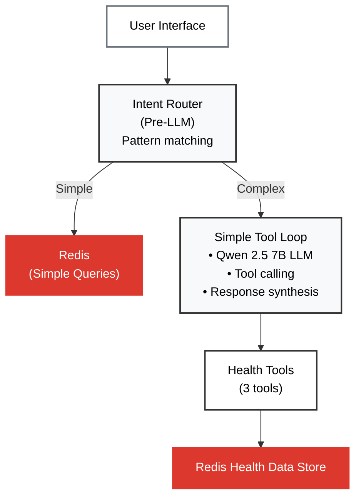

# Stateless Agent Architecture

## 1. Overview

This document explains the **internal architecture of the stateless agent**: how it operates with basic tool calling.

### What You'll Learn

- **[Key Technologies](#2-key-technologies)** - LLM and tools
- **[Architecture Overview](#3-architecture-overview)** - Component layers
- **[How It Works](#4-how-it-works)** - Workflow and examples
- **[Related Documentation](#5-related-documentation)** - Links to other docs

---

## 2. What is Stateless?

**Stateless** means the agent has **no memory** between requests. Each query is processed independently with no awareness of previous interactions.

### Key Characteristics

- **No conversation history**: Each request starts fresh
- **No context retention**: Previous queries and responses are not stored
- **No learning**: Agent doesn't improve or adapt over time
- **No user preferences**: Goals and patterns are not remembered

### How It Works

Every request to a stateless agent:
1. Receives only the current user message
2. Processes it in isolation
3. Returns a response
4. Forgets everything

The next request has zero knowledge of what came before.

### Example

```
Request 1: "What was my heart rate yesterday?"
Response: "Your average heart rate yesterday was 72 bpm."

Request 2: "Is that good?"
Response: "I need more information. What value are you referring to?"
```

The agent doesn't remember "that" refers to "72 bpm" from the previous exchange.

---

## 3. Key Technologies

**What's Included:**
- **Qwen 2.5 7B**: Function-calling LLM (via Ollama) that reads tool docstrings and autonomously decides which tools to call
- **Simple Tool Loop**: Up to 8 iterations of tool calling
- **Intent Router**: Pre-LLM pattern matching for simple goal queries (fast path, returns immediately)
- **3 Health Tools**: `get_health_metrics`, `get_sleep_analysis`, `get_workout_data`

**What's Deliberately Excluded:**
- ❌ NO conversation history (forgets previous messages)
- ❌ NO LangGraph (no StateGraph, no checkpointing)
- ❌ NO RedisVL (no vector search, no episodic/procedural memory)
- ❌ NO memory tools (`get_my_goals`, `get_tool_suggestions` not available)
- ❌ NO semantic memory (no long-term knowledge base)
- ❌ NO Redis storage (except through tools that read existing health data)

---

## 3. Architecture Overview

The stateless agent uses **intent routing** and a **simple tool-calling loop**:



### Layer Responsibilities

1. **Intent Router**: Pre-LLM pattern matching for simple queries (<100ms, returns immediately)
2. **Simple Tool Loop**: Iterative tool calling
3. **Tool Layer**: 3 LLM-callable health tools
   - `get_health_metrics`
   - `get_sleep_analysis`
   - `get_workout_data`

---

## 4. How It Works

### Workflow

The stateless agent routes queries through: intent routing → simple tool loop → response:

```mermaid
%%{init: {'theme':'base', 'themeVariables': { 'fontSize':'14px', 'edgeLabelBackground':'#f8f9fa'}, 'flowchart': {'nodeSpacing': 25, 'rankSpacing': 25}}}%%
flowchart TB
    Query["User Query"]
    Router{"Intent Router"}
    GoalOp["Simple Queries<br/>"]
    LLM["Qwen 2.5 7B<br/>(Ollama LLM)"]
    Decision{"Which tool?"}
    HealthTools["Health Data Tools<br/>get_health_metrics<br/>get_sleep_analysis<br/>get_workout_data"]
    DataSource["Redis Health Data Store"]
    Loop{"More data?"}
    Response["&nbsp;&nbsp;&nbsp;&nbsp;&nbsp;&nbsp;&nbsp;&nbsp;&nbsp;&nbsp;&nbsp;&nbsp;&nbsp;&nbsp;&nbsp;&nbsp;&nbsp;&nbsp;&nbsp;&nbsp;Response&nbsp;&nbsp;&nbsp;&nbsp;&nbsp;&nbsp;&nbsp;&nbsp;&nbsp;&nbsp;&nbsp;&nbsp;&nbsp;&nbsp;&nbsp;&nbsp;&nbsp;&nbsp;&nbsp;&nbsp;"]

    Query --> Router
    Router -->|"Simple Query"
    Router -->|"Complex"| LLM
    GoalOp --> Response
    LLM --> Decision
    Decision --> HealthTools
    Decision -->|"Has answer"| Response
    HealthTools -->|"Read only"| DataSource
    DataSource --> Loop
    Loop -->|Yes| LLM
    Loop -->|No| Response

    style Query fill:#fff,stroke:#333,stroke-width:2px
    style Router fill:#fff,stroke:#333,stroke-width:2px
    style GoalOp fill:#fff,stroke:#333,stroke-width:2px
    style LLM fill:#fff,stroke:#333,stroke-width:2px
    style Decision fill:#fff,stroke:#333,stroke-width:2px
    style HealthTools fill:#fff,stroke:#6c757d,stroke-width:2px
    style DataSource fill:#dc382d,stroke:#dc382d,stroke-width:2px,color:#fff
    style Loop fill:#fff,stroke:#333,stroke-width:2px
    style Response fill:#fff,stroke:#333,stroke-width:2px,min-width:500px
```

### Tool → Data Source Mapping

Tools read existing health data from Redis:

| Data Source | Storage Type | Tools That Use It | What's Stored |
|-------------|--------------|-------------------|---------------|
| `health:*` | Redis (read-only) | `get_health_metrics`<br/>`get_sleep_analysis` | Heart rate, steps, weight, BMI, sleep |
| `workout:*` | Redis (read-only) | `get_workout_data` | Workout records and indexes |

### Key Components

#### Intent Router (Fast Path)

Pattern-based routing for simple goal queries. Returns immediately without LLM.

**What are "simple queries"?**
- Simple queries: "My goal is X", "What are my goals?", "Delete my goals"
- Pattern matching on keywords: "goal", "target", "my goals"
- Direct Redis hash operations (no LLM, no vector search)
- Benefits: <100ms response, zero tokens, zero LLM cost

**Example:** "My goal is to run 3x per week" → Direct Redis HSET (<100ms, zero tokens)

**Note:** Intent router bypasses LLM entirely for simple queries.

#### Simple Tool Loop

Basic iterative tool calling without persistence:

**How it works:**
1. User query → LLM with tools
2. LLM decides to call tool → Execute tool
3. Tool result → Back to LLM
4. Repeat up to 8 times (MAX_TOOL_ITERATIONS)
5. Final response

### Real Example: Health Query

```
User: "What was my average heart rate last week?"
```

**Step 1: LLM decides to call tool**
```python
{"tool_calls": [{"name": "get_health_metrics", "args": {"metric": "HeartRate", "days": 7}}]}
```

**Step 2: Tool retrieves data from Redis**
```python
result = {"average": 72, "unit": "bpm", "days": 7}
```

**Step 3: LLM synthesizes response**
> "Your average heart rate last week was 72 bpm."

---

## 5. Related Documentation

- **[02_THE_DEMO.md](02_THE_DEMO.md)** - Side-by-side demo comparison
- **[STATEFUL_AGENT.md](STATEFUL_AGENT.md)** - Stateful agent architecture
- **[03_MEMORY_ARCHITECTURE.md](03_MEMORY_ARCHITECTURE.md)** - Memory system details
- **[04_AUTONOMOUS_AGENTS.md](04_AUTONOMOUS_AGENTS.md)** - Tool-calling patterns
