# Stateless vs Stateful Agent Comparison

## 1. Overview

This document provides a **comprehensive side-by-side comparison** of the stateless and stateful agents. Both use the same LLM (Qwen 2.5 7B) and same health tools - the **only difference is memory**.

This comparison shows **exactly** what Redis memory systems add to AI agents.

### What You'll Learn

- **[Architecture Comparison](#2-architecture-comparison)** - Side-by-side system diagrams
- **[Feature Comparison](#3-feature-comparison)** - What each agent can and cannot do
- **[Tool Comparison](#4-tool-comparison)** - 3 vs 5 tools explained
- **[Performance Comparison](#5-performance-comparison)** - Speed, memory, capabilities
- **[Related Documentation](#6-related-documentation)** - Deep dives into each agent

---

## 2. Architecture Comparison

### Stateless Agent (No Memory)

```mermaid
flowchart TB
    UI["User Interface"]
    Router["Intent Router<br/>(Pre-LLM)<br/>Pattern matching"]

    Simple["Redis<br/>(Simple Queries)"]
    SimpleLoop["Simple Tool Loop<br/>• Qwen 2.5 7B LLM<br/>• Tool calling<br/>• Response synthesis"]

    Tools["Health Tools<br/>(3 tools)"]
    RedisData["Redis Health Data Store"]
    Forget["❌ FORGET EVERYTHING"]

    UI --> Router
    Router -->|"Simple"| Simple
    Router -->|"Complex"| SimpleLoop
    Simple --> RedisData
    SimpleLoop --> Tools
    Tools --> RedisData
    RedisData --> Forget

    style UI fill:#fff,stroke:#6c757d,stroke-width:2px,color:#000
    style Router fill:#f8f9fa,stroke:#333,stroke-width:2px,color:#000
    style Simple fill:#dc382d,stroke:#dc382d,stroke-width:2px,color:#fff
    style SimpleLoop fill:#f8f9fa,stroke:#333,stroke-width:2px,color:#000
    style Tools fill:#fff,stroke:#333,stroke-width:2px,color:#000
    style RedisData fill:#dc382d,stroke:#dc382d,stroke-width:2px,color:#fff
    style Forget fill:#fff,stroke:#dc3545,stroke-width:2px,color:#dc3545,stroke-dasharray: 5 5
```



### Stateful Agent (With Memory)


### Key Differences

| Component | Stateless | Stateful |
|-----------|-----------|----------|
| **Orchestration** | Simple loop | LangGraph StateGraph |
| **Conversation History** | ❌ None | ✅ Redis checkpointing |
| **Tools** | 3 (health only) | 5 (health + memory) |
| **Vector Search** | ❌ None | ✅ RedisVL HNSW |
| **Memory Storage** | ❌ None | ✅ Episodic + Procedural |
| **Context Awareness** | ❌ None | ✅ Full conversation |

---

## 3. Feature Comparison

### What Both Agents Can Do ✅

| Feature | Stateless | Stateful |
|---------|-----------|----------|
| **Single-turn queries** | ✅ | ✅ |
| **Health data retrieval** | ✅ | ✅ |
| **Tool calling** | ✅ | ✅ |
| **Multi-step tool chains** | ✅ | ✅ |
| **Compound queries in one turn** | ✅ | ✅ |

**Example**: "What was my heart rate yesterday?" - Both answer correctly.

### What Only Stateful Can Do ✅

| Feature | Stateless | Stateful |
|---------|-----------|----------|
| **Follow-up questions** | ❌ | ✅ |
| **Pronoun resolution** | ❌ | ✅ |
| **Multi-turn reasoning** | ❌ | ✅ |
| **Goal awareness** | ❌ | ✅ |
| **Pattern learning** | ❌ | ✅ |
| **Cross-session memory** | ❌ | ✅ |

### Real Examples

#### Follow-Up Questions

**Query**: "How many workouts?" → "What's the most common type?"

| Agent | Response to Follow-Up |
|-------|----------------------|
| **Stateless** | ❌ "What are you referring to? Please provide context." |
| **Stateful** | ✅ "Traditional Strength Training (40 workouts, 26% of total)" |

**Memory Used**: Short-term checkpointing

---

#### Pronoun Resolution

**Query**: "When was my last workout?" → "How long was it?"

| Agent | Response to "it" |
|-------|------------------|
| **Stateless** | ❌ "How long was what? Please specify." |
| **Stateful** | ✅ "45 minutes" |

**Memory Used**: Short-term checkpointing

---

#### Goal Awareness

**Query**: "Am I on track for my weight goal?"

| Agent | Response |
|-------|----------|
| **Stateless** | ❌ "I don't have information about your goals. What's your target?" |
| **Stateful** | ✅ "Your goal is 125 lbs by December. Current: 136.8 lbs. You've lost 8.2 lbs - great progress!" |

**Memory Used**: Episodic memory (RedisVL vector search)

---

#### Pattern Learning

**Query 1**: "Compare my activity this month vs last month" (first time)

| Agent | Performance |
|-------|-------------|
| **Stateless** | 2.8s (figures out tools) |
| **Stateful** | 2.8s (learns pattern) |

**Query 2**: Same question asked again

| Agent | Performance |
|-------|-------------|
| **Stateless** | 2.8s (figures out again) |
| **Stateful** | 1.9s (retrieves pattern - 32% faster) |

**Memory Used**: Procedural memory (workflow patterns)

---

## 4. Tool Comparison

### Tools Available to Each Agent

#### Stateless Agent: 3 Health Tools

| Tool | Purpose | Code Location |
|------|---------|---------------|
| `get_health_metrics` | Heart rate, steps, weight, BMI | `apple_health/query_tools/get_health_metrics.py` |
| `get_sleep_analysis` | Sleep data and efficiency | `apple_health/query_tools/get_sleep_analysis.py` |
| `get_workout_data` | Workout lists, patterns, progress | `apple_health/query_tools/get_workout_data.py` |

**Total**: 3 tools (health data only)

---

#### Stateful Agent: 5 Tools (3 Health + 2 Memory)

| Tool | Purpose | Code Location |
|------|---------|---------------|
| `get_health_metrics` | Heart rate, steps, weight, BMI | `apple_health/query_tools/get_health_metrics.py` |
| `get_sleep_analysis` | Sleep data and efficiency | `apple_health/query_tools/get_sleep_analysis.py` |
| `get_workout_data` | Workout lists, patterns, progress | `apple_health/query_tools/get_workout_data.py` |
| **`get_my_goals`** 🆕 | Retrieve user goals (vector search) | `apple_health/query_tools/memory_tools.py` |
| **`get_tool_suggestions`** 🆕 | Retrieve learned patterns (vector search) | `apple_health/query_tools/memory_tools.py` |

**Total**: 5 tools (health + memory)

### Tool Code Example

```python
# From: backend/src/apple_health/query_tools/__init__.py

def create_user_bound_tools(user_id, include_memory_tools=True):
    tools = [
        create_get_health_metrics_tool(user_id),
        create_get_sleep_analysis_tool(user_id),
        create_get_workout_data_tool(user_id),
    ]

    # Memory tools (only for stateful agent)
    if include_memory_tools:
        memory_tools = create_memory_tools()
        tools.extend(memory_tools)  # Adds get_my_goals, get_tool_suggestions

    return tools

# Stateless usage:
tools = create_user_bound_tools(user_id, include_memory_tools=False)

# Stateful usage:
tools = create_user_bound_tools(user_id, include_memory_tools=True)
```

---

## 5. Performance Comparison

### Response Times

| Metric | Stateless | Stateful | Notes |
|--------|-----------|----------|-------|
| **First query** | 2.8s | 2.8s | Same (no prior context) |
| **Follow-up query** | ❌ Fails | 2.1s | Stateful understands context |
| **Goal-based query** | ❌ Fails | 3.2s | Includes vector search |
| **Repeat similar query** | 2.8s | 1.9s | Stateful learns patterns |

### Memory Overhead

| Metric | Stateless | Stateful |
|--------|-----------|----------|
| **RAM per session** | 0 KB | ~170 KB |
| **Redis storage** | 0 KB | ~150 KB per user |
| **Conversation history** | None | 100 messages (7-month TTL) |
| **Goals stored** | None | ~10 goals with embeddings |
| **Patterns stored** | None | ~20 workflow patterns |

### Token Usage

| Query Type | Stateless | Stateful | Difference |
|------------|-----------|----------|------------|
| **Simple query** | ~150 tokens | ~150 tokens | Same |
| **Follow-up** | ~150 tokens | ~400 tokens | +250 (conversation history) |
| **Goal query** | ❌ Fails | ~600 tokens | +450 (vector search results) |

**Key Insight**: Stateful uses more tokens but provides intelligent responses. Stateless uses fewer tokens but fails at context.

---

## 6. Related Documentation

- **[03_STATELESS_AGENT.md](03_STATELESS_AGENT.md)** - Detailed stateless agent architecture
- **[04_STATEFUL_AGENT.md](04_STATEFUL_AGENT.md)** - Detailed stateful agent architecture
- **[10_MEMORY_ARCHITECTURE.md](10_MEMORY_ARCHITECTURE.md)** - Four-layer memory system deep dive
- **[09_EXAMPLE_QUERIES.md](09_EXAMPLE_QUERIES.md)** - Try these queries in the demo
- **[02_QUICKSTART.md](02_QUICKSTART.md)** - Run the demo to see the difference

---

**Key takeaway:** Both agents use the same LLM and tools, but Redis memory transforms the stateful agent from isolated Q&A into intelligent conversation with context awareness, goal recall, and pattern learning - proving memory is essential for AI intelligence.
