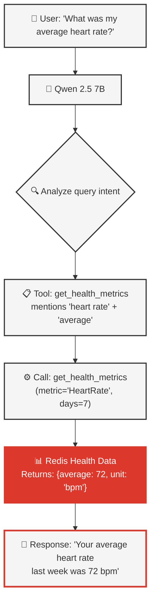
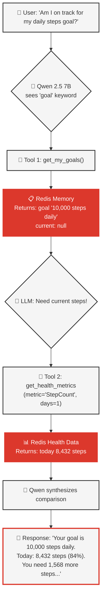
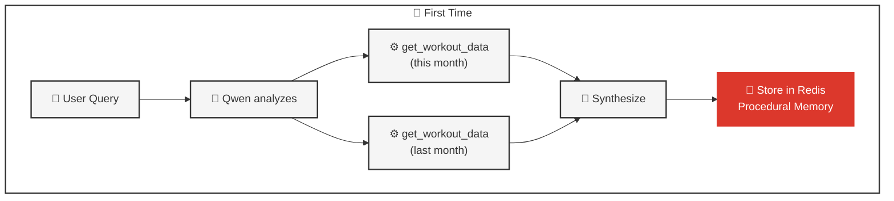
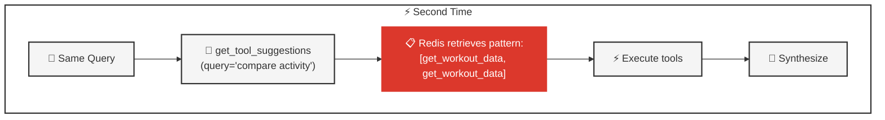

# Agentic RAG: Autonomous Tool Calling

## 1. Overview

**Agentic RAG** = Retrieval-Augmented Generation where the AI **autonomously decides** which tools to call and when. No hardcoded logic - the LLM makes all decisions based on query analysis.

This is the core pattern that makes both agents (stateless and stateful) intelligent at data retrieval.

### What You'll Learn

- **[What is Agentic RAG](#2-what-is-agentic-rag)** - Autonomous vs hardcoded tool calling
- **[How Qwen Chooses Tools](#3-how-qwen-chooses-tools)** - Tool docstrings and decision-making
- **[Tool Chaining Strategies](#4-tool-chaining-strategies)** - Multi-step autonomous workflows
- **[Intent Routing](#5-intent-routing)** - Fast path for simple queries
- **[Workflow Optimization](#6-workflow-optimization)** - Performance patterns
- **[Real Examples](#7-real-examples)** - Actual queries and tool selections
- **[Related Documentation](#8-related-documentation)** - Deep dives into tools and agents

---

## 2. What is Agentic RAG?

**Agentic RAG** is a paradigm shift in how AI systems interact with data retrieval tools. Instead of developers writing explicit routing logic to determine which tool to call for each query type, the AI agent itself analyzes the user's intent and autonomously selects the appropriate tools to fulfill the request.

Think of it as the difference between:
- **Traditional approach**: A waiter following a rigid script ("If customer says 'pasta', go to Italian menu")
- **Agentic approach**: An intelligent assistant who understands your needs and knows where to find the right information

The "agentic" part means the AI has **agency** - it can:
- Understand natural language variations ("workout" vs "exercise" vs "training session")
- Chain multiple tools together to answer complex questions
- Learn from patterns and adapt its approach
- Decide when it has enough information to respond

Let's compare the two approaches:

### ❌ Traditional RAG (Hardcoded)

**Code Approach:**
```python path=null start=null
# BAD: Hardcoded logic
if "weight" in query:
    tool = search_health_records
elif "workout" in query:
    tool = search_workouts
# ...100+ if/else statements
```

**Problems:**
- Can't handle variations ("fitness" vs "workout")
- Can't chain tools
- Breaks with complex queries
- Requires manual updates

---

### ✅ Agentic RAG (Autonomous)

**Code Approach:**
```python path=null start=null
# GOOD: LLM decides
llm_with_tools = llm.bind_tools([
    get_health_metrics,
    get_sleep_analysis,
    get_workout_data,
    get_my_goals,         # Stateful only
    get_tool_suggestions  # Stateful only
])

response = await llm_with_tools.ainvoke(user_query)
# LLM autonomously picks tools based on query
```

**Benefits:**
- Handles natural language variations
- Chains multiple tools as needed
- Adapts to new patterns
- No code changes required

---

## 3. How Qwen Chooses Tools

### Tool Docstrings as Instructions

Qwen 2.5 7B reads tool docstrings to understand what each tool does. For comprehensive best practices on tool calling with Qwen, see [08_QWEN_BEST_PRACTICES.md](08_QWEN_BEST_PRACTICES.md).

```python path=null start=null
@tool
def get_health_metrics(
    metric_types: list[str],
    time_period: str = "recent",
    aggregations: list[str] | None = None,
) -> dict[str, Any]:
    """
    Get health metrics with optional statistics (raw data OR aggregated).

    USE WHEN user asks:
    - "What was my weight in September?" (raw data)
    - "What was my average heart rate last week?" (statistics)
    - "Show me my BMI trend" (raw data over time)
    - "Total steps this month" (statistics)
    - "Minimum/maximum values" (statistics)

    DO NOT USE for:
    - Trend analysis → use get_trends instead
    - Period comparisons → use get_trends instead
    - Workout data → use get_workouts instead

    Args:
        metric_types: List of metric types (e.g., ["BodyMass"], ["HeartRate"])
        time_period: Natural language time period (default: "recent")
        aggregations: Optional statistics to compute (default: None = raw data)

    Returns health metrics with statistics or raw data.
    """
```

### Decision Process



---

## 4. Tool Chaining Strategies

Agentic RAG enables **autonomous multi-step workflows** with different strategies based on query complexity. See [09_EXAMPLE_QUERIES.md](09_EXAMPLE_QUERIES.md) for real-world examples.

### Simple Chain (Information Dependency)

**Query**: "Am I on track for my daily steps goal?"

**Stateful Agent Workflow** (Autonomous):



**Pattern**: Tool 2 needs Tool 1's result - sequential execution required.

```python path=null start=null
# LLM autonomously chains 2 tools:
1. get_my_goals(query="steps goal")
   → Returns: {"goal": "10,000 steps daily"}

2. get_health_metrics(
       metric_types=["StepCount"],
       time_period="today",
       aggregations=["sum"]
   )
   → Returns: {"sum": "8432 steps"}

3. Synthesizes answer
```

---

### Sequential Execution (Independent Tools)

**Query**: "Show my workouts and sleep patterns this week"

**Pattern**: Tools execute sequentially in the tool loop.

```python path=null start=null
# LLM calls 2 independent tools sequentially:
# Iteration 1: Call get_workout_data
# Iteration 2: Call get_sleep_analysis
# Both complete successfully, then synthesize response

# Note: Current implementation uses sequential tool execution.
# Parallel execution (asyncio.gather) could be a future optimization.
```

---

### Iterative Refinement

**Query**: "Compare my activity this month vs last month"

**Pattern**: LLM realizes it needs more data after seeing initial results.

```python path=null start=null
# LLM iteratively gathers data:
1. get_workout_data(time_period="this month")
   → Sees need for comparison baseline

2. get_workout_data(time_period="last month")
   → Sees both periods available

3. Performs comparison
```

**First time** (2.8s):



**Subsequent times** (1.9s, 32% faster):



---

## 5. Intent Routing

**Pattern**: Pre-LLM routing for simple, deterministic queries to avoid unnecessary LLM calls.

### When to Use Intent Routing

✅ **Use for**: Simple CRUD operations with clear patterns
- "My goal is X" → Direct Redis HSET (<100ms, zero tokens)
- "What are my goals?" → Direct Redis HGET
- "Delete my goals" → Direct Redis DEL

❌ **Don't use for**: Complex queries needing LLM reasoning
- "Am I on track for my goal?" → Needs tool chaining + synthesis
- "Compare my progress" → Needs data aggregation + analysis

### Implementation

```python path=null start=null
# From: backend/src/utils/intent_router.py

async def should_bypass_tools(message: str) -> tuple[bool, str | None, str | None]:
    """Determine if we should bypass tool calling and return a direct response."""
    if is_goal_setting_statement(message):
        goal = extract_goal_from_statement(message)
        response = f"Got it! I've saved your goal: {goal}."
        return True, response, "goal_setting"  # <100ms

    if is_goal_retrieval_question(message):
        goal_text = await retrieve_latest_goal()
        response = f"Your goal: {goal_text}" if goal_text else "You haven't set a goal yet."
        return True, response, "goal_retrieval"  # <100ms

    # No match → continue to LLM
    return False, None, None
```

### Benefits

| **Metric** | **Without Intent Routing** | **With Intent Routing** |
|------------|---------------------------|------------------------|
| **Latency** | ~2.5s (LLM call) | <100ms (direct Redis) |
| **Token Cost** | ~500 tokens | 0 tokens |
| **Accuracy** | 98% (LLM reasoning) | 100% (deterministic) |

---

## 6. Workflow Optimization

### Pattern Learning (Procedural Memory)

**First Time**:
```python path=null start=null
Query: "Compare workouts"
→ LLM figures out tools (2.8s)
→ Stores pattern with success_score=0.95
```

**Subsequent Times**:
```python path=null start=null
Query: "Compare workouts"
→ LLM calls get_tool_suggestions
→ Retrieves stored pattern (1.9s, 32% faster)
```

**Storage**:
```python path=null start=null
# Redis procedural memory
procedural:user123:compare_workouts → {
    "tools": ["get_workout_data", "get_workout_data"],
    "success_score": 0.95,
    "usage_count": 12,
    "avg_latency_ms": 1900
}
```

### Early Stopping

**Pattern**: Stop when you have enough information.

```python path=null start=null
# Don't call more tools if answer is complete
if response.tool_calls:
    execute_tools(response.tool_calls)
else:
    return response.content  # LLM says "done"
```

**Example**:
```python path=null start=null
Query: "How many workouts?"
→ Tool: get_workout_data(time_period="all", include_summary=True)
→ Returns: {"total": 154}
→ LLM: "You have 154 workouts" (stops, no more tools)
```

### Max Iterations

**Pattern**: Prevent infinite loops in tool calling.

```python path=null start=null
# Stateless: MAX_TOOL_ITERATIONS = 8
# Stateful: LANGGRAPH_RECURSION_LIMIT = 32

for iteration in range(MAX_ITERATIONS):
    if no_tool_calls:
        break
    if iteration >= MAX_ITERATIONS:
        return "Query too complex, please simplify"
```

**Real-world limits**:
- 95% of queries: 1-3 tool calls
- 4% of queries: 4-6 tool calls
- 1% of queries: 7-8 tool calls (hit limit)

---

## 7. Real Examples

### Simple Query (Single Tool)

**Query**: "How many workouts do I have?"

**Tool Selected**: `get_workout_data`

```python path=null start=null
{
    "tool_calls": [{
        "name": "get_workout_data",
        "args": {
            "time_period": "all",
            "include_summary": True
        }
    }]
}
```

**Response**: "You have 154 workouts recorded."

---

### Complex Query (Multiple Tools)

**Query**: "Show my workout pattern and tell me if I'm improving"

**Tools Selected**: 3 tool calls

```python path=null start=null
[
    {"name": "get_workout_data", "args": {"time_period": "recent", "include_patterns": True}},
    {"name": "get_workout_data", "args": {"time_period": "recent", "include_progress": True}},
    {"name": "get_my_goals", "args": {"query": "workout frequency"}}
]
```

**Response**: "You work out most on Fridays (24 workouts). Your frequency increased 50% this month, which aligns with your goal of 3x/week."

---

### Goal Query (Memory + Health Tools)

**Query**: "Am I hitting my step goal today?"

**Tools Selected** (Stateful only):

```python path=null start=null
[
    {"name": "get_my_goals", "args": {"query": "steps goal"}},
    {"name": "get_health_metrics", "args": {
        "metric_types": ["StepCount"],
        "time_period": "today",
        "aggregations": ["sum"]
    }}
]
```

**Response**: "Your goal is 10,000 steps daily. Today you have 8,432 steps (84%)."

---

## 8. Related Documentation

- **[03_STATELESS_AGENT.md](03_STATELESS_AGENT.md)** - Agentic RAG without memory
- **[04_STATEFUL_AGENT.md](04_STATEFUL_AGENT.md)** - Agentic RAG with memory
- **[08_QWEN_BEST_PRACTICES.md](08_QWEN_BEST_PRACTICES.md)** - Optimizing tool calling
- **[10_MEMORY_ARCHITECTURE.md](10_MEMORY_ARCHITECTURE.md)** - Procedural memory patterns
- **[09_EXAMPLE_QUERIES.md](09_EXAMPLE_QUERIES.md)** - See tool selection in action

---

**Key takeaway:** Agentic RAG lets the LLM autonomously decide which tools to call based on query analysis, enabling natural language understanding, tool chaining, adaptive workflows, and performance optimizations through intent routing and pattern learning - creating AI systems that improve over time without hardcoded logic.
