# Agentic RAG: Autonomous Tool Calling

## 1. Overview

**Agentic RAG** = Retrieval-Augmented Generation where the AI **autonomously decides** which tools to call and when. No hardcoded logic - the LLM makes all decisions based on query analysis.

This is the core pattern that makes both agents (stateless and stateful) intelligent at data retrieval.

### What You'll Learn

- **[What is Agentic RAG](#2-what-is-agentic-rag)** - Autonomous vs hardcoded tool calling
- **[How Qwen Chooses Tools](#3-how-qwen-chooses-tools)** - Tool docstrings and decision-making
- **[Tool Chaining Strategies](#4-tool-chaining-strategies)** - Multi-step autonomous workflows
- **[Intent Routing](#5-intent-routing)** - Fast path for simple queries
- **[Workflow Optimization](#6-workflow-optimization)** - Performance patterns
- **[Real Examples](#7-real-examples)** - Actual queries and tool selections
- **[Related Documentation](#8-related-documentation)** - Deep dives into tools and agents

---

## 2. What is Agentic RAG?

**Agentic RAG** is a paradigm shift in how AI systems interact with data retrieval tools. Instead of developers writing explicit routing logic to determine which tool to call for each query type, the AI agent itself analyzes the user's intent and autonomously selects the appropriate tools to fulfill the request.

Think of it as the difference between:
- **Traditional approach**: A waiter following a rigid script ("If customer says 'pasta', go to Italian menu")
- **Agentic approach**: An intelligent assistant who understands your needs and knows where to find the right information

The "agentic" part means the AI has **agency** - it can:
- Understand natural language variations ("workout" vs "exercise" vs "training session")
- Chain multiple tools together to answer complex questions
- Learn from patterns and adapt its approach
- Decide when it has enough information to respond

Let's compare the two approaches:

### ❌ Traditional RAG (Hardcoded)

**Code Approach:**
```python
# BAD: Hardcoded logic
if "weight" in query:
    tool = search_health_records
elif "workout" in query:
    tool = search_workouts
# ...100+ if/else statements
```

**Problems:**
- Can't handle variations ("fitness" vs "workout")
- Can't chain tools
- Breaks with complex queries
- Requires manual updates

---

### ✅ Agentic RAG (Autonomous)

**Code Approach:**
```python
# GOOD: LLM decides
llm_with_tools = llm.bind_tools([
    get_health_metrics,
    get_sleep_analysis,
    get_workout_data,
    get_my_goals,         # Stateful only
    get_tool_suggestions  # Stateful only
])

response = await llm_with_tools.ainvoke(user_query)
# LLM autonomously picks tools based on query
```

**Benefits:**
- Handles natural language variations
- Chains multiple tools as needed
- Adapts to new patterns
- No code changes required

---

## 3. How Qwen Chooses Tools

### Tool Docstrings as Instructions

Qwen 2.5 7B reads tool docstrings to understand what each tool does. For comprehensive best practices on tool calling with Qwen, see [08_QWEN_BEST_PRACTICES.md](08_QWEN_BEST_PRACTICES.md).

```python
@tool
def get_health_metrics(metric: str, days: int):
    """
    🔢 RETRIEVE health metrics: heart rate, steps, weight, BMI.

    ⚠️ USE THIS TOOL WHEN USER ASKS FOR:
    - "heart rate", "pulse", "bpm"
    - "steps", "walking", "distance"
    - "weight", "mass", "lbs", "kg"
    - "BMI", "body mass index"
    - Statistics: "average", "min", "max", "total"

    ❌ DO NOT USE for:
    - Sleep data (use get_sleep_analysis)
    - Workouts (use get_workout_data)
    - Goals (use get_my_goals)  # Stateful only

    Returns health metrics with statistics.
    """
```

### Decision Process

```mermaid
flowchart LR
    A["👤 User: 'What was my average heart rate?'"] --> B[🤖 Qwen 2.5 7B]
    B --> C{🔍 Analyze query intent}
    C --> D["📋 Tool: get_health_metrics<br/>mentions 'heart rate' + 'average'"]
    D --> E["⚙️ Call: get_health_metrics<br/>(metric='HeartRate', days=7)"]
    E --> F["📊 Redis Health Data<br/>Returns: {average: 72, unit: 'bpm'}"]
    F --> G["💬 Response: 'Your average heart rate<br/>last week was 72 bpm'"]

    style A fill:#f5f5f5,stroke:#333,stroke-width:2px
    style B fill:#f5f5f5,stroke:#333,stroke-width:2px
    style C fill:#f5f5f5,stroke:#333,stroke-width:2px
    style D fill:#f5f5f5,stroke:#333,stroke-width:2px
    style E fill:#f5f5f5,stroke:#333,stroke-width:2px
    style F fill:#DC382C,stroke:#DC382C,stroke-width:2px,color:#fff
    style G fill:#f5f5f5,stroke:#DC382C,stroke-width:3px
```



---

## 4. Tool Chaining Strategies

Agentic RAG enables **autonomous multi-step workflows** with different strategies based on query complexity. See [09_EXAMPLE_QUERIES.md](09_EXAMPLE_QUERIES.md) for real-world examples.

### Simple Chain (Information Dependency)

**Query**: "Am I on track for my weight goal?"

**Stateful Agent Workflow** (Autonomous):

```mermaid
flowchart LR
    A["👤 User: 'Am I on track for my weight goal?'"] --> B{🤖 Qwen 2.5 7B<br/>sees 'goal' keyword}
    B --> C["🎯 Tool 1: get_my_goals()"]
    C --> D["📋 Redis Memory<br/>Returns: goal '125 lbs by December'<br/>current: null"]
    D --> E{🤔 LLM: Need current weight!}
    E --> F["⚖️ Tool 2: get_health_metrics<br/>(metric='BodyMass')"]
    F --> G["📊 Redis Health Data<br/>Returns: latest 136.8 lb"]
    G --> H["🧮 Qwen synthesizes comparison"]
    H --> I["💬 Response: 'Your goal is 125 lbs.<br/>Current: 136.8 lbs.<br/>You need to lose 11.8 lbs...'"]

    style A fill:#f5f5f5,stroke:#333,stroke-width:2px
    style B fill:#f5f5f5,stroke:#333,stroke-width:2px
    style C fill:#f5f5f5,stroke:#333,stroke-width:2px
    style D fill:#DC382C,stroke:#DC382C,stroke-width:2px,color:#fff
    style E fill:#f5f5f5,stroke:#333,stroke-width:2px
    style F fill:#f5f5f5,stroke:#333,stroke-width:2px
    style G fill:#DC382C,stroke:#DC382C,stroke-width:2px,color:#fff
    style H fill:#f5f5f5,stroke:#333,stroke-width:2px
    style I fill:#f5f5f5,stroke:#DC382C,stroke-width:3px
```



**Pattern**: Tool 2 needs Tool 1's result - sequential execution required.

```python
# LLM autonomously chains 2 tools:
1. get_my_goals(query="weight goal")
   → Returns: {"goal": "125 lbs"}

2. get_health_metrics(metric="BodyMass")
   → Returns: {"latest": 136.8}

3. Synthesizes answer
```

---

### Parallel Execution (Independent Tools)

**Query**: "Show my workouts and sleep patterns this week"

**Pattern**: No dependencies - execute in parallel for speed.

```python
# LLM calls 2 independent tools:
results = await asyncio.gather(
    get_workout_data(days=7),
    get_sleep_analysis(days=7)
)
# ~1.2s total (vs 2.4s sequential)
```

---

### Iterative Refinement

**Query**: "Compare my activity this month vs last month"

**Pattern**: LLM realizes it needs more data after seeing initial results.

```python
# LLM iteratively gathers data:
1. get_workout_data(period="this month")
   → Sees need for comparison baseline

2. get_workout_data(period="last month")
   → Sees both periods available

3. Performs comparison
```

**First time** (2.8s):

```mermaid
flowchart LR
    subgraph first["🔵 First Time"]
        A1[👤 User Query] --> B1[🤖 Qwen analyzes]
        B1 --> C1["⚙️ get_workout_data<br/>(this month)"]
        B1 --> C2["⚙️ get_workout_data<br/>(last month)"]
        C1 --> D1[💬 Synthesize]
        C2 --> D1
        D1 --> E1["💾 Store in Redis<br/>Procedural Memory"]
    end

    style first fill:#fff,stroke:#333,stroke-width:2px
    style A1 fill:#f5f5f5,stroke:#333,stroke-width:2px
    style B1 fill:#f5f5f5,stroke:#333,stroke-width:2px
    style C1 fill:#f5f5f5,stroke:#333,stroke-width:2px
    style C2 fill:#f5f5f5,stroke:#333,stroke-width:2px
    style D1 fill:#f5f5f5,stroke:#333,stroke-width:2px
    style E1 fill:#DC382C,stroke:#DC382C,stroke-width:2px,color:#fff
```



**Subsequent times** (1.9s, 32% faster):

```mermaid
flowchart LR
    subgraph second["⚡ Second Time"]
        A2[👤 Same Query] --> B2["🧠 get_tool_suggestions<br/>(query='compare activity')"]
        B2 --> C3["📋 Redis retrieves pattern:<br/>[get_workout_data, get_workout_data]"]
        C3 --> D2[⚡ Execute tools]
        D2 --> E2[💬 Synthesize]
    end

    style second fill:#fff,stroke:#333,stroke-width:2px
    style A2 fill:#f5f5f5,stroke:#333,stroke-width:2px
    style B2 fill:#f5f5f5,stroke:#333,stroke-width:2px
    style C3 fill:#DC382C,stroke:#DC382C,stroke-width:2px,color:#fff
    style D2 fill:#f5f5f5,stroke:#333,stroke-width:2px
    style E2 fill:#f5f5f5,stroke:#333,stroke-width:2px
```



---

## 5. Intent Routing

**Pattern**: Pre-LLM routing for simple, deterministic queries to avoid unnecessary LLM calls.

### When to Use Intent Routing

✅ **Use for**: Simple CRUD operations with clear patterns
- "My goal is X" → Direct Redis HSET (<100ms, zero tokens)
- "What are my goals?" → Direct Redis HGET
- "Delete my goals" → Direct Redis DEL

❌ **Don't use for**: Complex queries needing LLM reasoning
- "Am I on track for my goal?" → Needs tool chaining + synthesis
- "Compare my progress" → Needs data aggregation + analysis

### Implementation

```python
# From: backend/src/utils/intent_bypass_handler.py

async def handle_intent_bypass(message: str, user_id: str):
    # Pattern matching for goals
    if re.search(r'\bgoal\b.*\bis\b', message, re.IGNORECASE):
        return await set_goal(user_id, message)  # <100ms

    if re.search(r'what.*goals', message, re.IGNORECASE):
        return await get_goals(user_id)  # <100ms

    # No match → continue to LLM
    return None
```

### Benefits

| **Metric** | **Without Intent Routing** | **With Intent Routing** |
|------------|---------------------------|------------------------|
| **Latency** | ~2.5s (LLM call) | <100ms (direct Redis) |
| **Token Cost** | ~500 tokens | 0 tokens |
| **Accuracy** | 98% (LLM reasoning) | 100% (deterministic) |

---

## 6. Workflow Optimization

### Pattern Learning (Procedural Memory)

**First Time**:
```python
Query: "Compare workouts"
→ LLM figures out tools (2.8s)
→ Stores pattern with success_score=0.95
```

**Subsequent Times**:
```python
Query: "Compare workouts"
→ LLM calls get_tool_suggestions
→ Retrieves stored pattern (1.9s, 32% faster)
```

**Storage**:
```python
# Redis procedural memory
procedural:user123:compare_workouts → {
    "tools": ["get_workout_data", "get_workout_data"],
    "success_score": 0.95,
    "usage_count": 12,
    "avg_latency_ms": 1900
}
```

### Early Stopping

**Pattern**: Stop when you have enough information.

```python
# Don't call more tools if answer is complete
if response.tool_calls:
    execute_tools(response.tool_calls)
else:
    return response.content  # LLM says "done"
```

**Example**:
```python
Query: "How many workouts?"
→ Tool: get_workout_data(include_summary=True)
→ Returns: {"total": 154}
→ LLM: "You have 154 workouts" (stops, no more tools)
```

### Max Iterations

**Pattern**: Prevent infinite loops in tool calling.

```python
# Stateless: MAX_TOOL_ITERATIONS = 8
# Stateful: LANGGRAPH_RECURSION_LIMIT = 50

for iteration in range(MAX_ITERATIONS):
    if no_tool_calls:
        break
    if iteration >= MAX_ITERATIONS:
        return "Query too complex, please simplify"
```

**Real-world limits**:
- 95% of queries: 1-3 tool calls
- 4% of queries: 4-6 tool calls
- 1% of queries: 7-8 tool calls (hit limit)

---

## 7. Real Examples

### Simple Query (Single Tool)

**Query**: "How many workouts do I have?"

**Tool Selected**: `get_workout_data`

```python
{
    "tool_calls": [{
        "name": "get_workout_data",
        "args": {"include_summary": True}
    }]
}
```

**Response**: "You have 154 workouts recorded."

---

### Complex Query (Multiple Tools)

**Query**: "Show my workout pattern and tell me if I'm improving"

**Tools Selected**: 3 tool calls

```python
[
    {"name": "get_workout_data", "args": {"include_patterns": True}},
    {"name": "get_workout_data", "args": {"include_progress": True}},
    {"name": "get_my_goals", "args": {"query": "workout frequency"}}
]
```

**Response**: "You work out most on Fridays (24 workouts). Your frequency increased 50% this month, which aligns with your goal of 3x/week."

---

### Goal Query (Memory + Health Tools)

**Query**: "Am I hitting my step goal today?"

**Tools Selected** (Stateful only):

```python
[
    {"name": "get_my_goals", "args": {"query": "steps goal"}},
    {"name": "get_health_metrics", "args": {"metric": "StepCount", "days": 1}}
]
```

**Response**: "Your goal is 10,000 steps daily. Today you have 8,432 steps (84%)."

---

## 8. Related Documentation

- **[03_STATELESS_AGENT.md](03_STATELESS_AGENT.md)** - Agentic RAG without memory
- **[04_STATEFUL_AGENT.md](04_STATEFUL_AGENT.md)** - Agentic RAG with memory
- **[08_QWEN_BEST_PRACTICES.md](08_QWEN_BEST_PRACTICES.md)** - Optimizing tool calling
- **[10_MEMORY_ARCHITECTURE.md](10_MEMORY_ARCHITECTURE.md)** - Procedural memory patterns
- **[09_EXAMPLE_QUERIES.md](09_EXAMPLE_QUERIES.md)** - See tool selection in action

---

**Key takeaway:** Agentic RAG lets the LLM autonomously decide which tools to call based on query analysis, enabling natural language understanding, tool chaining, adaptive workflows, and performance optimizations through intent routing and pattern learning - creating AI systems that improve over time without hardcoded logic.
