# Example Queries: Stateless vs Stateful

See why memory transforms AI from simple Q&A into intelligent conversation.

### ❌ Stateless Agent (No Memory)

```mermaid
%%{init: {'theme':'base', 'themeVariables': { 'fontSize':'14px'}, 'flowchart': {'nodeSpacing': 50, 'rankSpacing': 60}}}%%
flowchart LR
    S1["👤 Turn 1:<br/>'What was my heart rate?'"]
    S2["📊 Redis Health Data"]
    S3["💬 '72 bpm'"]
    S4["👤 Turn 2:<br/>'Is that good?'"]
    S5["❌ No context!<br/>What are you<br/>referring to?"]

    S1 --> S2
    S2 --> S3
    S3 -."forgets everything".-> S4
    S4 --> S5

    style S1 fill:#f5f5f5,stroke:#333,stroke-width:2px
    style S2 fill:#DC382C,stroke:#DC382C,stroke-width:2px,color:#fff
    style S3 fill:#f5f5f5,stroke:#333,stroke-width:2px
    style S4 fill:#f5f5f5,stroke:#333,stroke-width:2px
    style S5 fill:#f5f5f5,stroke:#333,stroke-width:2px
```



### ✅ Stateful Agent (With Memory)

```mermaid
%%{init: {'theme':'base', 'themeVariables': { 'fontSize':'14px'}, 'flowchart': {'nodeSpacing': 50, 'rankSpacing': 60}}}%%
flowchart LR
    T1["👤 Turn 1:<br/>'What was my heart rate?'"]
    T2["📊 Redis Health Data"]
    T3["💬 '72 bpm'"]
    T4["💾 Save to Redis<br/>Checkpoint"]
    T5["👤 Turn 2:<br/>'Is that good?'"]
    T6["💾 Load from Redis<br/>(sees '72 bpm')"]
    T7["✅ '72 bpm is within<br/>normal range...'"]

    T1 --> T2
    T2 --> T3
    T3 --> T4
    T4 --> T5
    T5 --> T6
    T6 --> T7

    style T1 fill:#f5f5f5,stroke:#333,stroke-width:2px
    style T2 fill:#DC382C,stroke:#DC382C,stroke-width:2px,color:#fff
    style T3 fill:#f5f5f5,stroke:#333,stroke-width:2px
    style T4 fill:#DC382C,stroke:#DC382C,stroke-width:2px,color:#fff
    style T5 fill:#f5f5f5,stroke:#333,stroke-width:2px
    style T6 fill:#DC382C,stroke:#DC382C,stroke-width:2px,color:#fff
    style T7 fill:#f5f5f5,stroke:#DC382C,stroke-width:3px
```



## Quick Index

1. [Basic Queries](#basic-queries) - Both agents work the same
2. [Follow-up Questions](#follow-up-questions) - Where stateless breaks
3. [Goal Memory](#goal-memory) - Remembering user goals
4. [Pattern Learning](#pattern-learning) - Getting faster over time
5. [Tool Chaining](#tool-chaining) - Multi-step reasoning

---

## Basic Queries

**Both agents work the same on first queries** - memory isn't needed yet.

**Note:** The stateful agent IS building checkpoint state from the start (via LangGraph), but it hasn't accumulated enough context to show a difference yet. Memory becomes valuable on follow-up questions.

```
"What was my average heart rate last week?"
→ Both: "Your average heart rate last week was 72 bpm."

"How many calories did I burn this month?"
→ Both: "You burned 2,847 calories across 12 workouts this month."
```

---

## Follow-up Questions

**Stateless agents forget. Stateful agents remember** using [short-term memory](10_MEMORY_ARCHITECTURE.md#1%EF%B8%8F%E2%83%A3-short-term-memory) via LangGraph checkpointing.

### Example 1: Workout Types

```
You: "Tell me about my recent workouts"
Both: "You have 154 workouts recorded in the past 30 days."

You: "What's the most common type?"
Stateless: ❌ "What are you referring to?"
Stateful:  ✅ "Traditional Strength Training (40 workouts, 26%)."
```

**Why**: Stateful remembers "workouts" from previous turn via LangGraph checkpointing.

### Example 2: Calories Burned

```
You: "When was my last cycling workout?"
Both: "October 17, 2024 at 4:19 PM."

You: "How many calories did I burn?"
Stateless: ❌ "Which workout are you asking about?"
Stateful:  ✅ "420 calories during that cycling workout."
```

### Example 3: Pronoun Resolution

```
You: "Show me my workouts from last Friday"
Both: "Cycling (45 min, 420 cal) and Yoga (30 min, 150 cal)."

You: "Which one was more intense?"
Stateless: ❌ "Which workouts are you comparing?"
Stateful:  ✅ "Cycling - 142 bpm vs 98 bpm, and 2.8x more calories/min."
```

---

## Goal Memory

**Stateful agents use RedisVL vector search to remember your goals** through [episodic memory](10_MEMORY_ARCHITECTURE.md#2%EF%B8%8F%E2%83%A3-episodic-memory).

### Weight Goal

```
You: "Am I on track for my weight goal?"

Stateless: ❌ "I don't have information about your goals."
Stateful:  ✅ "Your goal is 125 lbs by December. Current: 136.8 lbs.
               You've lost 8.2 lbs since September - excellent progress!"

Tools: get_my_goals (episodic memory via RedisVL) → get_health_metrics
Redis Keys: episodic:{user_id}:{event_type}:{timestamp}
Example: episodic:wellness_user:goal:1729962000
```

### Step Goal

```
You: "How close am I to my step goal?"

Stateless: ❌ "What's your daily target?"
Stateful:  ✅ "Goal: 10,000 steps. Today: 8,432 (84% complete)."
```

**How it works**: LLM autonomously calls `get_my_goals` tool when queries mention goals.

---

## Pattern Learning

**Stateful agents learn which tools work for which queries** using [procedural memory](10_MEMORY_ARCHITECTURE.md#3%EF%B8%8F%E2%83%A3-procedural-memory).

```
Query: "Compare my activity this month vs last month"

First time:
  Stateless: 2.8s (figures out tools)
  Stateful:  2.8s (same - no pattern yet)

Second time:
  Stateless: 2.8s (figures out again)
  Stateful:  1.9s (32% faster - pattern known)
```

Stateful stores successful workflows in procedural memory:

```python
# Redis Key: procedure:{user_id}:{query_hash}
{
    "query": "Compare activity this month vs last",
    "query_type": "activity_comparison",
    "tools_used": ["get_workout_data", "get_health_metrics"],
    "success_score": 0.95,
    "execution_time_ms": 2800,
    "embedding": [...]  # 1024-dim vector for similarity search
}
```

---

## Tool Chaining

**Stateful agents chain tools autonomously for complete answers.** See [06_AGENTIC_RAG.md](06_AGENTIC_RAG.md) for detailed tool chaining patterns.

### Workout Progress

```
You: "Show me my workout pattern and tell me if I'm improving"

Stateless:
  → Calls get_workout_data
  → Lists workouts
  → Stops

Stateful:
  → Calls get_workout_data(include_patterns=True, include_progress=True)
  → Calls get_my_goals("workout frequency goal")
  → "You work out most on Fridays (24) and Mondays (18).
      Frequency up 50% this month, aligns with 3x/week goal!"
```

### BMI + Goals

```
You: "What's my BMI and is it healthy for my goals?"

Stateless:
  → "BMI 22.1 (normal range). Generally 18.5-24.9 is healthy."

Stateful:
  → Calls get_health_metrics (BMI)
  → Calls get_my_goals (weight target)
  → "BMI 22.1 (normal). Your 125 lb goal = 20.8 BMI (still healthy).
      You're 11.8 lbs away."
```

---

## Multi-Turn Conversations

**Stateful maintains full conversation context.**

```
Turn 1: "What was my heart rate during workouts last week?"
Both: "Average workout heart rate: 142 bpm."

Turn 2: "How does that compare to this week?"
Stateless: ❌ "What are you comparing?"
Stateful:  ✅ "This week: 156 bpm (14 bpm higher, 10% increase)."

Turn 3: "Is the trend concerning?"
Stateless: ❌ "What trend?"
Stateful:  ✅ "Not concerning if you intensified workouts.
               You replaced walking with cycling this week,
               which explains the higher heart rate."
```

**Memory layers used**: 
- **Short-term** (LangGraph checkpointing for conversation context)
- **Episodic** (RedisVL vector search for user goals)
- **Procedural** (RedisVL vector search for learned tool patterns)
- **Semantic** (optional - not actively used in this demo)

---

## Related Docs

- [03_STATELESS_AGENT.md](03_STATELESS_AGENT.md) - Stateless implementation
- [04_STATEFUL_AGENT.md](04_STATEFUL_AGENT.md) - Stateful implementation
- [06_AGENTIC_RAG.md](06_AGENTIC_RAG.md) - Tool calling patterns
- [10_MEMORY_ARCHITECTURE.md](10_MEMORY_ARCHITECTURE.md) - Memory system
- [05_STATELESS_VS_STATEFUL_COMPARISON.md](05_STATELESS_VS_STATEFUL_COMPARISON.md) - Try these queries

**Key takeaway**: Memory transforms AI from isolated Q&A into intelligent conversation.
