# Memory Architecture for AI Agents

## 1. Overview

This document explains the **four-layer memory architecture** that transforms the stateful agent from stateless chat into an intelligent system. Based on the [CoALA (Cognitive Architecture for Language Agents)](https://arxiv.org/pdf/2309.02427) framework.

**Key Point**: Each memory type serves a different purpose - together they enable human-like intelligence.

**Further Reading**: [Build smarter AI agents: Manage short-term and long-term memory with Redis](https://redis.io/blog/build-smarter-ai-agents-manage-short-term-and-long-term-memory-with-redis/)

### What You'll Learn

- **[Four Memory Types](#2-four-memory-types)** - Short-term, episodic, procedural, semantic
- **[Redis Storage Patterns](#3-redis-storage-patterns)** - How each memory type is stored
- **[Memory Retrieval](#4-memory-retrieval)** - When and how memory is accessed
- **[Memory Storage](#5-memory-storage)** - Automatic storage after responses
- **[Related Documentation](#6-related-documentation)** - Implementation details

---

## 2. Four Memory Types

```mermaid
flowchart TD
    User[👤 User Query] --> Agent[🤖 Qwen 2.5 7B]

    Agent --> STM["💭 Short-Term Memory<br/>(LangGraph Checkpointing)<br/><br/>Recent conversation<br/>Automatic load<br/><br/>Enables: Follow-ups,<br/>pronoun resolution"]
    Agent --> EM["🎯 Episodic Memory<br/>(RedisVL Vector Search)<br/><br/>Goals & facts<br/>Permanent storage<br/>Cross-session recall<br/><br/>Example: 'My goal is<br/>never skip leg day'"]
    Agent --> PM["🔧 Procedural Memory<br/>(RedisVL Vector Search)<br/><br/>Learned patterns<br/>Permanent storage<br/>Speeds up queries<br/><br/>Example: 'For activity<br/>comparisons, use<br/>get_workout_data +<br/>get_health_metrics'"]
    Agent --> SM["🧠 Semantic Memory<br/>(RedisVL Vector Search)<br/><br/>Domain knowledge<br/>Permanent storage<br/>Optional<br/><br/>Example: 'Normal HR<br/>is 60-100 bpm'"]

    STM --> Redis[(Redis<br/>Checkpoint<br/>Storage)]
    EM --> RedisVL[(RedisVL<br/>Vector Indexes<br/>1024-dim HNSW)]
    PM --> RedisVL
    SM --> RedisVL

    Redis --> Response[💬 Contextual Response]
    RedisVL --> Response

    style User fill:#f5f5f5,stroke:#333,stroke-width:2px
    style Agent fill:#f5f5f5,stroke:#333,stroke-width:2px
    style STM fill:#f5f5f5,stroke:#333,stroke-width:2px
    style EM fill:#f5f5f5,stroke:#333,stroke-width:2px
    style PM fill:#f5f5f5,stroke:#333,stroke-width:2px
    style SM fill:#f5f5f5,stroke:#333,stroke-width:2px
    style Redis fill:#DC382C,stroke:#DC382C,stroke-width:2px,color:#fff
    style RedisVL fill:#DC382C,stroke:#DC382C,stroke-width:2px,color:#fff
    style Response fill:#f5f5f5,stroke:#DC382C,stroke-width:3px
```



### 1️⃣ Short-Term Memory

**Purpose**: Recent conversation within current session

**Storage**: Redis via LangGraph checkpointing

**Enables**: Follow-up questions, pronoun resolution

**Example**:
```
User: "What was my heart rate?"
Agent: "72 bpm average"
User: "Is that good?" ← Remembers "that" = 72 bpm
```

**Redis Keys**: Managed by `AsyncRedisSaver` (LangGraph checkpoint format)

[📄 View implementation](../backend/src/agents/stateful_rag_agent.py)

---

### 2️⃣ Episodic Memory

**Purpose**: Important user facts and goals

**Storage**: RedisVL HNSW vector index

**Persistence**: Long-term storage

**Enables**: Cross-session goal recall

**Example**:
```
User (Day 1): "My goal is to never skip leg day"
→ Stored with embedding

User (Day 30): "Am I on track with my leg day goal?"
→ Vector search retrieves goal
Agent: "Your goal is to never skip leg day. You've worked out legs 8 times this month..."
```

**Redis Keys**: `episodic:{user_id}:{event_type}:{timestamp}` (e.g., `episodic:wellness_user:goal:1729737600`)

[📄 View service](../backend/src/services/episodic_memory_manager.py) | [📄 View tools](../backend/src/apple_health/query_tools/memory_tools.py)

---

### 3️⃣ Procedural Memory

**Purpose**: Successful workflow patterns

**Storage**: RedisVL HNSW vector index

**Persistence**: Long-term storage

**Enables**: Learning which tools work for which queries

**Example**:
```
Query 1: "Compare activity this month vs last"
→ LLM figures out: get_workout_data + get_health_metrics
→ Stores successful pattern with embedding

Query 2: Similar comparison query
→ Retrieves pattern (32% faster)
```

**Redis Keys**: `procedural:{pattern_hash}:{timestamp}` (e.g., `procedural:a1b2c3d4e5f6:1729737600`)

[📄 View service](../backend/src/services/procedural_memory_manager.py) | [📄 View tools](../backend/src/apple_health/query_tools/memory_tools.py)

---

### 4️⃣ Semantic Memory (Optional)

**Purpose**: General domain knowledge

**Storage**: RedisVL HNSW vector index

**Persistence**: Long-term storage

**Enables**: Background health knowledge

**Example**: Medical facts like "Normal resting heart rate is 60-100 bpm"

**Redis Keys**: `semantic:{category}:{fact_type}:{timestamp}` (e.g., `semantic:cardio:definition:1729737600`)

[📄 View service](../backend/src/services/semantic_memory_manager.py)

---

## 3. Redis Storage Patterns

### Short-Term (LangGraph Checkpointing)

[📄 View implementation](../backend/src/agents/stateful_rag_agent.py)

```python
# Automatic via LangGraph AsyncRedisSaver
checkpointer = AsyncRedisSaver(redis_url="redis://localhost:6379")

# Stores conversation turns
{
    "messages": [
        {"role": "user", "content": "What was my heart rate?"},
        {"role": "assistant", "content": "72 bpm average"},
        {"role": "user", "content": "Is that good?"}
    ],
    "metadata": {"step": 2, "timestamp": 1729962000}
}
```

---

### Episodic (RedisVL Vector Index)

[📄 View implementation](../backend/src/services/episodic_memory_manager.py)

```python
# Stored with 1024-dim embeddings
{
    "user_id": "wellness_user",
    "event_type": "goal",
    "timestamp": 1729962000,
    "description": "Goal is to never skip leg day",
    "metadata": {"metric": "workout", "category": "lower_body"},
    "embedding": <1024 floats from mxbai-embed-large>
}

# Vector search for retrieval
query_embedding = generate_embedding("leg day goal")
results = episodic_index.search(query_embedding, top_k=3)
```

---

### Procedural (RedisVL Vector Index)

[📄 View implementation](../backend/src/services/procedural_memory_manager.py)

```python
# Stored after successful workflows
{
    "query": "Compare activity this month vs last",
    "query_type": "comparison",
    "tools_used": ["get_workout_data", "get_health_metrics"],
    "success_score": 0.95,
    "execution_time_ms": 2800,
    "embedding": <1024 floats>
}

# Vector search for similar queries
query_embedding = generate_embedding("compare workouts")
patterns = procedural_index.search(query_embedding, top_k=3)
```

---

## 4. Memory Retrieval

### Automatic (Short-Term)

**When**: Every request

**How**: LangGraph checkpointer loads conversation history automatically

```python
# Happens transparently
config = {"configurable": {"thread_id": session_id}}
result = await graph.ainvoke(input_state, config)
# Checkpointer injects conversation history
```

---

### Autonomous (All Tools - Including Memory)

**When**: LLM autonomously decides based on query

**How**: LLM has access to ALL tools (3 health + 2 memory) and decides which to call

[📄 View all tools](../backend/src/apple_health/query_tools/) | [📄 View agent workflow](../backend/src/agents/stateful_rag_agent.py)

**Available Tools:**

*Health Tools:*
- `get_health_metrics` - Query health data (heart rate, steps, weight, BMI, trends)
- `get_sleep_analysis` - Query sleep data with daily aggregation
- `get_workout_data` - Query ALL workout data (lists, patterns, progress)

*Memory Tools:*
- `get_my_goals` - Retrieve user goals via vector search
- `get_tool_suggestions` - Retrieve successful workflow patterns

```python
# Example: LLM sees query mentions "goal"
# → Autonomously calls get_my_goals tool

@tool
async def get_my_goals(query: str, top_k: int = 3) -> str:
    """Retrieve user goals via vector search."""
    embedding = await generate_embedding(query)
    result = await episodic_memory.retrieve_goals(
        user_id="wellness_user",
        query=query,
        top_k=top_k
    )
    return result.get("context", "No goals found.")
```

**Key Point**: The LLM decides which tools (if any) to call based on the query. Memory retrieval is not forced upfront—it's autonomous like all other tool calls.

---

## 5. Memory Storage

### When Memory is Stored

**After every response**, the stateful agent automatically:

1. **Reflects** on workflow success (evaluates metrics)
2. **Extracts facts** from conversation (goals, preferences)
3. **Stores episodic** memory if goals found
4. **Stores procedural** patterns if `success_score >= 0.7` (70% threshold)

```python
# LangGraph workflow nodes (actual implementation)
workflow.add_node("reflect", self._reflect_node)
workflow.add_node("store_episodic", self._store_episodic_node)
workflow.add_node("store_procedural", self._store_procedural_node)

# Flow: llm → tools (loop) → reflect → store_episodic → store_procedural → END
```

### Storage Logic

[📄 View workflow nodes](../backend/src/agents/stateful_rag_agent.py) | [📄 View fact extractor](../backend/src/utils/conversation_fact_extractor.py)

**Actual Implementation:**

```python
# Episodic storage: Extract goals from user messages
async def _store_episodic_node(self, state: MemoryState) -> dict[str, Any]:
    # Find last user message
    user_msg = None
    for msg in reversed(state["messages"]):
        if isinstance(msg, HumanMessage):
            user_msg = msg
            break
    
    if not user_msg:
        return {}
    
    # Extract goals using regex patterns
    facts = self.fact_extractor.extract_facts([user_msg])
    user_id = state["user_id"]
    
    # Store each goal in episodic memory
    for goal in facts.get("goals", []):
        await self.episodic.store_goal(
            user_id=user_id,
            metric="weight",  # For now, assume weight goals
            value=float(goal["value"]),
            unit=goal["unit"],
        )
        logger.info(f"💾 Stored goal: {goal['value']} {goal['unit']}")
    
    return {}

# Procedural storage: Store if success_score >= 0.7
async def _store_procedural_node(self, state: MemoryState) -> dict[str, Any]:
    # Evaluate workflow success
    evaluation = self.procedural.evaluate_workflow(
        tools_used=tools_used,
        tool_results=tool_results,
        response_generated=response_generated,
        execution_time_ms=execution_time_ms,
    )
    
    # Store only if successful (score >= 0.7)
    if evaluation.get("success"):
        await self.procedural.store_pattern(
            query=user_msg.content,
            tools_used=tools_used,
            success_score=evaluation.get("success_score", 0.0),
            execution_time_ms=execution_time_ms,
        )
        logger.info(f"✅ Stored procedural pattern (score: {evaluation.get('success_score'):.2%})")
    else:
        logger.info(f"⏭️ Skipped procedural storage (score: {evaluation.get('success_score'):.2%})")
    
    return {}
```

**Key Points:**
- Episodic storage: Only stores **goals** extracted via regex patterns (not all facts)
- Procedural storage: Requires `success_score >= 0.7` (70% threshold) to store patterns
- Success evaluation: Checks for tool errors, response generation, and execution time < 30s

---

## 6. Related Documentation

### Internal Docs
- **[04_STATEFUL_AGENT.md](04_STATEFUL_AGENT.md)** - How stateful agent uses memory
- **[11_REDIS_PATTERNS.md](11_REDIS_PATTERNS.md)** - Redis data structures in detail
- **[12_LANGGRAPH_CHECKPOINTING.md](12_LANGGRAPH_CHECKPOINTING.md)** - Short-term memory deep dive
- **[05_STATELESS_VS_STATEFUL_COMPARISON.md](05_STATELESS_VS_STATEFUL_COMPARISON.md)** - Memory impact
- **[09_EXAMPLE_QUERIES.md](09_EXAMPLE_QUERIES.md)** - See memory in action

### External Resources
- **[CoALA Framework Paper](https://arxiv.org/pdf/2309.02427)** - Cognitive Architecture for Language Agents (academic foundation)
- **[Redis AI Memory Blog](https://redis.io/blog/build-smarter-ai-agents-manage-short-term-and-long-term-memory-with-redis/)** - Practical guide to agentic memory with Redis

---

**Key takeaway:** Four memory types work together - short-term for conversation flow, episodic for facts/goals, procedural for learned patterns, and semantic for domain knowledge - enabling human-like AI intelligence through Redis storage and RedisVL vector search.
