# Memory Architecture for AI Agents

## 1. Overview

This document explains the **four-layer memory architecture** that transforms the stateful agent from stateless chat into an intelligent system. Based on the CoALA (Cognitive Architecture for Language Agents) framework.

**Key Point**: Each memory type serves a different purpose - together they enable human-like intelligence.

### What You'll Learn

- **[Four Memory Types](#2-four-memory-types)** - Short-term, episodic, procedural, semantic
- **[Redis Storage Patterns](#3-redis-storage-patterns)** - How each memory type is stored
- **[Memory Retrieval](#4-memory-retrieval)** - When and how memory is accessed
- **[Memory Storage](#5-memory-storage)** - Automatic storage after responses
- **[Related Documentation](#6-related-documentation)** - Implementation details

---

## 2. Four Memory Types

```mermaid
flowchart TD
    User[👤 User Query] --> Agent[🤖 Qwen 2.5 7B]

    Agent --> STM["💭 Short-Term Memory<br/>(LangGraph Checkpointing)<br/>Recent conversation"]
    Agent --> EM["🎯 Episodic Memory<br/>(RedisVL Vector Search)<br/>Goals & facts"]
    Agent --> PM["🧠 Procedural Memory<br/>(RedisVL Vector Search)<br/>Learned patterns"]
    Agent --> SM["📚 Semantic Memory<br/>(RedisVL Vector Search)<br/>Domain knowledge"]

    STM --> Redis[(Redis)]
    EM --> RedisVL[(RedisVL)]
    PM --> RedisVL
    SM --> RedisVL

    Redis --> Response[💬 Contextual Response]
    RedisVL --> Response

    subgraph legend["Memory Characteristics"]
        L1["💭 Short-Term: 7 months TTL, automatic"]
        L2["🎯 Episodic: Permanent, cross-session"]
        L3["🧠 Procedural: Permanent, speeds up queries"]
        L4["📚 Semantic: Permanent, optional"]
    end

    style User fill:#f5f5f5,stroke:#333,stroke-width:2px
    style Agent fill:#f5f5f5,stroke:#333,stroke-width:2px
    style STM fill:#f5f5f5,stroke:#333,stroke-width:2px
    style EM fill:#f5f5f5,stroke:#333,stroke-width:2px
    style PM fill:#f5f5f5,stroke:#333,stroke-width:2px
    style SM fill:#f5f5f5,stroke:#333,stroke-width:2px
    style Redis fill:#DC382C,stroke:#DC382C,stroke-width:3px,color:#fff
    style RedisVL fill:#DC382C,stroke:#DC382C,stroke-width:3px,color:#fff
    style Response fill:#f5f5f5,stroke:#DC382C,stroke-width:3px
    style legend fill:#fff,stroke:#ddd,stroke-width:1px
    style L1 fill:#fff,stroke:none
    style L2 fill:#fff,stroke:none
    style L3 fill:#fff,stroke:none
    style L4 fill:#fff,stroke:none
```



### 1️⃣ Short-Term Memory

**Purpose**: Recent conversation within current session
**Storage**: Redis via LangGraph checkpointing
**TTL**: 7 months
**Enables**: Follow-up questions, pronoun resolution

**Example**:
```
User: "What was my heart rate?"
Agent: "72 bpm average"
User: "Is that good?" ← Remembers "that" = 72 bpm
```

**Redis Keys**: `langgraph:checkpoint:{session_id}:*`

---

### 2️⃣ Episodic Memory

**Purpose**: Important user facts and goals
**Storage**: RedisVL HNSW vector index
**TTL**: Permanent
**Enables**: Cross-session goal recall

**Example**:
```
User (Day 1): "My weight goal is 125 lbs by December"
→ Stored with embedding

User (Day 30): "Am I on track for my weight goal?"
→ Vector search retrieves goal
Agent: "Your goal is 125 lbs. Current: 136.8 lbs..."
```

**Redis Keys**: `episodic:{user_id}:goal:{timestamp}`

---

### 3️⃣ Procedural Memory

**Purpose**: Successful workflow patterns
**Storage**: RedisVL HNSW vector index
**TTL**: Permanent
**Enables**: Learning which tools work for which queries

**Example**:
```
Query 1: "Compare activity this month vs last"
→ LLM figures out: get_workout_data + get_health_metrics
→ Stores successful pattern with embedding

Query 2: Similar comparison query
→ Retrieves pattern (32% faster)
```

**Redis Keys**: `procedural:pattern:{timestamp}`

---

### 4️⃣ Semantic Memory (Optional)

**Purpose**: General domain knowledge
**Storage**: RedisVL HNSW vector index
**TTL**: Permanent
**Enables**: Background health knowledge

**Example**: Medical facts like "Normal resting heart rate is 60-100 bpm"

**Redis Keys**: `semantic:{category}:{timestamp}`

---

## 3. Redis Storage Patterns

### Short-Term (LangGraph Checkpointing)

```python
# Automatic via LangGraph AsyncRedisSaver
checkpointer = AsyncRedisSaver(redis_url="redis://localhost:6379")

# Stores conversation turns
{
    "messages": [
        {"role": "user", "content": "What was my heart rate?"},
        {"role": "assistant", "content": "72 bpm average"},
        {"role": "user", "content": "Is that good?"}
    ],
    "metadata": {"step": 2, "timestamp": 1729962000}
}
```

---

### Episodic (RedisVL Vector Index)

```python
# Stored with 1024-dim embeddings
{
    "user_id": "wellness_user",
    "event_type": "goal",
    "timestamp": 1729962000,
    "description": "Weight goal is 125 lbs by December",
    "metadata": {"metric": "weight", "value": 125, "unit": "lbs"},
    "embedding": <1024 floats from mxbai-embed-large>
}

# Vector search for retrieval
query_embedding = generate_embedding("weight goal")
results = episodic_index.search(query_embedding, top_k=3)
```

---

### Procedural (RedisVL Vector Index)

```python
# Stored after successful workflows
{
    "query": "Compare activity this month vs last",
    "query_type": "comparison",
    "tools_used": ["get_workout_data", "get_health_metrics"],
    "success_score": 0.95,
    "execution_time_ms": 2800,
    "embedding": <1024 floats>
}

# Vector search for similar queries
query_embedding = generate_embedding("compare workouts")
patterns = procedural_index.search(query_embedding, top_k=3)
```

---

## 4. Memory Retrieval

### Automatic (Short-Term)

**When**: Every request
**How**: LangGraph checkpointer loads conversation history automatically

```python
# Happens transparently
config = {"configurable": {"thread_id": session_id}}
result = await graph.ainvoke(input_state, config)
# Checkpointer injects conversation history
```

---

### Autonomous (Episodic & Procedural)

**When**: LLM decides based on query
**How**: LLM calls memory tools

```python
# LLM sees query mentions "goal"
# → Autonomously calls get_my_goals tool

@tool
def get_my_goals(query: str):
    """Retrieve user goals via vector search."""
    embedding = generate_embedding(query)
    results = episodic_index.search(embedding, top_k=3)
    return results
```

---

## 5. Memory Storage

### When Memory is Stored

**After every response**, the stateful agent automatically:

1. **Extracts facts** from conversation
2. **Evaluates workflow** success
3. **Stores episodic** memory (if facts found)
4. **Stores procedural** patterns (if successful)

```python
# LangGraph workflow nodes
workflow.add_node("reflect", self._reflect_node)
workflow.add_node("store_episodic", self._store_episodic_node)
workflow.add_node("store_procedural", self._store_procedural_node)

# Flow: llm → tools → reflect → store_episodic → store_procedural
```

### Storage Logic

```python
async def _store_episodic_node(self, state):
    # Extract facts from conversation
    facts = extract_facts(state["messages"])

    for fact in facts:
        if is_worth_remembering(fact):
            embedding = generate_embedding(fact)
            await episodic_memory.store(
                text=fact,
                embedding=embedding,
                user_id=state["user_id"]
            )

async def _store_procedural_node(self, state):
    # Store if workflow was successful
    if success_score >= 0.7:
        pattern = {
            "query": user_query,
            "tools_used": tools_used,
            "success_score": success_score
        }
        embedding = generate_embedding(pattern["query"])
        await procedural_memory.store(pattern, embedding)
```

---

## 6. Related Documentation

- **[04_STATEFUL_AGENT.md](04_STATEFUL_AGENT.md)** - How stateful agent uses memory
- **[11_REDIS_PATTERNS.md](11_REDIS_PATTERNS.md)** - Redis data structures in detail
- **[12_LANGGRAPH_CHECKPOINTING.md](12_LANGGRAPH_CHECKPOINTING.md)** - Short-term memory deep dive
- **[05_STATELESS_VS_STATEFUL_COMPARISON.md](05_STATELESS_VS_STATEFUL_COMPARISON.md)** - Memory impact
- **[09_EXAMPLE_QUERIES.md](09_EXAMPLE_QUERIES.md)** - See memory in action

---

**Key takeaway:** Four memory types work together - short-term for conversation flow, episodic for facts/goals, procedural for learned patterns, and semantic for domain knowledge - enabling human-like AI intelligence through Redis storage and RedisVL vector search.
