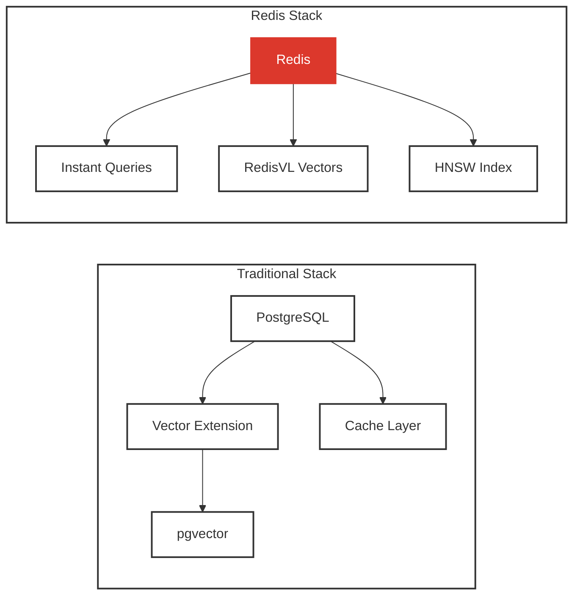
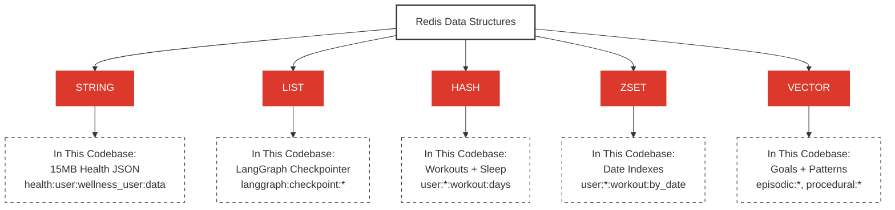
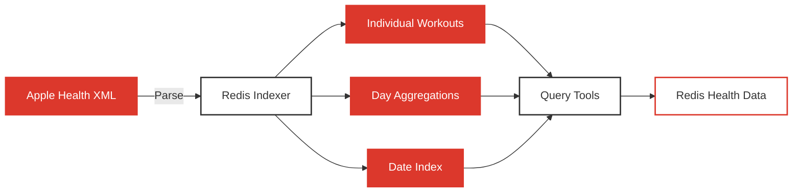
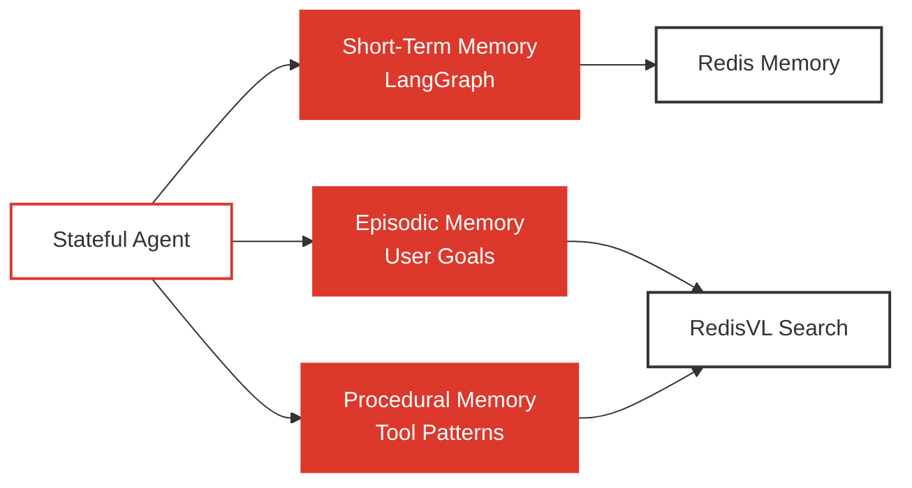

# Redis Data Structures for AI Agents

## 1. Overview

Redis powers the entire memory system with five key data structures. This doc explains **which Redis structures to use when** and **why Redis beats traditional databases** for AI workloads.

### What You'll Learn

- **[Why Redis for AI](#2-why-redis-for-ai)** - Redis vs PostgreSQL comparison
- **[Five Key Structures](#3-five-key-structures)** - STRING, LIST, HASH, ZSET, Vector
- **[Health Data Patterns](#4-health-data-patterns)** - Storing Apple Health data
- **[Memory Patterns](#5-memory-patterns)** - Checkpointing and vector search
- **[Related Documentation](#6-related-documentation)** - Implementation details

---

## 2. Why Redis for AI?



### PostgreSQL Approach (Traditional)

```sql
-- Conversation history
SELECT * FROM messages WHERE session_id = 'abc123' LIMIT 10;

-- Workout aggregations
SELECT day_of_week, COUNT(*) FROM workouts GROUP BY day_of_week;

-- Vector search
-- ❌ Needs pgvector extension, slower performance
```

**Problems**: Network round-trips, join overhead, no native vector search, multiple systems

### Redis Approach (Unified)

```python
# Conversation history - O(1)
conversation = redis.lrange("session:abc123", 0, 9)

# Workout aggregations - O(1)
day_counts = redis.hgetall("workout:days")

# Vector search - native RedisVL
results = episodic_index.search(query_vector)
```

**Benefits**: In-memory speed (50-100x faster), single data store, native vector search

---

## 3. Five Key Structures



### STRING (JSON Blob)

**Use**: Store entire health data export as JSON

```python
# 15 MB health data as single JSON (permanent storage)
from ..utils.redis_keys import RedisKeys

main_key = RedisKeys.health_data("wellness_user")
# Returns: "health:user:wellness_user:data"

redis_client.set(main_key, json.dumps(health_data))
# No TTL - permanent storage for health data
```

**Pros**: Simple, O(1) retrieval, permanent storage
**Cons**: No partial updates, no indexing

**Real code**:
- Storage: [`redis_apple_health_manager.py:59`](../backend/src/services/redis_apple_health_manager.py#L59)
- Key generation: [`redis_keys.py:10-23`](../backend/src/utils/redis_keys.py#L10-L23)

---

### LIST (Conversation History)

**Use**: Automated via LangGraph checkpointing (no manual LIST operations)

```python
# LangGraph uses AsyncRedisSaver for automatic checkpointing
from langgraph.checkpoint.redis.aio import AsyncRedisSaver

# Connection initialized once per agent
checkpointer = AsyncRedisSaver(redis_url="redis://localhost:6379/0")
await checkpointer.asetup()

# Keys created automatically by LangGraph:
# langgraph:checkpoint:{session_id}:{step} → Serialized state
# conversation history stored in checkpoint state
```

**Why AsyncRedisSaver**: Automatic persistence, built-in serialization, survives restarts

**Real code**:
- Checkpointer setup: [`redis_connection.py:255-292`](../backend/src/services/redis_connection.py#L255-L292)
- Agent usage: [`stateful_rag_agent.py:64,146`](../backend/src/agents/stateful_rag_agent.py#L64)

---

### HASH (Workout Details)

**Use**: Store structured data with multiple fields

```python
from ..utils.redis_keys import RedisKeys

# Individual workout (HASH)
workout_key = RedisKeys.workout_detail("wellness_user", "2024-10-22:Cycling:161934")
# Returns: "user:wellness_user:workout:2024-10-22:Cycling:161934"

pipeline.hset(workout_key, mapping={
    "date": "2024-10-22",
    "startDate": "2024-10-22T14:30:00Z",
    "day_of_week": "Tuesday",
    "type": "Cycling",
    "duration_minutes": "45.2",
    "calories": "420"
})
pipeline.expire(workout_key, ttl_seconds)  # 7 months TTL

# Aggregations by day (HASH with atomic increment)
days_key = RedisKeys.workout_days("wellness_user")
# Returns: "user:wellness_user:workout:days"

pipeline.hincrby(days_key, "Tuesday", 1)  # Atomic counter
pipeline.expire(days_key, ttl_seconds)
```

**Why HASH**: O(1) field access, atomic updates, efficient pipelines

**Real code**:
- Workout indexing: [`redis_workout_indexer.py:72`](../backend/src/services/redis_workout_indexer.py#L72) (hincrby for days)
- Workout details: [`redis_workout_indexer.py:93-106`](../backend/src/services/redis_workout_indexer.py#L93-L106) (hset individual workouts)
- Fetching counts: [`redis_workout_indexer.py:151-178`](../backend/src/services/redis_workout_indexer.py#L151-L178) (hgetall)
- Key generation: [`redis_keys.py:90-103,122-135`](../backend/src/utils/redis_keys.py#L90-L103)

---

### ZSET (Date-Sorted Index)

**Use**: Time-series queries

```python
from ..utils.redis_keys import RedisKeys

# Add workout with timestamp score (during indexing)
by_date_key = RedisKeys.workout_by_date("wellness_user")
# Returns: "user:wellness_user:workout:by_date"

workout_id = "2024-10-22:Cycling:161934"
workout_date = datetime.fromisoformat("2024-10-22T14:30:00+00:00")
timestamp = workout_date.timestamp()

pipeline.zadd(by_date_key, {workout_id: timestamp})
pipeline.expire(by_date_key, ttl_seconds)

# Get workouts in date range (O(log N))
workout_ids = client.zrangebyscore(
    by_date_key,
    start_timestamp,
    end_timestamp
)
```

**Why ZSET**: O(log N) range queries, sorted by timestamp, efficient pagination

**Real code**:
- Adding to ZSET: [`redis_workout_indexer.py:85`](../backend/src/services/redis_workout_indexer.py#L85) (zadd with timestamp)
- Range queries: [`redis_workout_indexer.py:180-211`](../backend/src/services/redis_workout_indexer.py#L180-L211) (zrangebyscore)
- Cardinality: [`redis_workout_indexer.py:273-292`](../backend/src/services/redis_workout_indexer.py#L273-L292) (zcard)
- Key generation: [`redis_keys.py:106-119`](../backend/src/utils/redis_keys.py#L106-L119)

---

### Vector (RedisVL HNSW)

**Use**: Semantic search over goals/patterns

```python
from redisvl.index import SearchIndex
from redisvl.schema import IndexSchema
from ..utils.redis_keys import RedisKeys
import numpy as np

# Create vector index
schema = IndexSchema.from_dict({
    "index": {
        "name": RedisKeys.EPISODIC_MEMORY_INDEX,  # "episodic_memory_idx"
        "prefix": RedisKeys.EPISODIC_PREFIX,  # "episodic:"
        "storage_type": "hash"
    },
    "fields": [
        {"name": "user_id", "type": "tag"},
        {"name": "event_type", "type": "tag"},
        {"name": "timestamp", "type": "numeric"},
        {"name": "description", "type": "text"},
        {"name": "metadata", "type": "text"},
        {"name": "embedding", "type": "vector",
         "attrs": {"dims": 1024, "algorithm": "hnsw",
                   "distance_metric": "cosine", "datatype": "float32"}}
    ]
})

episodic_index = SearchIndex(schema=schema)
episodic_index.connect(redis_url)
episodic_index.create(overwrite=False)

# Store goal with embedding
memory_key = RedisKeys.episodic_memory("wellness_user", "goal", 1729962000)
# Returns: "episodic:wellness_user:goal:1729962000"

redis_client.hset(memory_key, mapping={
    "user_id": "wellness_user",
    "event_type": "goal",
    "timestamp": 1729962000,
    "description": "User's weight goal is 125 lbs",
    "metadata": json.dumps({"metric": "weight", "value": 125, "unit": "lbs"}),
    "embedding": np.array(embedding, dtype=np.float32).tobytes()
})
redis_client.expire(memory_key, ttl_seconds)  # 7 months TTL

# Vector search with filters
from redisvl.query import VectorQuery

vector_query = VectorQuery(
    vector=query_embedding,
    vector_field_name="embedding",
    return_fields=["description", "metadata", "timestamp"],
    num_results=3
)
results = episodic_index.query(vector_query)
```

**Why HNSW**: Fast approximate nearest neighbor search, O(log N) complexity, native Redis support

**Real code**:
- Index initialization: [`episodic_memory_manager.py:45-103`](../backend/src/services/episodic_memory_manager.py#L45-L103)
- Goal storage: [`episodic_memory_manager.py:105-176`](../backend/src/services/episodic_memory_manager.py#L105-L176) (store_goal with embedding)
- Goal retrieval: [`episodic_memory_manager.py:177-276`](../backend/src/services/episodic_memory_manager.py#L177-L276) (vector search)
- Key generation: [`redis_keys.py:189-202`](../backend/src/utils/redis_keys.py#L189-L202)
- Index constants: [`redis_keys.py:324-335`](../backend/src/utils/redis_keys.py#L324-L335)

---

## 4. Health Data Patterns



### Workout Storage

```python
# Individual workout (HASH)
user:wellness_user:workout:2024-10-17:Cycling:161934 → HASH {
    "date": "2024-10-17",
    "startDate": "2024-10-17T16:19:34Z",
    "day_of_week": "Thursday",
    "type": "Cycling",
    "duration_minutes": "45.2",
    "calories": "420"
}

# Aggregations by day (HASH with atomic counters)
user:wellness_user:workout:days → HASH {
    "Monday": "18",
    "Tuesday": "22",
    "Wednesday": "19",
    "Thursday": "21",
    "Friday": "24"
}

# Date index (ZSET sorted by timestamp)
user:wellness_user:workout:by_date → ZSET {
    "2024-10-17:Cycling:161934": 1729182000.0,
    "2024-10-18:Running:080000": 1729238400.0
}
```

**Implementation**:
- Indexing: [`redis_workout_indexer.py:31-132`](../backend/src/services/redis_workout_indexer.py#L31-L132)
- Fetching details: [`redis_workout_indexer.py:213-271`](../backend/src/services/redis_workout_indexer.py#L213-L271)
- Used by: [`get_workout_data.py:167-180`](../backend/src/apple_health/query_tools/get_workout_data.py#L167-L180)

### Sleep Storage

```python
# Daily sleep summary (HASH)
user:wellness_user:sleep:2024-10-17 → HASH {
    "date": "2024-10-17",
    "sleep_hours": "7.2",
    "in_bed_hours": "7.8",
    "efficiency": "0.92",
    "bedtime": "2024-10-16T23:15:00Z",
    "wake_time": "2024-10-17T06:27:00Z"
}

# Date index (ZSET)
user:wellness_user:sleep:by_date → ZSET {
    "2024-10-17": 1729123200.0,
    "2024-10-18": 1729209600.0
}
```

**Implementation**:
- Indexing: [`redis_sleep_indexer.py:30-152`](../backend/src/services/redis_sleep_indexer.py#L30-L152)
- Key generation: [`redis_keys.py:140-169`](../backend/src/utils/redis_keys.py#L140-L169)
- Used by: [`get_sleep_analysis.py:100-120`](../backend/src/apple_health/query_tools/get_sleep_analysis.py#L100-L120)

---

## 5. Memory Patterns



### Short-Term (LangGraph Checkpointing)

```python
# Automatic via AsyncRedisSaver (no manual operations needed)
from langgraph.checkpoint.redis.aio import AsyncRedisSaver

# Initialize once per agent
checkpointer = AsyncRedisSaver(redis_url="redis://localhost:6379/0")
await checkpointer.asetup()

# Keys created automatically by LangGraph:
# langgraph:checkpoint:{session_id}:{step_id} → Serialized state
# Includes: messages, tool calls, state snapshots
# TTL: Managed by LangGraph (typically 7 months)

# Usage in agent
graph = workflow.compile(checkpointer=checkpointer)
result = await graph.ainvoke(
    {"messages": [HumanMessage(content="...")]},
    config={"configurable": {"thread_id": session_id}}
)
```

**Real code**:
- Checkpointer setup: [`redis_connection.py:255-292`](../backend/src/services/redis_connection.py#L255-L292)
- Graph compilation: [`stateful_rag_agent.py:146`](../backend/src/agents/stateful_rag_agent.py#L146)
- Session usage: [`redis_chat.py:293-305`](../backend/src/services/redis_chat.py#L293-L305)

### Episodic (RedisVL Vector)

```python
# Goal with vector embedding (HASH with vector field)
episodic:wellness_user:goal:1729962000 → HASH {
    "user_id": "wellness_user",
    "event_type": "goal",
    "timestamp": 1729962000,
    "description": "User's weight goal is 125 lbs",
    "metadata": '{"metric": "weight", "value": 125, "unit": "lbs"}',
    "embedding": <1024-dim float32 bytes>
}

# Vector search powered by HNSW index
# Index name: episodic_memory_idx
# Prefix: episodic:
```

**Real code**:
- Storage: [`episodic_memory_manager.py:144-165`](../backend/src/services/episodic_memory_manager.py#L144-L165)
- Retrieval: [`episodic_memory_manager.py:217-232`](../backend/src/services/episodic_memory_manager.py#L217-L232) (vector query)
- Tool usage: [`memory_tools.py:45-115`](../backend/src/apple_health/query_tools/memory_tools.py#L45-L115) (get_my_goals)

### Procedural (RedisVL Vector)

```python
# Workflow pattern with embedding (HASH with vector field)
procedural:a1b2c3d4:1729962000 → HASH {
    "query_type": "workout_analysis",
    "timestamp": 1729962000,
    "query_description": "workout_analysis: compare activity levels",
    "tools_used": '["get_workout_data", "get_health_metrics"]',
    "success_score": 0.95,
    "execution_time_ms": 2450,
    "metadata": '{}',
    "embedding": <1024-dim float32 bytes>
}

# Vector search powered by HNSW index
# Index name: procedural_memory_idx
# Prefix: procedural:
# Hash: SHA256 of query + tools (first 12 chars)
```

**Real code**:
- Pattern storage: [`procedural_memory_manager.py:313-392`](../backend/src/services/procedural_memory_manager.py#L313-L392) (store_pattern)
- Pattern retrieval: [`procedural_memory_manager.py:394-474`](../backend/src/services/procedural_memory_manager.py#L394-L474) (retrieve_patterns)
- Workflow evaluation: [`procedural_memory_manager.py:476-497`](../backend/src/services/procedural_memory_manager.py#L476-L497)
- Tool usage: [`memory_tools.py:118-187`](../backend/src/apple_health/query_tools/memory_tools.py#L118-L187) (get_tool_suggestions)

---

## 6. Related Documentation

- **[10_MEMORY_ARCHITECTURE.md](10_MEMORY_ARCHITECTURE.md)** - Memory types
- **[12_LANGGRAPH_CHECKPOINTING.md](12_LANGGRAPH_CHECKPOINTING.md)** - Checkpointing deep dive
- **[04_STATEFUL_AGENT.md](04_STATEFUL_AGENT.md)** - How agent uses Redis
- **[07_HOW_TO_IMPORT_APPLE_HEALTH_DATA.md](07_HOW_TO_IMPORT_APPLE_HEALTH_DATA.md)** - Data import patterns

---

**Key takeaway:** Redis provides five data structures (STRING, LIST, HASH, ZSET, Vector) that together enable fast health data storage, conversation history, and semantic memory search - all in one in-memory system.
