# LangGraph Checkpointing: Short-Term Memory

## 1. Overview

LangGraph's **AsyncRedisSaver** provides automatic conversation persistence - the foundation of short-term memory. This doc explains how checkpointing works and why it's essential for stateful agents.

### What You'll Learn

- **[What is Checkpointing](#2-what-is-checkpointing)** - Automatic conversation persistence
- **[AsyncRedisSaver](#3-asyncredissaver)** - Redis-backed checkpointing
- **[How It Works](#4-how-it-works)** - State loading and saving
- **[Benefits](#5-benefits)** - Why checkpointing matters
- **[Related Documentation](#6-related-documentation)** - StateGraph and memory

---

## 2. What is Checkpointing?

**Checkpointing** = Automatically saving agent state after each step so it can be resumed later.


**Without Checkpointing (Stateless)**:
```
User: "What was my heart rate?"
Agent: "72 bpm"
[Forgets everything]

User: "Is that good?"
Agent: ❌ "What are you referring to?"
```

**With Checkpointing (Stateful)**:
```
User: "What was my heart rate?"
Agent: "72 bpm"
[Saves conversation to Redis]

User: "Is that good?"
[Loads conversation from Redis]
Agent: ✅ "72 bpm is in the normal range..."
```

---

## 3. AsyncRedisSaver

### Setup

```python
# From: backend/src/services/redis_connection.py

from langgraph.checkpoint.redis import AsyncRedisSaver

async def get_checkpointer():
    redis_url = "redis://localhost:6379/0"
    checkpointer = AsyncRedisSaver(redis_url=redis_url)
    await checkpointer.asetup()
    return checkpointer
```

**Real code**:
- Checkpointer initialization: [`redis_connection.py:255-292`](../backend/src/services/redis_connection.py#L255-L292)
- Redis URL builder: [`redis_connection.py:309-330`](../backend/src/services/redis_connection.py#L309-L330)

### Integration with LangGraph

```python
# From: backend/src/agents/stateful_rag_agent.py

class StatefulRAGAgent:
    def __init__(self, checkpointer: BaseCheckpointSaver):
        self.checkpointer = checkpointer
        self.graph = self._build_graph()

    def _build_graph(self):
        workflow = StateGraph(MemoryState)
        # ...add nodes...
        return workflow.compile(checkpointer=self.checkpointer)
```

**Real code**:
- Agent initialization: [`stateful_rag_agent.py:59-73`](../backend/src/agents/stateful_rag_agent.py#L59-L73)
- Graph compilation: [`stateful_rag_agent.py:91-146`](../backend/src/agents/stateful_rag_agent.py#L91-L146)

---

## 4. How It Works

```mermaid
%%{init: {'theme':'base', 'themeVariables': { 'fontSize':'14px'}, 'flowchart': {'nodeSpacing': 60, 'rankSpacing': 80}}}%%
flowchart LR
    Start["🧑 User Query"]
    Load["📥 Load from Redis<br/>(if exists)"]
    Execute["⚙️ LangGraph Workflow<br/>(LLM + Tools)"]
    Save["💾 Save to Redis<br/>(after each step)"]
    Response["✅ Return Response"]
    
    Start --> Load
    Load --> Execute
    Execute --> Save
    Save -."Next turn".-> Load
    Execute --> Response
    
    style Start fill:#e9ecef,stroke:#6c757d,stroke-width:2px,color:#000
    style Load fill:#DC382C,stroke:#DC382C,stroke-width:2px,color:#fff
    style Execute fill:#f8f9fa,stroke:#495057,stroke-width:2px,color:#000
    style Save fill:#DC382C,stroke:#DC382C,stroke-width:2px,color:#fff
    style Response fill:#f8f9fa,stroke:#495057,stroke-width:2px,color:#000
```



### State Structure

```python
class MemoryState(TypedDict):
    messages: Annotated[list[BaseMessage], add_messages]
    user_id: str
    episodic_context: str | None
    procedural_patterns: list[dict] | None
    workflow_start_time: int
```

**Real code**:
- State definition: [`stateful_rag_agent.py:47-56`](../backend/src/agents/stateful_rag_agent.py#L47-L56)

### Automatic Saving

After each node execution, LangGraph automatically saves state:

```python
# Happens transparently
config = {"configurable": {"thread_id": session_id}}

# Step 1: Load checkpoint
previous_state = await checkpointer.aget(config)

# Step 2: Execute node
new_state = await node_function(previous_state)

# Step 3: Save checkpoint
await checkpointer.aput(config, new_state)
```

**Real code**:
- Graph execution example: [`stateful_rag_agent.py:270-296`](../backend/src/agents/stateful_rag_agent.py#L270-L296) (invoke method)

### Redis Keys

```bash
# Checkpoint keys
langgraph:checkpoint:{session_id}:{step_number}

# Example
langgraph:checkpoint:abc123:0  # Initial state
langgraph:checkpoint:abc123:1  # After first LLM call
langgraph:checkpoint:abc123:2  # After tool execution
```

**Storage**: LangGraph's AsyncRedisSaver automatically manages checkpoint keys. No manual key management needed.

---

## 5. Benefits

### Follow-Up Questions

**Checkpoint loads conversation history**, enabling context awareness:

```python
# Loaded automatically
messages = [
    HumanMessage("What was my heart rate?"),
    AIMessage("72 bpm average"),
    HumanMessage("Is that good?")  # LLM sees all 3 messages
]
```

### Pronoun Resolution

**Checkpoint provides context** for pronouns:

```python
messages = [
    HumanMessage("When was my last workout?"),
    AIMessage("October 17th"),
    HumanMessage("How long was it?")  # "it" = last workout
]
```

### Session Isolation

**Each session has its own checkpoint** - no cross-contamination:

```bash
langgraph:checkpoint:user1_session1:*
langgraph:checkpoint:user1_session2:*
langgraph:checkpoint:user2_session1:*
```

---

## 6. Related Documentation

- **[04_STATEFUL_AGENT.md](04_STATEFUL_AGENT.md)** - How stateful agent uses checkpointing
- **[10_MEMORY_ARCHITECTURE.md](10_MEMORY_ARCHITECTURE.md)** - Short-term memory layer
- **[11_REDIS_PATTERNS.md](11_REDIS_PATTERNS.md)** - Redis storage patterns
- **[09_EXAMPLE_QUERIES.md](09_EXAMPLE_QUERIES.md)** - See checkpointing in action

---

**Key takeaway:** LangGraph's AsyncRedisSaver automatically persists conversation state in Redis after each step, enabling follow-up questions, pronoun resolution, and multi-turn reasoning without manual state management.
