# Tools, Services & Utils Reference

## 1. Overview

This document provides a comprehensive reference for every tool, service, and utility in the redis-wellness codebase. Each component is categorized by its role in the architecture.

**Key Point**: The codebase follows clean architecture principles with clear separation of concerns.

### What You'll Learn

- **[Query Tools](#2-query-tools)** - LangChain tools callable by AI agents
- **[Services](#3-services)** - Data layer and business logic
- **[Utils](#4-utils)** - Pure utilities and helpers
- **[Component Relationships](#5-component-relationships)** - How everything fits together

---

## 2. Query Tools

**Location**: `backend/src/apple_health/query_tools/`

LangChain tools callable by AI agents - the only functions directly accessible to the LLM.

### 2.1 Health Data Tools

| Tool | Purpose | Example Queries | Key Features |
|------|---------|-----------------|-------------|
| **`get_health_metrics`** | All non-sleep, non-workout data | "What was my heart rate last week?" "Show me weight + BMI trends" | Single/multi-metric queries Trend analysis Aggregations |
| **`get_sleep_analysis`** | Sleep data + efficiency | "How much did I sleep?" "What's my sleep efficiency?" | Daily aggregation Efficiency = asleep/in_bed Multi-session handling |
| **`get_workout_data`** | **ALL** workout queries | "How many workouts?" "What day do I train most?" "Compare cardio vs strength" | Lists, patterns, progress Type-specific queries Comparisons |

[📄 View source files](../backend/src/apple_health/query_tools/)

### 2.2 Memory Tools

| Tool | Purpose | When Used | Performance Impact |
|------|---------|-----------|-------------------|
| **`get_my_goals`** | Retrieve goals from episodic memory (RedisVL) | "What's my weight goal?" "Am I on track?" | Cross-session recall Vector search |
| **`get_tool_suggestions`** | Retrieve workflow patterns from procedural memory | Agent optimization (internal) | 32% faster on repeated queries |

---

## 3. Services

**Location**: `backend/src/services/`

Business logic layer between API endpoints and Redis.

### 3.1 Chat Services
| Service | Purpose | Memory Layers | Key Method | Endpoint |
|---------|---------|---------------|------------|----------|
| **`stateless_chat`** | Baseline (NO memory) | None | `process_message(message)` | `/api/chat/stateless` |
| **`redis_chat`** | Full RAG with 4-layer memory | Short-term (7mo TTL) Episodic (goals) Procedural (patterns) Semantic (optional) | `process_message(message, session_id)` | `/api/chat/stateful` |

### 3.2 Memory Services (RedisVL Vector Search)

| Service | Purpose | Storage Pattern | Key Methods | Performance |
|---------|---------|-----------------|-------------|------------|
| **`episodic_memory_manager`** | User goals & facts | `episodic:{user}:goal:{ts}` | `store_event()` `retrieve_events()` | Cross-session HNSW index 1024-dim |
| **`procedural_memory_manager`** | Workflow patterns | `procedural:pattern:{ts}` | `store_pattern()` `get_suggestions()` | 32% faster on repeats |
| **`semantic_memory_manager`** | Domain knowledge (optional) | `semantic:{category}:{ts}` | `store_memory()` `retrieve_memories()` | General facts Not user-specific |

### 3.3 Redis Data Services

| Service | Purpose | Key Features | Performance |
|---------|---------|--------------|------------|
| **`redis_connection`** | Connection management | Pooling, auto-reconnect Health checks, cleanup | Production-ready |
| **`redis_apple_health_manager`** | Health data CRUD | `store_health_record()` `store_workout()` `get_health_data()` | 7-month TTL Hash storage |
| **`redis_workout_indexer`** | Workout aggregations | Pre-computed counts by date/type/day-of-week | O(1) lookups |
| **`redis_sleep_indexer`** | Sleep aggregations | Daily summaries Efficiency calc Multi-session handling | Fast ranges |
| **`embedding_service`** | Embeddings + cache | mxbai-embed-large (1024d) Batch support | 60% fewer calls |

---

## 4. Utils

**Location**: `backend/src/utils/`

Pure utilities - no side effects, no external dependencies.

### Quick Reference by Category

#### Agent & Workflow

| Util | Purpose | Key Features |
|------|---------|-------------|
| **`agent_helpers`** | Shared agent utilities | LLM setup, prompts, message formatting, tool binding |
| **`tool_deduplication`** | Prevent duplicate calls | Cache results, detect same params |
| **`validation_retry`** | Retry logic | Exponential backoff, max 3 retries |

#### Validation

| Util | Purpose | Impact |
|------|---------|--------|
| **`numeric_validator`** | Detect LLM hallucinations | 40% fewer numeric errors |
| **`date_validator`** | Validate/normalize dates | Parse "last week", check ranges |

#### Data Fetching

| Util | Purpose | Used By |
|------|---------|--------|
| **`workout_fetchers`** | Fetch from Redis indexes | get_workout_data |
| **`metric_aggregators`** | Aggregate health metrics | get_health_metrics, get_sleep_analysis |
| **`sleep_aggregator`** | Daily sleep summaries | get_sleep_analysis |

#### Analysis

| Util | Purpose | Features |
|------|---------|----------|
| **`health_analytics`** | Trend analysis | Detect trends, compare periods, anomalies |
| **`stats_utils`** | Statistical calcs | Mean, median, std dev, percentiles |

#### NLP

| Util | Purpose | Features |
|------|---------|----------|
| **`intent_router`** | Route queries to tools | Classify types, multi-intent, tool-first policy |
| **`intent_bypass_handler`** | Skip semantic for factual | Fresh data priority |
| **`pronoun_resolver`** | Resolve "it", "that" | Uses conversation context |
| **`conversation_fact_extractor`** | Extract facts for memory | Identify goals, preferences |
| **`verbosity_detector`** | Detect response length preference | Concise vs verbose |

#### Classification

| Util | Purpose | Categories |
|------|---------|------------|
| **`metric_classifier`** | Classify health metrics | Cardiovascular, activity, body, nutrition |
| **`workout_helpers`** | Normalize workout types | Cardio, strength, flexibility |

#### Utilities

| Util | Purpose | Features |
|------|---------|----------|
| **`time_utils`** | Date parsing | "last week", timezones, ISO 8601 |
| **`conversion_utils`** | Unit conversions | Miles↔km, lbs↔kg, °F↔°C |
| **`redis_keys`** | Centralized key management | Namespaces, prevent collisions |
| **`token_manager`** | Token counting | 8192 limit for Qwen |
| **`user_config`** | User preferences | Units, timezone, verbosity |

#### Error Handling

| Util | Purpose | Features |
|------|---------|----------|
| **`exceptions`** | Custom exceptions | Domain-specific errors |
| **`api_errors`** | HTTP error formatting | User-friendly messages |
| **`base`** | Base classes | `@retry`, `@log_execution` decorators |

---

## 5. Component Relationships

### 5.1 Data Flow

---

### 5.2 Memory Flow

---

### 5.3 Tool Execution Flow

```mermaid
flowchart TD
    A["Agent receives:<br/>'What was my heart rate last week?'"] --> B[intent_router.py<br/>Classifies as health_metric_query]

    B --> C["Agent calls:<br/>get_health_metrics()<br/>metric='HeartRate'<br/>start='2024-10-13'<br/>end='2024-10-20'"]

    C --> D[get_health_metrics.py]

    D --> E1[1. date_validator.py<br/>validates dates]
    E1 --> E2[2. metric_classifier.py<br/>normalizes HeartRate]
    E2 --> E3[3. redis_apple_health_manager.py<br/>fetches raw data from Redis]
    E3 --> E4[4. metric_aggregators.py<br/>calculates average]
    E4 --> E5[5. health_analytics.py<br/>detects trends]
    E5 --> E6[6. conversion_utils.py<br/>formats for display]

    E6 --> F["Returns:<br/>{avg: 72, min: 65,<br/>max: 88, trend: 'stable'}"]

    F --> G["Agent synthesizes:<br/>'Your average heart rate<br/>was 72 bpm...'"]

    G --> H[numeric_validator.py<br/>verifies 72 matches<br/>tool output ✅]

    H --> I[Response sent to user]

    style C fill:#f9f,stroke:#333,stroke-width:2px
    style D fill:#9cf,stroke:#333,stroke-width:2px
    style E3 fill:#c84,stroke:#333,stroke-width:2px
    style F fill:#9f9,stroke:#333,stroke-width:2px
```

---

[📄 View all source files](../backend/src/utils/)

---

## 7. Related Documentation

- **[02_QUICKSTART.md](02_QUICKSTART.md)** - Get started quickly
- **[06_AGENTIC_RAG.md](06_AGENTIC_RAG.md)** - How tools are called by agents
- **[10_MEMORY_ARCHITECTURE.md](10_MEMORY_ARCHITECTURE.md)** - Four-layer memory system
- **[11_REDIS_PATTERNS.md](11_REDIS_PATTERNS.md)** - Redis usage patterns
- **[04_STATEFUL_AGENT.md](04_STATEFUL_AGENT.md)** - Agent decision-making

---

**Key Takeaway**: The codebase follows clean architecture with clear boundaries:
- **Tools** = LLM-callable functions (LangChain tools)
- **Services** = Business logic and data layer (Redis operations)
- **Utils** = Pure functions (no side effects, no external dependencies)

This separation ensures testability, maintainability, and clear data flow throughout the system.
