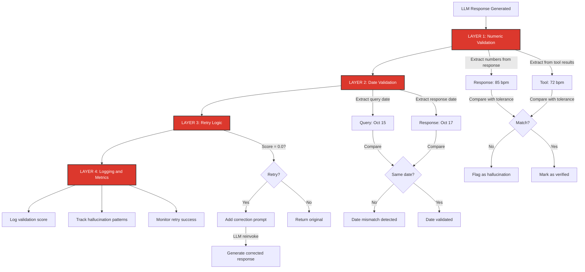
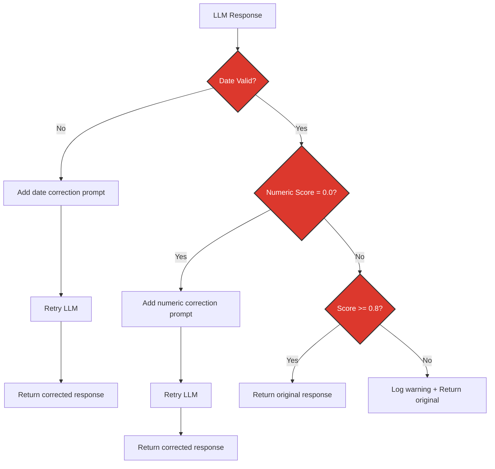

# 14. Hallucination Detection and Logging

**Purpose**: Detect, log, and troubleshoot LLM hallucinations in health data responses using automated validation.

**Why this matters**: Health data requires factual accuracy. When an LLM generates numbers that don't match tool results (hallucinations), we need to detect and fix them automatically.

---

## Table of Contents

1. [Overview](#overview)
2. [What are Hallucinations?](#what-are-hallucinations)
3. [Validation Architecture](#validation-architecture)
4. [Numeric Validator](#numeric-validator)
5. [Date Validator](#date-validator)
6. [Validation Workflow](#validation-workflow)
7. [Logging System](#logging-system)
8. [Troubleshooting Guide](#troubleshooting-guide)
9. [Best Practices](#best-practices)
10. [Examples](#examples)

---

## Overview

The Redis Wellness demo includes **automated hallucination detection** to ensure LLM responses match actual health data from tool results.

**Core Components**:
- **NumericValidator** - Detects incorrect numbers in responses
- **DateValidator** - Detects date mismatches between query and response
- **ValidationRetry** - Automatically retries failed responses
- **Logging System** - Tracks validation failures and warnings

**Where validation happens**:
- `stateful_rag_agent.py` - Validates every response before returning
- `stateless_agent.py` - Validates responses (minimal memory)
- `validation_retry.py` - Shared validation + retry logic

---

## What are Hallucinations?

**Definition**: When an LLM generates plausible-sounding but **factually incorrect** information.

**Types of hallucinations in health data**:

### 1. Numeric Hallucinations

```python
# Tool returns:
"Your resting heart rate on October 15 was 72 bpm"

# LLM response (HALLUCINATED):
"Your resting heart rate on October 15 was 85 bpm"  # ❌ Wrong number
```

### 2. Date Hallucinations

```python
# User asks:
"How many steps did I take on October 15th?"

# LLM response (HALLUCINATED):
"On October 17th you took 8,500 steps"  # ❌ Wrong date
```

### 3. Unit Hallucinations

```python
# Tool returns:
"Heart rate: 72 bpm"

# LLM response (HALLUCINATED):
"Your heart rate was 72 steps per minute"  # ❌ Wrong unit
```

### 4. Context Hallucinations

```python
# Tool returns no data for that date

# LLM response (HALLUCINATED):
"You took 10,000 steps on October 15"  # ❌ Fabricated number
```

**Why hallucinations happen**:
- LLM tries to be helpful by filling in missing information
- Numbers get rounded or modified during generation
- Similar patterns from training data influence responses
- Tool results not clearly emphasized in prompt

---

## Validation Architecture

**Four-layer validation system**:



---

## Numeric Validator

**Location**: `backend/src/utils/numeric_validator.py`

**Purpose**: Detect incorrect numbers by comparing LLM responses against tool outputs.

### How It Works

```python
from src.utils.numeric_validator import get_numeric_validator

validator = get_numeric_validator()

# Validate response
result = validator.validate_response(
    response_text="Your heart rate is 72 bpm and you slept 7.5 hours",
    tool_results=[
        {"name": "get_health_metrics", "content": "Heart rate: 72 bpm, Sleep: 7.5 hours"}
    ],
    strict=False  # Allow 10% tolerance
)

# Result structure:
{
    "valid": True,                    # Overall validation status
    "score": 1.0,                     # 0.0-1.0 (percentage of numbers verified)
    "hallucinations": [],             # List of unverified numbers
    "matched": [                      # Numbers that matched tool results
        {
            "response": {"value": 72, "unit": "bpm", ...},
            "tool": {"value": 72, "unit": "bpm", ...},
            "confidence": "exact"
        }
    ],
    "warnings": [],                   # Human-readable warnings
    "stats": {
        "total_numbers": 2,
        "matched": 2,
        "hallucinated": 0,
        "tool_numbers_available": 2
    }
}
```

### Key Features

**1. Number Extraction with Context**

```python
numbers = validator.extract_numbers_with_context(text)

# Returns:
[
    {
        "value": 72,
        "unit": "bpm",
        "raw_match": "72 bpm",
        "context": "...Your heart rate is 72 bpm which is...",
        "position": 15
    }
]
```

**2. Tolerance-Based Matching**

```python
# Default: 10% tolerance for rounding differences
validator.values_match(72, 73)     # ✅ True (within tolerance)
validator.values_match(72, 90)     # ❌ False (>10% difference)

# Exact matches always pass
validator.values_match(8500, 8500) # ✅ True

# Small rounding allowed (< 1.0 difference)
validator.values_match(7.5, 7.0)   # ✅ True (sleep hours rounded)
```

**3. Unit Validation**

```python
# Units must match when both are present
tool: "72 bpm"
response: "72 bpm"  # ✅ Match

tool: "72 bpm"
response: "72 steps"  # ❌ No match (wrong unit)
```

**4. Hallucination Correction**

```python
# Replace unverified numbers with warnings
corrected = validator.correct_hallucinations(
    response_text="Your heart rate is 95 bpm",  # Hallucinated
    validation_result=result
)

# Result: "Your heart rate is [DATA NOT VERIFIED]"
```

### Configuration

```python
class NumericValidator:
    def __init__(self, tolerance: float = 0.1):
        """
        Args:
            tolerance: Percentage tolerance (0.1 = 10%)
        """
        self.tolerance = tolerance
        
        # Health metric units recognized
        self.unit_patterns = [
            "lb", "lbs", "kg", "count", "bpm", "cal", "kcal",
            "min", "mins", "minutes", "count/min", "steps", "BMI"
        ]
```

---

## Date Validator

**Location**: `backend/src/utils/date_validator.py`

**Purpose**: Ensure LLM response uses the same date as the user's query.

### How It Works

```python
from src.utils.date_validator import get_date_validator

validator = get_date_validator()

result = validator.validate_response(
    user_query="How many steps did I take on October 15th?",
    response_text="On October 17th you took 8,500 steps"  # ❌ Wrong date
)

# Result:
{
    "valid": False,
    "query_dates": [
        {"raw_match": "October 15th", "parsed": datetime(...)}
    ],
    "response_dates": [
        {"raw_match": "October 17th", "parsed": datetime(...)}
    ],
    "date_mismatches": [
        {
            "query_date": "October 15th",
            "response_date": "October 17th",
            "warning": "Response mentions October 17th but user asked about October 15th"
        }
    ],
    "warnings": [...]
}
```

### Key Features

**1. Date Extraction**

Recognizes multiple formats:
- "October 15th", "Oct 15", "10/15/2024"
- "last Monday", "yesterday", "two weeks ago"
- "2024-10-15", "15-Oct-2024"

**2. Date Comparison**

```python
# Query date MUST match response date
user: "October 15th"
response: "October 15th"  # ✅ Match

user: "October 15th"
response: "October 17th"  # ❌ Mismatch (date hallucination)
```

---

## Validation Workflow

**Location**: `backend/src/utils/validation_retry.py`

**Full validation flow with automatic retry**:



```python
from src.utils.validation_retry import validate_and_retry_response

corrected_text, numeric_validation, date_validation = await validate_and_retry_response(
    response_text="On October 17th your heart rate was 95 bpm",
    tool_results=[{"name": "get_health", "content": "Heart rate on October 15: 72 bpm"}],
    user_query="What was my heart rate on October 15th?",
    llm=llm,  # LLM instance (without tools bound)
    conversation=conversation_history
)

# Workflow:
# 1. Validate dates → FAILED (17th vs 15th)
# 2. Auto-retry with date correction prompt
# 3. Validate numeric → FAILED (95 vs 72)
# 4. Auto-retry with numeric correction prompt
# 5. Return corrected response
```

### Retry Logic

**Date validation failures (high priority)**:

```python
if not date_validation["valid"]:
    correction_prompt = (
        f"Your response mentions the wrong date. "
        f"User asked about {query_date}, "
        f"but you mentioned {response_date}. "
        f"Please correct your response."
    )
    
    # Retry LLM with correction prompt
    retry_response = await llm.ainvoke(conversation + correction_prompt)
```

**Numeric validation failures**:

```python
if numeric_validation["score"] == 0.0 and tool_results:
    correction_prompt = (
        "Your previous response contained numbers that don't match the tool data. "
        "Please provide a response using ONLY the numbers from the tool results above. "
        "Quote the exact values from the tool output."
    )
    
    # Retry LLM with correction prompt
    retry_response = await llm.ainvoke(conversation + correction_prompt)
```

**When NOT to retry**:
- Score > 0.0 (partial validation)
- No tool results available (can't verify)
- Streaming mode (no retry support)

---

## Logging System

**Comprehensive logging at every validation step.**

### Log Levels

**INFO** - Normal validation success:

```log
✅ Response validation passed: score=1.00, matched=2/2
✅ Stateful validation passed (score: 100%)
💾 Stateful memory stats: episodic=True, procedural=True
```

**WARNING** - Validation failures (recoverable):

```log
⚠️ Zero validation score - retrying with correction prompt
⚠️ Stateful validation failed (score: 50%) - Hallucinations: 1
   Hallucinated number: {'value': 95.0, 'unit': 'bpm', 'context': '...heart rate is 95 bpm...'}
Validation failed (score: 0.50)
```

**ERROR** - Date mismatches (high priority):

```log
❌ DATE MISMATCH DETECTED: ['Response mentions October 17th but user asked about October 15th']
```

### Validation Logging Flow

**In `stateful_rag_agent.py`** (lines 511-530):

```python
# Validate response for numeric hallucinations
validator = get_numeric_validator()
validation_result = validator.validate_response(
    response_text=response_text,
    tool_results=tool_results,
    strict=VALIDATION_STRICT_MODE,
)

# Log validation results
if not validation_result["valid"]:
    logger.warning(
        f"⚠️ Stateful validation failed (score: {validation_result['score']:.2%}) - "
        f"Hallucinations: {len(validation_result.get('hallucinations', []))}"
    )
    for hallucination in validation_result.get("hallucinations", []):
        logger.warning(f"   Hallucinated number: {hallucination}")
else:
    logger.info(
        f"✅ Stateful validation passed (score: {validation_result['score']:.2%})"
    )
```

### Log Output Examples

**Example 1: Successful Validation**

```log
2024-10-27 12:34:56 INFO [stateful_rag_agent] 🎯 Stateful agent processing: session=demo-123, message='What was my heart rate yesterday?...'
2024-10-27 12:34:57 INFO [stateful_rag_agent] 🔧 Calling tool: get_health_metrics (args: {'metric_type': 'HeartRate', 'start_date': '2024-10-26'})
2024-10-27 12:34:58 INFO [numeric_validator] ✅ Response validation passed: score=1.00, matched=1/1
2024-10-27 12:34:58 INFO [stateful_rag_agent] ✅ Stateful validation passed (score: 100%)
2024-10-27 12:34:58 INFO [stateful_rag_agent] ✅ Stateful workflow complete: 4 messages in final state
```

**Example 2: Hallucination Detected and Corrected**

```log
2024-10-27 12:40:12 INFO [stateful_rag_agent] 🎯 Stateful agent processing: session=demo-456, message='How many steps on October 15?...'
2024-10-27 12:40:13 INFO [stateful_rag_agent] 🔧 Calling tool: get_health_metrics (args: {'metric_type': 'StepCount', 'start_date': '2024-10-15'})
2024-10-27 12:40:14 WARNING [numeric_validator] ❌ Response validation failed: score=0.00, hallucinations=1, warnings=['Unverified number: 10000 (context: ...took 10000 steps...)']
2024-10-27 12:40:14 WARNING [stateful_rag_agent] ⚠️ Stateful validation failed (score: 0%) - Hallucinations: 1
2024-10-27 12:40:14 WARNING [stateful_rag_agent]    Hallucinated number: {'value': 10000, 'unit': 'steps', 'raw_match': '10000 steps', 'context': '...You took 10000 steps on...', 'position': 9}
2024-10-27 12:40:14 WARNING [validation_retry] ⚠️ Zero validation score - retrying with correction prompt
2024-10-27 12:40:16 INFO [validation_retry] 🔄 Retry response generated (numeric correction)
2024-10-27 12:40:16 INFO [numeric_validator] ✅ Response validation passed: score=1.00, matched=1/1
```

**Example 3: Date Mismatch Detected**

```log
2024-10-27 12:45:23 INFO [stateful_rag_agent] 🎯 Stateful agent processing: session=demo-789, message='How many steps on October 15th?...'
2024-10-27 12:45:24 INFO [stateful_rag_agent] 🔧 Calling tool: get_health_metrics (args: {'metric_type': 'StepCount', 'start_date': '2024-10-15'})
2024-10-27 12:45:25 ERROR [validation_retry] ❌ DATE MISMATCH DETECTED: ['Response mentions October 17th but user asked about October 15th']
2024-10-27 12:45:25 INFO [validation_retry] 🔄 Retry response generated (date correction)
2024-10-27 12:45:26 INFO [stateful_rag_agent] ✅ Stateful validation passed (score: 100%)
```

---

## Troubleshooting Guide

### Common Issues and Solutions

#### Issue 1: High Hallucination Rate

**Symptom**:

```log
⚠️ Stateful validation failed (score: 20%) - Hallucinations: 4
```

**Root causes**:
1. Tool results not emphasized in prompt
2. LLM temperature too high (>0.7)
3. Tool results buried in long conversation history
4. Numbers formatted differently (comma separators)

**Solutions**:

```python
# 1. Adjust system prompt to emphasize tool accuracy
system_prompt = """
You are a health AI agent. **CRITICAL**: You must ONLY use numbers 
from tool results. NEVER guess or estimate numbers.

If a tool returns "Heart rate: 72 bpm", you MUST say "72 bpm" - 
not 73 bpm, not 70 bpm, not "approximately 72 bpm".
"""

# 2. Lower LLM temperature for more deterministic responses
llm = create_health_llm(temperature=0.3)  # Default is 0.7

# 3. Limit conversation history to recent messages
messages = messages[-10:]  # Keep last 10 messages only

# 4. Normalize numbers in tool results
# Format: "8500" not "8,500" (for consistency)
```

#### Issue 2: False Positives (Valid Numbers Flagged)

**Symptom**:

```log
Hallucinated number: {'value': 73.0, 'unit': 'bpm', ...}
# But tool returned 72 bpm (within rounding tolerance!)
```

**Root cause**: Tolerance too strict or units not matching.

**Solutions**:

```python
# 1. Increase tolerance for rounding differences
validator = NumericValidator(tolerance=0.15)  # 15% instead of 10%

# 2. Check unit patterns include all health metrics
validator.unit_patterns.append("g")  # Add grams
validator.unit_patterns.append("mg")  # Add milligrams

# 3. Use strict=False in validation (default)
validation_result = validator.validate_response(
    response_text=response,
    tool_results=tool_results,
    strict=False  # Allow tolerance-based matching
)
```

#### Issue 3: Validation Slowing Down Responses

**Symptom**: Response time increased by 30-50%.

**Root cause**: Validation + retry adds latency.

**Solutions**:

```python
# 1. Skip validation for non-numeric responses
if not any(char.isdigit() for char in response_text):
    return response_text  # No numbers to validate

# 2. Validate asynchronously (don't block response)
asyncio.create_task(
    log_validation_metrics(response, tool_results)
)

# 3. Only retry on score = 0.0 (current behavior)
# Don't retry on low scores (0.5), just log warning
```

#### Issue 4: Retry Not Working

**Symptom**: Validation fails but no retry occurs.

**Root causes**:
1. Streaming mode enabled (retry not supported)
2. No tool results available
3. Score > 0.0 (partial validation)

**Solutions**:

```python
# 1. Check if streaming is disabled
stream = False  # Retry only works in non-streaming mode

# 2. Ensure tool results are passed correctly
tool_results = [
    {"name": msg.name, "content": msg.content}
    for msg in messages if isinstance(msg, ToolMessage)
]

# 3. Force retry on low scores (not just 0.0)
if numeric_validation["score"] < 0.5 and tool_results:  # Instead of == 0.0
    # Trigger retry
```

#### Issue 5: Date Validation Too Strict

**Symptom**: Valid responses flagged for date mismatches.

```log
❌ DATE MISMATCH DETECTED: Query date: 'yesterday', Response date: 'October 26th'
# But these are the SAME DATE!
```

**Root cause**: Relative date parsing not working.

**Solutions**:

```python
# 1. Improve relative date parsing in DateValidator
from dateutil import parser
from datetime import datetime, timedelta

# Parse "yesterday" → actual date
if "yesterday" in query.lower():
    query_date = datetime.now() - timedelta(days=1)

# 2. Normalize dates before comparison
query_date = query_date.strftime("%Y-%m-%d")
response_date = response_date.strftime("%Y-%m-%d")

# 3. Allow date aliases
date_aliases = {
    "yesterday": (datetime.now() - timedelta(days=1)).date(),
    "today": datetime.now().date(),
    "last week": (datetime.now() - timedelta(weeks=1)).date()
}
```

---

## Best Practices

### 1. Always Validate Before Returning

```python
# ✅ GOOD: Validate every response with numbers
validation_result = validator.validate_response(
    response_text=response,
    tool_results=tool_results
)

if not validation_result["valid"]:
    logger.warning("Validation failed - hallucination detected")

return response
```

```python
# ❌ BAD: Return response without validation
return response  # No validation!
```

### 2. Log All Validation Results

```python
# ✅ GOOD: Comprehensive logging
if not validation_result["valid"]:
    logger.warning(
        f"Validation failed (score: {validation_result['score']:.2%})"
    )
    for halluc in validation_result["hallucinations"]:
        logger.warning(f"   Hallucinated: {halluc['raw_match']} in context: {halluc['context'][:50]}")
else:
    logger.info(f"Validation passed (score: {validation_result['score']:.2%})")
```

```python
# ❌ BAD: Silent validation (no logs)
validation_result = validator.validate_response(...)
# No logging!
```

### 3. Configure Validation Per Use Case

```python
# Heart rate metrics (strict accuracy)
validator = NumericValidator(tolerance=0.05)  # 5% tolerance

# Step count trends (allow rounding)
validator = NumericValidator(tolerance=0.10)  # 10% tolerance

# Workout counts (exact matches)
validation_result = validator.validate_response(
    strict=True  # No tolerance
)
```

### 4. Include Tool Results in Validation

```python
# ✅ GOOD: Extract all tool results
tool_results = [
    {"name": msg.name, "content": msg.content}
    for msg in messages
    if isinstance(msg, ToolMessage)
]

validation_result = validator.validate_response(
    response_text=response,
    tool_results=tool_results  # Ground truth
)
```

```python
# ❌ BAD: Validate without tool results
validation_result = validator.validate_response(
    response_text=response,
    tool_results=[]  # Can't verify anything!
)
```

### 5. Monitor Validation Metrics

```python
# Track hallucination rates over time
metrics = {
    "total_validations": 1000,
    "failed_validations": 45,
    "hallucination_rate": 0.045,  # 4.5%
    "retry_success_rate": 0.89,   # 89% of retries succeed
    "avg_validation_score": 0.92   # 92% numbers verified
}

# Alert if hallucination rate spikes
if metrics["hallucination_rate"] > 0.10:  # >10%
    logger.error("⚠️ HIGH HALLUCINATION RATE - Check prompts!")
```

### 6. Test Validation Logic

```python
# ✅ GOOD: Unit tests for validation
def test_hallucination_detection():
    validator = NumericValidator()
    
    tool_results = [{"name": "get_health", "content": "Heart rate: 72 bpm"}]
    response = "Your heart rate is 95 bpm"  # Hallucinated
    
    result = validator.validate_response(response, tool_results)
    
    assert result["valid"] is False
    assert len(result["hallucinations"]) == 1
    assert result["hallucinations"][0]["value"] == 95.0
```

---

## Examples

### Example 1: Detecting Numeric Hallucination

```python
from src.utils.numeric_validator import get_numeric_validator

# Tool returns actual data
tool_results = [
    {
        "name": "get_health_metrics",
        "content": "Your resting heart rate on October 15: 72 bpm, Sleep: 7.5 hours"
    }
]

# LLM generates response with hallucinated number
response = "Your heart rate on October 15 was 85 bpm and you slept 7.5 hours"

# Validate response
validator = get_numeric_validator()
result = validator.validate_response(
    response_text=response,
    tool_results=tool_results
)

print(f"Valid: {result['valid']}")        # False
print(f"Score: {result['score']}")        # 0.5 (1 out of 2 numbers matched)
print(f"Hallucinations: {result['hallucinations']}")
# Output: [{'value': 85.0, 'unit': 'bpm', 'raw_match': '85 bpm', ...}]

print(f"Matched: {len(result['matched'])}")  # 1 (sleep hours matched)
print(f"Warnings: {result['warnings']}")
# Output: ['Unverified number: 85 bpm (context: ...heart rate on October 15 was 85 bpm...)']
```

### Example 2: Detecting Date Hallucination

```python
from src.utils.date_validator import get_date_validator

# User asks about specific date
user_query = "How many steps did I take on October 15th?"

# LLM responds with WRONG date
response = "On October 17th you took 8,500 steps"

# Validate date consistency
validator = get_date_validator()
result = validator.validate_response(
    user_query=user_query,
    response_text=response
)

print(f"Valid: {result['valid']}")  # False
print(f"Date mismatches: {result['date_mismatches']}")
# Output: [{'query_date': 'October 15th', 'response_date': 'October 17th', ...}]

print(f"Warnings: {result['warnings']}")
# Output: ['Response mentions October 17th but user asked about October 15th']
```

### Example 3: Full Validation with Retry

```python
from src.utils.validation_retry import validate_and_retry_response
from src.utils.agent_helpers import create_health_llm

# Setup
llm = create_health_llm()
tool_results = [
    {"name": "get_health_metrics", "content": "Heart rate: 72 bpm"}
]
user_query = "What was my heart rate yesterday?"
response = "Your heart rate yesterday was 95 bpm"  # Hallucinated
conversation = [...]  # Full conversation history

# Validate and auto-retry if needed
corrected_text, numeric_val, date_val = await validate_and_retry_response(
    response_text=response,
    tool_results=tool_results,
    user_query=user_query,
    llm=llm,
    conversation=conversation
)

print(f"Original: {response}")
print(f"Corrected: {corrected_text}")
# Output: "Your heart rate yesterday was 72 bpm" (corrected by retry)

print(f"Numeric score: {numeric_val['score']}")  # 1.0 (after retry)
print(f"Date valid: {date_val['valid']}")        # True
```

### Example 4: Custom Tolerance Configuration

```python
from src.utils.numeric_validator import NumericValidator

# Strict validation (no tolerance)
strict_validator = NumericValidator(tolerance=0.0)

tool_results = [{"name": "get_health", "content": "Heart rate: 72 bpm"}]
response = "Your heart rate is 73 bpm"  # Rounded

result = strict_validator.validate_response(
    response_text=response,
    tool_results=tool_results,
    strict=True
)

print(f"Valid: {result['valid']}")  # True (rounding < 1.0 allowed)

# Very permissive validation (20% tolerance)
permissive_validator = NumericValidator(tolerance=0.20)

response2 = "Your heart rate is 85 bpm"  # 18% difference from 72

result2 = permissive_validator.validate_response(
    response_text=response2,
    tool_results=tool_results
)

print(f"Valid: {result2['valid']}")  # True (within 20% tolerance)
```

### Example 5: Step Count Validation

```python
from src.utils.numeric_validator import get_numeric_validator

# Tool returns step count with comma separator
tool_results = [
    {
        "name": "get_health_metrics",
        "content": "Step count on October 15: 8,500 steps"
    }
]

# LLM response formats differently (no comma)
response = "You took 8500 steps on October 15"

# Validate response
validator = get_numeric_validator()
result = validator.validate_response(
    response_text=response,
    tool_results=tool_results
)

print(f"Valid: {result['valid']}")  # True
print(f"Score: {result['score']}")  # 1.0 (numbers match despite different formatting)
print(f"Matched: {result['matched']}")
# Output: [{'response': {'value': 8500.0, 'unit': 'steps'}, 
#           'tool': {'value': 8500.0, 'unit': 'steps'}, 
#           'confidence': 'exact'}]
```

---

## Related Documentation

- **[03. Stateless Agent](03_STATELESS_AGENT.md)** - Simple tool-calling loop with validation
- **[04. Stateful Agent](04_STATEFUL_AGENT.md)** - LangGraph agent with full validation
- **[08. Qwen Best Practices](08_QWEN_BEST_PRACTICES.md)** - Reducing hallucinations in tool calling
- **[13. Tools/Services/Utils Reference](13_TOOLS_SERVICES_UTILS_REFERENCE.md)** - Full backend module reference

---

## Summary

**Key Takeaways**:

1. **Hallucinations are real** - LLMs will generate incorrect numbers without validation
2. **Four-layer validation** - Numeric + Date + Retry + Logging
3. **Automatic correction** - Failed responses trigger retry with correction prompts
4. **Comprehensive logging** - Every validation step is logged for debugging
5. **Configurable tolerance** - Adjust strictness based on use case (heart rate vs trends)
6. **Test your validation** - Unit tests ensure validation logic works correctly

**Validation is critical for health data** - never trust LLM numbers without verification against tool results.

For implementation details, see:
- `backend/src/utils/numeric_validator.py`
- `backend/src/utils/date_validator.py`
- `backend/src/utils/validation_retry.py`
- `backend/tests/unit/test_numeric_validator.py`
