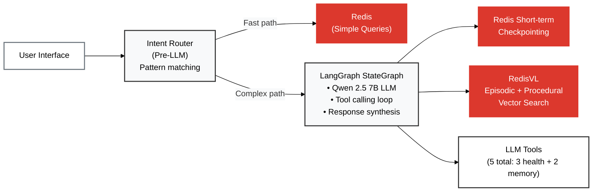

# Stateful Agent Architecture - Slide Deck Material

## Horizontal Architecture Diagram

## Horizontal Workflow Diagram

```mermaid
%%{init: {'theme':'base', 'themeVariables': { 'fontSize':'16px', 'edgeLabelBackground':'#f8f9fa'}, 'flowchart': {'rankSpacing': 60, 'nodeSpacing': 30}}}%%
flowchart LR
    Query["User Query"]
    Router{"Intent Router"}
    GoalOp["Simple Query"]
    GoalRedis["Redis"]
    Memory["LangGraph<br/>Checkpointer"]
    LLM["Qwen 2.5 7B<br/>(Ollama)"]
    Decision{"Which tool?"}
    MemoryTools["Memory Tools<br/>get_my_goals<br/>get_tool_suggestions"]
    HealthTools["Health Data Tools<br/>get_health_metrics<br/>get_sleep_analysis<br/>get_workout_data"]
    DataSource["Data Source"]
    RedisStructured["Redis<br/>(Structured)"]
    RedisVector["RedisVL<br/>(Vector Search)"]
    Response["Response"]
    Store["Store Memories"]
    
    Query --> Router
    Router -->|"Simple"| GoalOp
    Router -->|"Complex"| Memory
    GoalOp --> GoalRedis
    GoalRedis --> Response
    Memory --> LLM
    LLM --> Decision
    Decision --> MemoryTools
    Decision --> HealthTools
    Decision -->|"Has answer"| Response
    MemoryTools --> DataSource
    HealthTools --> DataSource
    DataSource --> RedisStructured
    DataSource --> RedisVector
    RedisStructured --> Response
    RedisVector --> Response
    Response --> Store
    
    style Query fill:#fff,stroke:#333,stroke-width:2px
    style Router fill:#fff,stroke:#333,stroke-width:2px
    style GoalOp fill:#fff,stroke:#333,stroke-width:2px
    style GoalRedis fill:#dc382d,stroke:#dc382d,stroke-width:2px,color:#fff
    style Memory fill:#fff,stroke:#333,stroke-width:2px
    style LLM fill:#fff,stroke:#333,stroke-width:2px
    style Decision fill:#fff,stroke:#333,stroke-width:2px
    style MemoryTools fill:#fff,stroke:#6c757d,stroke-width:2px
    style HealthTools fill:#fff,stroke:#6c757d,stroke-width:2px
    style DataSource fill:#fff,stroke:#333,stroke-width:2px
    style RedisStructured fill:#dc382d,stroke:#dc382d,stroke-width:2px,color:#fff
    style RedisVector fill:#dc382d,stroke:#dc382d,stroke-width:2px,color:#fff
    style Response fill:#fff,stroke:#333,stroke-width:2px
    style Store fill:#fff,stroke:#333,stroke-width:2px
```

## Key Points for Slides

### Architecture Components
1. **Intent Router**: Pre-LLM pattern matching for simple queries (<100ms)
2. **LangGraph**: Orchestrates LLM → tools → memory → response workflow
3. **Memory Layer**: Redis checkpointing + RedisVL vector search
4. **Tool Layer**: 5 LLM-callable tools (3 health + 2 memory)

### Memory Architecture
- **Short-term** (session): Conversation context for follow-ups
- **Episodic** (permanent): User goals and preferences
- **Procedural** (permanent): Learned tool-calling patterns
- **Semantic** (optional): Health knowledge base

### Performance Metrics
- Intent router: <100ms
- First turn: ~2.8s (0.5s checkpoint + 2.3s LLM)
- Follow-up: ~1.9s (context already loaded)
- Memory overhead: ~170 KB per user

### Comparison: Stateless vs. Stateful

| Without Redis | With Redis + LangGraph |
|---------------|------------------------|
| ❌ Forgets conversation | ✅ Checkpointing loads conversation automatically |
| ❌ Can't answer follow-ups | ✅ Understands "that", "it", "them" references |
| ❌ Doesn't know user goals | ✅ Vector search retrieves goals semantically |
| ❌ Repeats mistakes | ✅ Learns successful tool-calling patterns |

### Technologies Stack
- **Qwen 2.5 7B**: Function-calling LLM (via Ollama)
- **Ollama Embeddings**: mxbai-embed-large (1024-dim vectors)
- **LangGraph**: StateGraph workflow with Redis checkpointing
- **Redis**: Short-term conversation history + structured health data
- **RedisVL**: Vector search for episodic + procedural memory
