# Stateful Agent Architecture - Slide Deck Material

## Horizontal Architecture Diagram

## Horizontal Workflow Diagram

## Short-Term Memory: Redis Checkpointing (Horizontal)

## Short-Term Memory: Redis Checkpointing (Vertical)

```mermaid
%%{init: {'theme':'base', 'themeVariables': { 'fontSize':'15px'}, 'flowchart': {'rankSpacing': 60, 'nodeSpacing': 40}}}%%
flowchart TD
    User1["👤 Turn 1: How many steps<br/>did I take this month?"]
    Agent1["🤖 45,230 steps in October"]
    CP1["💾 Save to Redis<br/>Checkpoint:1"]
    User2["👤 Turn 2: Compare that<br/>to April"]
    Load["📥 Load from Redis<br/>(sees 'October' + '45,230')"]
    Agent2["🤖 April: 38,150 steps<br/>18.5% increase from April"]
    CP2["💾 Save to Redis<br/>Checkpoint:2"]
    
    User1 --> Agent1
    Agent1 --> CP1
    CP1 --> User2
    User2 --> Load
    Load --> Agent2
    Agent2 --> CP2
    
    style User1 fill:#f5f5f5,stroke:#333,stroke-width:2px
    style User2 fill:#f5f5f5,stroke:#333,stroke-width:2px
    style Agent1 fill:#f5f5f5,stroke:#333,stroke-width:2px
    style Agent2 fill:#f5f5f5,stroke:#333,stroke-width:2px
    style CP1 fill:#DC382C,stroke:#DC382C,stroke-width:2px,color:#fff
    style Load fill:#DC382C,stroke:#DC382C,stroke-width:2px,color:#fff
    style CP2 fill:#DC382C,stroke:#DC382C,stroke-width:2px,color:#fff
```

### How It Works
1. **After each turn**: Agent state saved to Redis as checkpoint
2. **Before next turn**: Checkpoint loaded, conversation context restored
3. **Key pattern**: `langgraph:checkpoint:{session_id}:{step}`
4. **Storage**: Redis LIST structure via LangGraph AsyncRedisSaver
5. **TTL**: 7 months (210 days)

### Without Checkpointing (Stateless)
- ❌ User: "What's the most common type?" → Agent: "What are you referring to?"
- ❌ Each turn is isolated, no conversation memory

### With Checkpointing (Stateful)
- ✅ User: "What's the most common type?" → Agent answers using context
- ✅ Agent remembers: previous question, previous response, conversation flow

---

## Key Points for Slides

### Architecture Components
1. **Intent Router**: Pre-LLM pattern matching for simple queries (<100ms)
2. **LangGraph**: Orchestrates LLM → tools → memory → response workflow
3. **Memory Layer**: Redis checkpointing + RedisVL vector search
4. **Tool Layer**: 5 LLM-callable tools (3 health + 2 memory)

### Memory Architecture
- **Short-term** (session): Conversation context for follow-ups
- **Episodic** (permanent): User goals and preferences
- **Procedural** (permanent): Learned tool-calling patterns
- **Semantic** (optional): Health knowledge base

### Performance Metrics
- Intent router: <100ms
- First turn: ~2.8s (0.5s checkpoint + 2.3s LLM)
- Follow-up: ~1.9s (context already loaded)
- Memory overhead: ~170 KB per user

### Comparison: Stateless vs. Stateful

| Without Redis | With Redis + LangGraph |
|---------------|------------------------|
| ❌ Forgets conversation | ✅ Checkpointing loads conversation automatically |
| ❌ Can't answer follow-ups | ✅ Understands "that", "it", "them" references |
| ❌ Doesn't know user goals | ✅ Vector search retrieves goals semantically |
| ❌ Repeats mistakes | ✅ Learns successful tool-calling patterns |

### Technologies Stack
- **Qwen 2.5 7B**: Function-calling LLM (via Ollama)
- **Ollama Embeddings**: mxbai-embed-large (1024-dim vectors)
- **LangGraph**: StateGraph workflow with Redis checkpointing
- **Redis**: Short-term conversation history + structured health data
- **RedisVL**: Vector search for episodic + procedural memory
