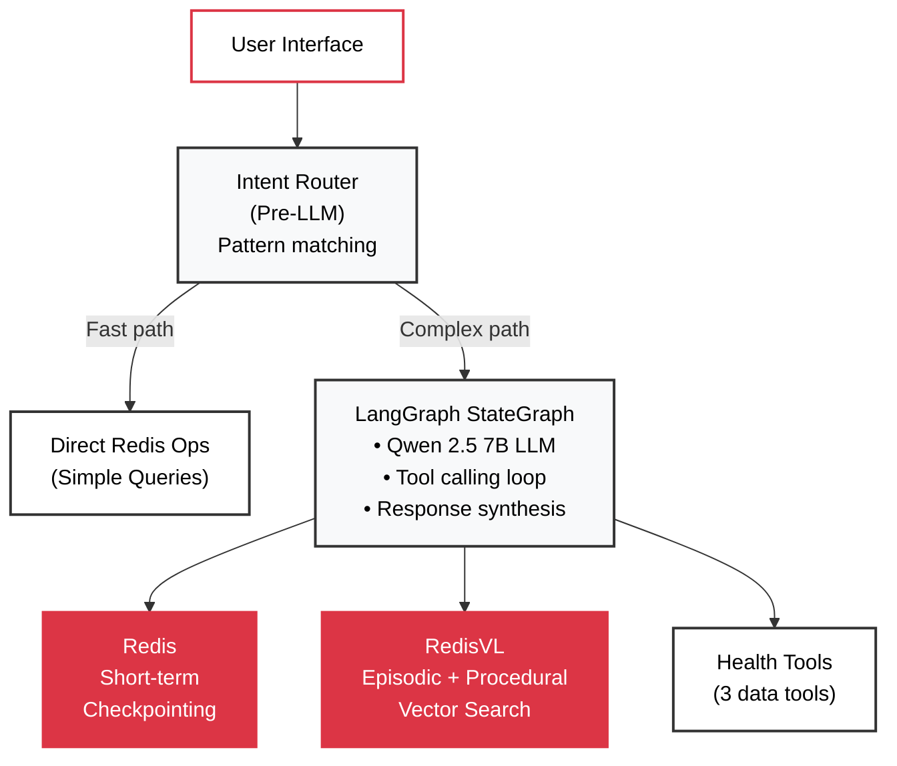
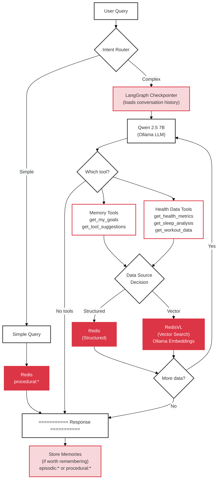

# Stateful Agent Architecture

## 1. Overview

This document explains the **internal architecture of the stateful agent**: how it uses **Agentic RAG** (Retrieval-Augmented Generation with autonomous tool calling) to maintain context and intelligence.

### What You'll Learn

- **[Key Technologies](#2-key-technologies)** - LangGraph, Redis, RedisVL, and the 5 tools bound to the LLM
- **[Architecture Overview](#3-architecture-overview)** - Component layers and how they interact
- **[How It Works](#4-how-it-works)** - Workflow with intent routing, checkpointing, and vector search
- **[Why It Matters](#5-why-it-matters)** - Benefits of stateful vs. stateless agents
- **[Related Documentation](#6-related-documentation)** - Links to deeper dives on memory and Redis patterns

---

## 2. Key Technologies

- **Qwen 2.5 7B**: Function-calling LLM that reads tool docstrings and autonomously decides which tools to call
- **LangGraph**: StateGraph workflow orchestration with automatic Redis checkpointing for conversation history
- **Redis**: Stores short-term conversation history via LangGraph's AsyncRedisSaver
- **RedisVL**: Vector search for episodic memory (goals) and procedural memory (learned patterns)
- **Intent Router**: Pre-LLM pattern matching for fast deterministic operations (simple queries)

### 5 Tools Bound to LLM

#### Health Data Tools

1. `get_health_metrics` - Heart rate, steps, weight, BMI, etc.
2. `get_sleep_analysis` - Sleep data with daily aggregation and efficiency metrics
3. `get_workout_data` - All workout queries (lists, patterns, progress, comparisons)

#### Memory Tools

4. `get_my_goals` - Retrieve user goals and preferences (episodic memory)
5. `get_tool_suggestions` - Retrieve learned tool-calling patterns (procedural memory)

---

## 3. Architecture Overview

The stateful agent combines **intent routing**, **LangGraph workflow**, and **Redis memory layers**:



### Layer Responsibilities

1. **Intent Router**: Pre-LLM pattern matching for fast deterministic operations (<100ms)
2. **LangGraph**: Orchestrates LLM → tools → memory → response workflow
3. **Memory Layer**:
   - Redis checkpointing (short-term conversation history)
   - RedisVL vector search (episodic goals + procedural patterns)
4. **Tool Layer**: 5 tools for health data retrieval and memory access

---

## 4. How It Works

### Workflow

The stateful agent processes queries through a multi-stage workflow:



### Data Sources → Tools

Each Redis data source is accessed by specific tools:

| Data Source | Storage Type | Tools That Use It | What's Stored |
|-------------|--------------|-------------------|---------------|
| `langgraph:checkpoint:*` | Redis (LangGraph) | *(automatic)* | Conversation history for context |
| `episodic:*` | RedisVL (vector) | `get_my_goals`<br/>`get_health_metrics` (context) | User goals and targets |
| `procedural:*` | RedisVL (vector) | `get_tool_suggestions`<br/>`get_workout_data` (patterns) | Learned tool-calling patterns |
| `semantic:*` | RedisVL (vector) | `get_my_goals` *(optional)* | General health knowledge base |
| `health:*` | Redis (hash/JSON) | `get_health_metrics`<br/>`get_sleep_analysis` | Heart rate, steps, weight, BMI, sleep |
| `workout:*` | Redis (hash/JSON) | `get_workout_data` | Workout records and indexes |

**Storage Types:**
- **Redis** = Structured data (hashes, JSON) for O(1) lookups
- **RedisVL** = Vector search (1024-dim embeddings) for semantic retrieval
- **LangGraph** = Automatic checkpointing for conversation state

### Key Components

#### Intent Router (Fast Path)

Pattern-based routing for deterministic operations. Bypasses LLM for simple queries like goal setting.

**Example:** "My goal is to run 3x per week" → Direct Redis storage (<100ms, zero tokens)

#### LangGraph Checkpointing (Short-term Memory)

Automatically loads conversation history before each LLM call via `AsyncRedisSaver`.

**Example conversation state:**
```python
messages = [
    HumanMessage("What was my heart rate?"),
    AIMessage("72 bpm average"),
    HumanMessage("Is that good?")  # LLM understands "that" = 72 bpm
]
```

**Redis keys:** `langgraph:checkpoint:{session_id}:*` (TTL: 7 months)

#### RedisVL Vector Search (Episodic + Procedural Memory)

Goals and patterns stored with embeddings for semantic retrieval.

**Example goal storage:**
```python
episodic:user:goal:1729962000 → {
    "text": "Target resting heart rate is 60-75 bpm",
    "embedding": [0.234, -0.123, ...],  # 1024-dim
    "metric": "HeartRate"
}
```

**LLM retrieves via `get_my_goals` tool** when needed for context.

### Real Example: "Is that good?"

Demonstrates all three components working together:

```
User: "What was my heart rate last week?"
Agent: "72 bpm average"
User: "Is that good?"  ← Needs context + goals
```

**Step 1: LangGraph loads conversation**
```python
messages = [
    HumanMessage("What was my heart rate last week?"),
    AIMessage("72 bpm average"),
    HumanMessage("Is that good?")  # Current query
]
```

**Step 2: LLM autonomously calls `get_my_goals` tool**

Qwen reads the tool docstring and decides to retrieve goals:
```python
{"tool_calls": [{"name": "get_my_goals", "args": {"query": "heart rate goal"}}]}
```

**Step 3: RedisVL retrieves goal**
```python
goals = [{"metric": "HeartRate", "target": "60-75 bpm"}]
```

**Step 4: LLM synthesizes response**

Combines conversation context (72 bpm) + episodic memory (goal: 60-75 bpm):

> "72 bpm is within your target range of 60-75 bpm. That's a healthy resting heart rate."

---

## 5. Why It Matters

### Comparison: Stateless vs. Stateful

| Without Redis | With Redis + LangGraph |
|---------------|------------------------|
| ❌ Forgets conversation | ✅ Checkpointing loads conversation automatically |
| ❌ Can't answer follow-ups | ✅ Understands "that", "it", "them" references |
| ❌ Doesn't know user goals | ✅ Vector search retrieves goals semantically |
| ❌ Repeats mistakes | ✅ Learns successful tool-calling patterns |

### Four-Layer Memory Architecture

- **Short-term** (session): Conversation context for follow-ups
- **Episodic** (permanent): User goals and preferences
- **Procedural** (permanent): Learned tool-calling patterns
- **Semantic** (optional): Health knowledge base

### Performance

- Intent router: <100ms (direct Redis)
- First turn: ~2.8s (0.5s checkpoint + 2.3s LLM)
- Follow-up: ~1.9s (context preloaded)
- Memory overhead: ~170 KB per user (100 turns + 10 goals)

---

## 6. Related Documentation

- **[02_THE_DEMO.md](02_THE_DEMO.md)** - Side-by-side stateless vs. stateful comparison in the UI
- **[03_MEMORY_ARCHITECTURE.md](03_MEMORY_ARCHITECTURE.md)** - Deep dive into four-layer memory system
- **[04_AUTONOMOUS_AGENTS.md](04_AUTONOMOUS_AGENTS.md)** - Tool-calling and agentic workflow patterns
- **[05_REDIS_PATTERNS.md](05_REDIS_PATTERNS.md)** - Redis usage patterns and best practices

---

**Key takeaway:** Redis + LangGraph transforms stateless chat into context-aware AI that remembers, learns, and understands user intent through autonomous tool calling and multi-layer memory.
