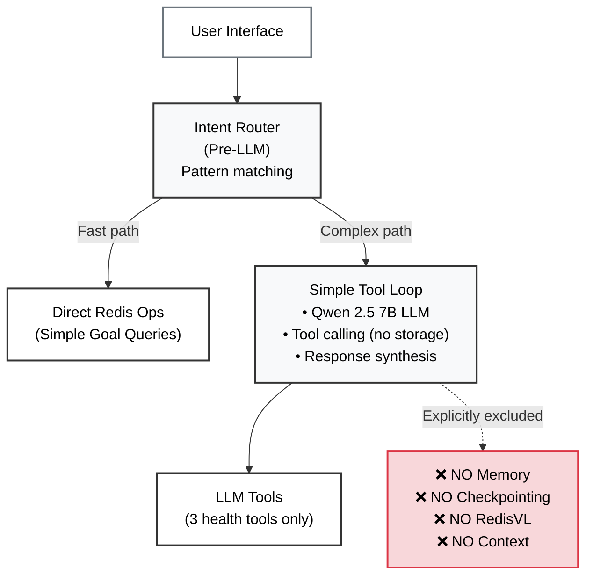
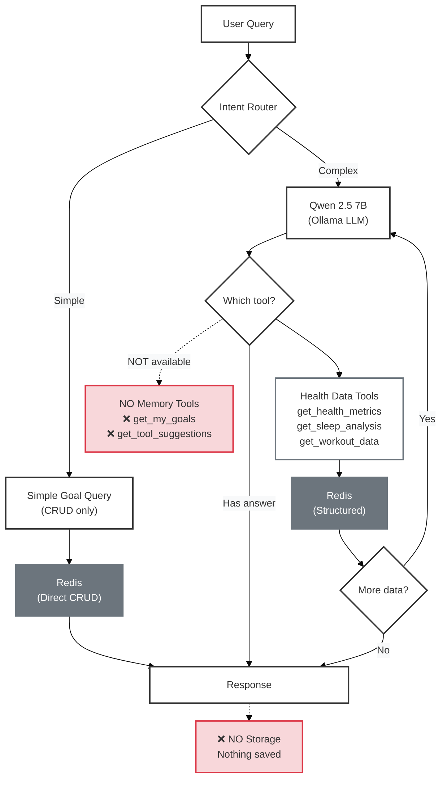

# Stateless Agent Architecture

## 1. Overview

This document explains the **internal architecture of the stateless agent**: how it operates as a **baseline comparison** with basic tool calling but **zero memory**.

### What You'll Learn

- **[Key Technologies](#2-key-technologies)** - LLM, tools, and what's deliberately excluded
- **[Architecture Overview](#3-architecture-overview)** - Minimal component layers
- **[How It Works](#4-how-it-works)** - Workflow without memory or checkpointing
- **[Why It Matters](#5-why-it-matters)** - Limitations vs. stateful agent
- **[Related Documentation](#6-related-documentation)** - Links to the stateful comparison

---

## 2. Key Technologies

**What's Included:**
- **Qwen 2.5 7B**: Function-calling LLM (via Ollama) that reads tool docstrings and autonomously decides which tools to call
- **Simple Tool Loop**: Up to 8 iterations of tool calling without persistence
- **Intent Router**: Pre-LLM pattern matching for simple goal queries (fast path, returns immediately)
- **3 Health Tools**: `get_health_metrics`, `get_sleep_analysis`, `get_workout_data` (tools can read Redis data but agent stores nothing)

**What's Deliberately Excluded:**
- ❌ NO conversation history (forgets previous messages)
- ❌ NO LangGraph (no StateGraph, no checkpointing)
- ❌ NO RedisVL (no vector search, no episodic/procedural memory)
- ❌ NO memory tools (`get_my_goals`, `get_tool_suggestions` not available)
- ❌ NO semantic memory (no long-term knowledge base)
- ❌ NO Redis storage (except through tools that read existing health data)

---

## 3. Architecture Overview

The stateless agent uses **intent routing** and a **simple tool-calling loop** without any memory persistence:



### Layer Responsibilities

1. **Intent Router**: Pre-LLM pattern matching for simple goal queries (<100ms, returns immediately)
2. **Simple Tool Loop**: Iterative tool calling (up to 8 iterations) without memory storage
3. **NO Memory Layer**: Deliberately excluded to demonstrate baseline performance
4. **Tool Layer**: 3 LLM-callable health tools ONLY
   - **Health data**: `get_health_metrics`, `get_sleep_analysis`, `get_workout_data`
   - **NO memory tools**: `get_my_goals` and `get_tool_suggestions` not available

---

## 4. How It Works

### Workflow

The stateless agent routes queries through: intent routing → simple tool loop → response (no storage):



### Tool → Data Source Mapping

Tools can only READ existing data, agent stores NOTHING:

| Data Source | Storage Type | Tools That Use It | What's Stored |
|-------------|--------------|-------------------|---------------|
| ❌ `langgraph:checkpoint:*` | *(not used)* | *(not available)* | NO conversation history |
| ❌ `episodic:*` | *(not used)* | *(not available)* | NO user goals |
| ❌ `procedural:*` | *(not used)* | *(not available)* | NO learned patterns |
| ❌ `semantic:*` | *(not used)* | *(not available)* | NO knowledge base |
| ✅ `health:*` | Redis (read-only) | `get_health_metrics`<br/>`get_sleep_analysis` | Heart rate, steps, weight, BMI, sleep |
| ✅ `workout:*` | Redis (read-only) | `get_workout_data` | Workout records and indexes |

**Key Difference from Stateful Agent:**
- **Stateless** = Tools can READ existing data but agent stores NOTHING
- **Stateful** = Tools READ + agent STORES conversation, goals, patterns

### Key Components

#### Intent Router (Fast Path)

Pattern-based routing for simple goal queries. Returns immediately without LLM.

**What are "simple queries"?**
- Simple queries: "My goal is X", "What are my goals?", "Delete my goals"
- Pattern matching on keywords: "goal", "target", "my goals"
- Direct Redis hash operations (no LLM, no vector search)
- Benefits: <100ms response, zero tokens, zero LLM cost

**Example:** "My goal is to run 3x per week" → Direct Redis HSET (<100ms, zero tokens)

**Note:** Intent router bypasses LLM entirely - same behavior for both stateless and stateful agents.

#### NO Conversation History

Each query is processed in complete isolation:

**BAD for follow-up questions:**
```python
# Stateless agent conversation
messages = [
    HumanMessage("What was my heart rate?")
]
# Agent responds: "72 bpm average"

# Next query starts fresh - NO CONTEXT
messages = [
    HumanMessage("Is that good?")  # ❌ LLM doesn't know "that" = 72 bpm
]
```

**Result:** "I need more information. What value are you referring to?"

#### NO RedisVL Vector Search

No episodic or procedural memory available:

**What's missing:**
- ❌ No `episodic:*` keys (user goals not retrievable)
- ❌ No `procedural:*` keys (tool patterns not learned)
- ❌ No semantic search
- ❌ No embeddings
- ❌ No memory tools (`get_my_goals`, `get_tool_suggestions`)

**Result:** Agent can't retrieve user goals or learn from past tool-calling patterns.

#### Simple Tool Loop

Basic iterative tool calling without persistence:

**How it works:**
1. User query → LLM with tools
2. LLM decides to call tool → Execute tool
3. Tool result → Back to LLM
4. Repeat up to 8 times (MAX_TOOL_ITERATIONS)
5. Final response → Nothing stored

**What's stored:** NOTHING (except via intent router for goal CRUD)

### Real Example: "Is that good?" (FAILS)

Demonstrates why follow-ups fail without conversation history:

```
User: "What was my heart rate last week?"
Agent: "72 bpm average"
User: "Is that good?"  ← NO CONTEXT
```

**Step 1: No conversation loaded**
```python
messages = [HumanMessage("Is that good?")]  # Previous messages lost
```

**Step 2: LLM has no context**

Response:
> "I need more information. What specific metric or value are you asking about?"

**What's missing:**
- ❌ No conversation history (doesn't know "that" = 72 bpm)
- ❌ No goal retrieval (can't compare to target)
- ❌ No memory tools available

**Result:** Agent can't answer follow-up questions because it forgets the conversation context.

### Real Example: First-Time Query (WORKS)

Demonstrates that stateless agent CAN answer direct questions:

```
User: "What was my average heart rate last week?"
```

**Step 1: LLM decides to call tool**
```python
{"tool_calls": [{"name": "get_health_metrics", "args": {"metric": "HeartRate", "days": 7}}]}
```

**Step 2: Tool retrieves data from Redis**
```python
result = {"average": 72, "unit": "bpm", "days": 7}
```

**Step 3: LLM synthesizes response**
> "Your average heart rate last week was 72 bpm."

**What works:**
- ✅ Tool calling (reads existing health data)
- ✅ Direct queries (no follow-ups needed)
- ✅ Basic synthesis

**What doesn't work:**
- ❌ Follow-up questions ("Is that good?")
- ❌ Goal comparisons ("Am I meeting my target?")
- ❌ Pattern learning (doesn't improve over time)

---

## 5. Why It Matters

### Comparison: Stateless vs. Stateful

| Stateless Agent | Stateful Agent |
|-----------------|----------------|
| ❌ Forgets conversation | ✅ Checkpointing loads conversation automatically |
| ❌ Can't answer follow-ups | ✅ Understands "that", "it", "them" references |
| ❌ Doesn't know user goals | ✅ Vector search retrieves goals semantically |
| ❌ Repeats mistakes | ✅ Learns successful tool-calling patterns |
| ❌ NO memory tools available | ✅ 5 tools (3 health + 2 memory) |
| ✅ Fast first response (~2.3s) | ⚠️ Slower first response (~2.8s due to checkpoint load) |
| ✅ Simple architecture | ⚠️ Complex LangGraph workflow |
| ✅ Good for one-off queries | ✅ Good for conversations |

### Zero-Memory Architecture

**What's deliberately excluded:**
- **Short-term** (session): NO conversation context
- **Episodic** (permanent): NO user goals or preferences
- **Procedural** (permanent): NO learned tool-calling patterns
- **Semantic** (optional): NO health knowledge base

**Purpose:** Baseline comparison to demonstrate memory value

### Performance

- Intent router: <100ms (direct Redis CRUD, no LLM)
- First turn: ~2.3s (pure LLM inference, no checkpoint overhead)
- Follow-up: ~2.3s (same as first turn - no context loaded)
- Memory overhead: ~0 KB per user (nothing stored)

**Key difference:** Stateful agent is ~0.5s slower on first turn due to checkpoint loading, but MUCH faster for follow-ups because it has context.

---

## 6. Related Documentation

- **[02_THE_DEMO.md](02_THE_DEMO.md)** - Side-by-side stateless vs. stateful comparison in the UI
- **[STATEFUL_AGENT.md](STATEFUL_AGENT.md)** - Full stateful agent architecture with memory
- **[03_MEMORY_ARCHITECTURE.md](03_MEMORY_ARCHITECTURE.md)** - Deep dive into four-layer memory system
- **[04_AUTONOMOUS_AGENTS.md](04_AUTONOMOUS_AGENTS.md)** - Tool-calling and agentic workflow patterns

---

**Key takeaway:** The stateless agent demonstrates what happens WITHOUT memory - it can answer direct questions but fails at follow-ups, goal comparisons, and learning from patterns. This baseline makes the value of Redis + LangGraph memory immediately clear in side-by-side comparison.
