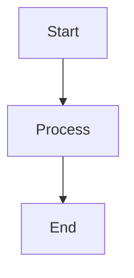

# [Document Title]

## 1. Overview

[Brief introduction to the topic - 1-2 paragraphs explaining what this document covers and why it matters.]

### What You'll Learn

- **[Section Title](#2-section-heading)** - Brief description of what this section covers
- **[Section Title](#3-section-heading)** - Brief description of what this section covers
- **[Section Title](#4-section-heading)** - Brief description of what this section covers
- **[Section Title](#5-section-heading)** - Brief description of what this section covers
- **[Related Documentation](#6-related-documentation)** - Links to related docs

---

## 2. [Section Heading]

[Content for this section. Use clear, concise language.]

### Subsection Title

[Details about this subsection.]

**Key Points:**
- Point 1
- Point 2
- Point 3

---

## 3. [Section Heading]

[Content for this section.]

### Visual Diagrams (Optional)



### Tables (When Comparing/Listing)

| Column 1 | Column 2 | Column 3 |
|----------|----------|----------|
| Data 1   | Data 2   | Data 3   |
| Data 4   | Data 5   | Data 6   |

---

## 4. [Section Heading]

### Workflow Example

[Step-by-step breakdown of a process or workflow.]

**Step 1: [Step Title]**

[Details about this step]

```python
# Code example (if applicable)
example_code = "here"
```

**Step 2: [Step Title]**

[Details about this step]

---

## 5. [Section Heading]

### Comparison Table (Optional)

| Without Feature | With Feature |
|-----------------|--------------|
| ❌ Problem 1     | ✅ Solution 1 |
| ❌ Problem 2     | ✅ Solution 2 |
| ❌ Problem 3     | ✅ Solution 3 |

### Key Benefits

- **Benefit 1**: Explanation
- **Benefit 2**: Explanation
- **Benefit 3**: Explanation

### Performance Metrics (If Applicable)

- Metric 1: Value (context)
- Metric 2: Value (context)
- Metric 3: Value (context)

---

## 6. Related Documentation

- **[Doc Title](filename.md)** - Brief description of what's in that doc
- **[Doc Title](filename.md)** - Brief description of what's in that doc
- **[Doc Title](filename.md)** - Brief description of what's in that doc
- **[Doc Title](filename.md)** - Brief description of what's in that doc

---

**Key takeaway:** [One-sentence summary of the main point of this document.]
