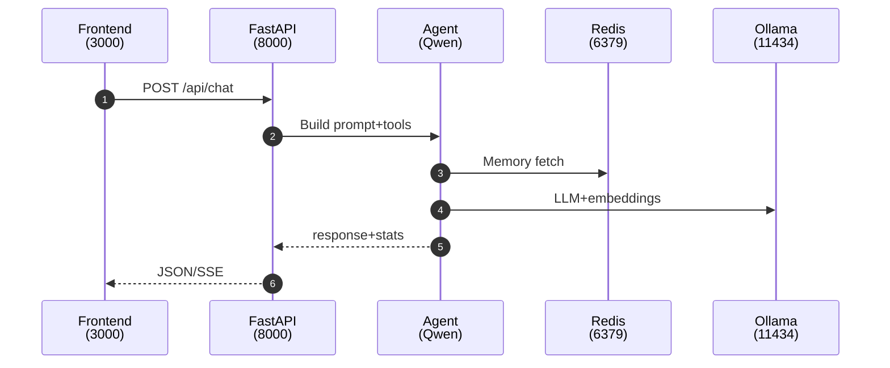

# Services overview

What runs where and why. Paths are relative to `backend/src/`.

## API layer
- `api/chat_routes.py`
  - POST `/api/chat/stateless` → StatelessChatService
  - POST `/api/chat/stateful` → RedisChatService (stateful, memory)
  - SSE streaming variants available for both
- `api/system_routes.py`
  - `/api/health/check` dependency health (Redis Stack, Ollama)
  - Semantic memory audit/inspect endpoints

## Core services (`services/`)
- `redis_connection.py`
  - Pooled Redis connection manager + circuit breaker
  - AsyncRedisSaver checkpointer for LangGraph; `session_id` → `thread_id`
- `stateless_chat.py`
  - Baseline agent without memory; each request independent
- `redis_chat.py`
  - Stateful chat with CoALA-style memory (short-term, episodic, procedural, semantic)
  - Binds LangGraph agent, tools, and Redis checkpointer
- `episodic_memory_manager.py`
  - RedisVL vector index for user goals/preferences (per-user, HNSW, 1024-dim)
- `procedural_memory_manager.py`
  - RedisVL vector index for learned tool sequences; suggests execution plans
- `semantic_memory_manager.py`
  - RedisVL vector index for general health facts/definitions
- `short_term_memory_manager.py`
  - Conversation history (Redis LIST per `session_id`, 7-month TTL)
- `embedding_service.py`
  - Embeddings via Ollama `mxbai-embed-large` (1024-dim)
- `redis_workout_indexer.py`
  - O(1) workout aggregations: day-of-week, date ranges, details
- `redis_apple_health_manager.py`
  - CRUD helpers and tools over Redis-stored health data

## Apple Health module (`apple_health/`)
- `parser.py` secure Apple Health XML → structured data (UTC-normalized)
- `query_tools/` LangChain tools used by agents
  - `search_health_records_by_metric`, `search_workouts_and_activity`, comparisons/trends

## Request flow

