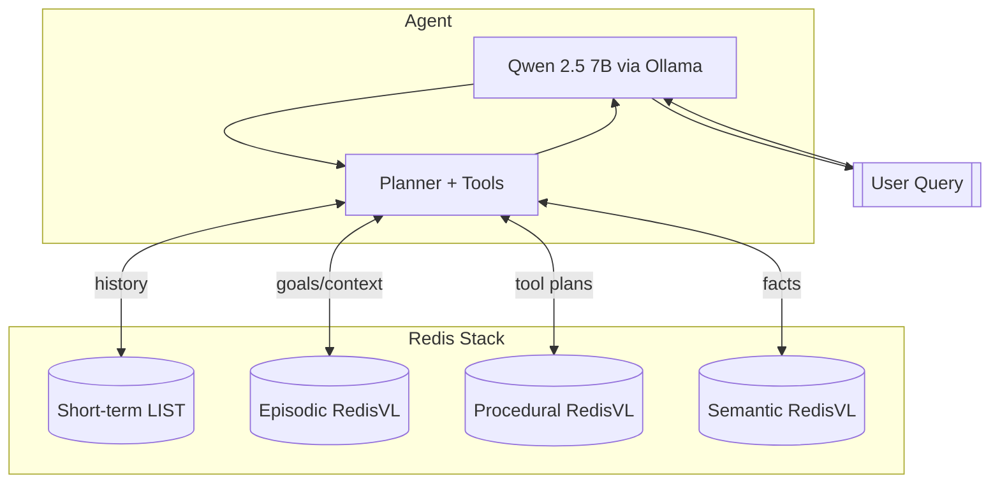

# Memory architecture and example questions

We use four complementary memory types. All data lives in your local Redis.

## 1) Short‑term (conversation history)
- Storage: Redis LIST per `session_id` (7‑month TTL)
- Purpose: recent turns for context and follow‑ups
- Used by: LangGraph checkpointer + history utilities
- Ask:
  - “What did I ask you first in this session?”
  - “Summarize our last 5 messages.”

## 2) Episodic (user‑specific facts/goals)
- Storage: RedisVL vector index (HNSW, 1024‑dim embeddings)
- Contents: goals/preferences (e.g., “weight goal 130 lbs”)
- Used by: stateful agent to personalize answers
- Ask:
  - “What’s my current weight goal?”
  - “Remind me of goals we discussed.”

## 3) Procedural (learned tool patterns)
- Storage: RedisVL vector index of successful tool sequences
- Contents: query → tools_used, success score, timing
- Used by: planner to suggest efficient execution plans
- Ask:
  - “Plan how to analyze my weight trend last 2 weeks.”
  - “Which tools should we chain for workout comparisons?”

## 4) Semantic (general health knowledge)
- Storage: RedisVL vector index of curated facts/definitions
- Contents: non‑personal health knowledge (e.g., BMI formula)
- Used by: LLM for factual context when needed
- Ask:
  - “How is BMI calculated?”
  - “What heart‑rate zones indicate threshold work?”

## Data flow

