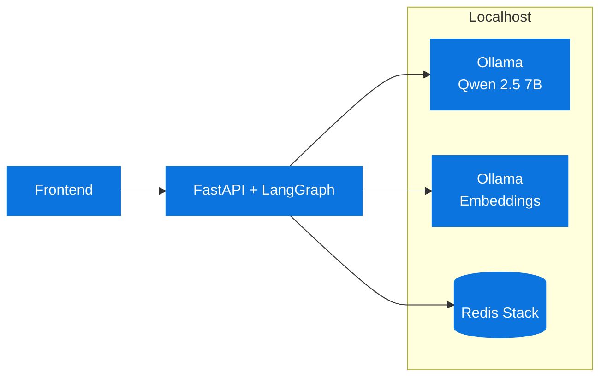

# Technology choices (succinct)

## Ollama (local inference)
- Privacy: runs fully on your machine; no data leaves localhost
- Performance: low latency, predictable costs
- Simplicity: single endpoint for chat and embeddings

## Qwen 2.5 7B (LLM)
- Strong function/tool‑calling behavior for agent loops
- Good local performance/VRAM fit while preserving reasoning quality
- Deterministic enough for reproducible demos (low temperature)

## Redis + RedisVL
- Unified store: short‑term (LIST) and long‑term vector search in one system
- RedisVL: HNSW index, 1024‑dim embeddings from `mxbai-embed-large`
- TTLs for automatic cleanup; O(1) aggregations via purpose‑built indexes

## LangGraph (stateful agent orchestration)
- Explicit state machine (nodes: llm, tools, memory retrieval/storage)
- Checkpointing via AsyncRedisSaver for conversation persistence by `session_id`
- Clear control of tool‑calling loops and “should_continue” conditions

## Ports and runtime
- Frontend: 3000 (Vite, TypeScript)
- Backend: 8000 (FastAPI)
- Redis Stack: 6379 (database), 8001 (RedisInsight)
- Ollama: 11434

