# Stateful Agent Architecture

This document explains the **internal architecture of the stateful agent**: how it uses **Agentic RAG** with LangGraph, Redis memory, and **autonomous tool calling** to maintain context and intelligence.

---

## Architecture Overview

The stateful agent uses **intent router + LangGraph StateGraph** with four-layer Redis memory:

```mermaid
flowchart TB
    Start(["🔴 Stateful Agent"])
    Query["User Query"]

    Router{"Intent Router<br/>(Pre-LLM)"}
    GoalOp["Direct Redis<br/>Goal Operation"]

    LLM["Qwen 2.5 7B<br/>LLM Node"]

    ShortTerm["Redis Memory<br/>(Checkpointing)"]
    LongTerm["RedisVL Search<br/>(Goals + Patterns)"]

    Tools["Tool Calling<br/>(Health Data)"]
    HealthData["Redis Health Data<br/>(Metrics + Workouts)"]

    Response["Contextual Response"]

    Start --> Query
    Query --> Router

    Router -->|"Goal setting/<br/>retrieval"| GoalOp
    Router -->|"Complex<br/>query"| LLM

    ShortTerm -."Short-term".-> LLM
    LongTerm -."Long-term".-> LLM

    LLM --> Tools
    Tools --> HealthData
    HealthData --> Response

    GoalOp --> Response

    style Start fill:#dc3545,stroke:#dc3545,stroke-width:3px,color:#fff
    style Query fill:#fff,stroke:#dc3545,stroke-width:2px,color:#000
    style Router fill:#f8f9fa,stroke:#333,stroke-width:2px,color:#000
    style LLM fill:#f8f9fa,stroke:#333,stroke-width:2px,color:#000
    style ShortTerm fill:#dc3545,stroke:#dc3545,stroke-width:2px,color:#fff
    style LongTerm fill:#dc3545,stroke:#dc3545,stroke-width:2px,color:#fff
    style Tools fill:#fff,stroke:#333,stroke-width:2px,color:#000
    style HealthData fill:#fff,stroke:#333,stroke-width:2px,color:#000
    style Response fill:#fff,stroke:#dc3545,stroke-width:2px,color:#000
    style GoalOp fill:#fff,stroke:#333,stroke-width:2px,color:#000
```



**Key Technologies:**
- **Agentic RAG with Autonomous Tool Calling**: Qwen 2.5 7B reads tool docstrings and autonomously decides when to retrieve memory or call tools
- **Intent Router**: Pattern-based routing for deterministic operations
- **LangGraph**: Workflow orchestration with automatic checkpointing
- **Redis**: All four memory layers (short-term, episodic, procedural, semantic)
- **RedisVL**: Vector search for episodic/procedural memory

**5 Tools Bound to LLM:**

**Health Data Tools (3):**
1. `get_health_metrics` - All non-sleep, non-workout health data (heart rate, steps, weight, BMI, etc.)
2. `get_sleep_analysis` - Sleep data with daily aggregation and efficiency metrics
3. `get_workout_data` - ALL workout queries (lists, patterns, progress, comparisons)

**Memory Tools (2):**
4. `get_my_goals` - Retrieve user goals and preferences (episodic memory)
5. `get_tool_suggestions` - Retrieve learned tool-calling patterns (procedural memory)

---

## How Stateful Agentic RAG Works

The agent uses three Redis-powered components to maintain intelligence:

**Component 1:** [Intent Router](#component-1-intent-router) - Direct Redis operations (bypass LLM)
**Component 2:** [LangGraph Checkpointing](#component-2-langgraph-checkpointing) - Automatic conversation memory
**Component 3:** [RedisVL Vector Search](#component-3-redisvl-vector-search) - Semantic goal retrieval

**Plus:** [Real Example](#real-example-is-that-good) showing all three working together.

### Component 1: Intent Router

Go straight to Redis to reduce latency when handling deterministic statements like “this is my goal,” as no tool call is needed.

```python
# From backend/src/agents/stateful_rag_agent.py
if intent_router.is_goal_setting(query):
    # "My goal is to never skip leg day" → Direct Redis storage
    goal = extract_goal_from_query(query)
    await episodic_memory.store_goal(user_id, goal)
    return success_response(goal)  # <100ms, zero tokens
```

**Why this matters:**
- 10x faster (<100ms vs. 2-3s)
- No hallucination risk

| Query Type | Path | Speed |
|------------|------|-------|
| "My goal is to never skip leg day" | Direct Redis | <100ms |
| "What are my goals?" | Redis vector search | <100ms |

---

### Component 2: LangGraph Checkpointing

**Redis loads conversation history before the LLM even runs.**

```python
# From backend/src/services/redis_connection.py
checkpointer = AsyncRedisSaver(redis_url="redis://localhost:6379")

# LangGraph automatically:
# 1. Loads previous messages from Redis
# 2. Provides full context to LLM
# 3. Saves new messages after response

config = {"configurable": {"thread_id": session_id}}
result = await graph.ainvoke(state, config)
```

**What the LLM sees:**

```python
state["messages"] = [
    HumanMessage("What was my heart rate?"),
    AIMessage("72 bpm average"),
    HumanMessage("Is that good?")  # ← Current query
]
# LLM understands "that" = 72 bpm
```

**Redis storage (automatic):**
- Key: `langgraph:checkpoint:{session_id}:*`
- TTL: 7 months
- You never manually call `redis.get()` or `redis.set()`

---

### Component 3: RedisVL Vector Search

**Goals stored with embeddings for intelligent matching.**

```python
# From backend/src/services/episodic_memory_manager.py
await episodic_memory.store_goal(
    user_id="wellness_user",
    metric="HeartRate",
    value=82.5,
    unit="bpm"
)
```

**Redis stores:**
```python
# Key: episodic:wellness_user:goal:1729962000
{
    "text": "User's target heart rate is 80-85 bpm",
    "embedding": [0.234, -0.123, ...],  # 1024-dim
    "metric": "HeartRate",
    "value": 82.5,
    "unit": "bpm"
}
```

**LLM retrieves when needed:**

```python
# From backend/src/apple_health/query_tools/memory_tools.py
@tool
async def get_my_goals(query: str) -> str:
    """Get your stored goals and preferences."""
    result = await episodic_memory.retrieve_goals(
        user_id="wellness_user",
        query=query,  # Semantic search
        top_k=3
    )
    return result["context"]
```

---

## Real Example: "Is that good?"

### User asks follow-up question

```
User: "What was my heart rate last week?"
Agent: "87 bpm average"
User: "Is that good?"  ← Needs context + goals
```

### Step 1: LangGraph loads conversation from Redis

```python
# Automatic checkpointing
messages = [
    HumanMessage("What was my heart rate last week?"),
    AIMessage("87 bpm average"),
    HumanMessage("Is that good?")  # Current
]
```

### Step 2: Autonomous tool calling (Qwen reads docstrings)

**The LLM autonomously decides to call `get_my_goals` tool:**

```python
# From backend/src/apple_health/query_tools/memory_tools.py
@tool
async def get_my_goals(query: str) -> str:
    """Get your stored goals and preferences.

    USE WHEN user asks:
    - "What's my goal?"
    - "What did I say my target was?"
    """
```

### Step 3: Agentic RAG (LLM decides memory is needed)

```python
# Qwen generates:
{
    "tool_calls": [{
        "name": "get_my_goals",
        "args": {"query": "heart rate goal"}
    }]
}
```

### Step 4: RedisVL retrieves goal

```python
# From Redis episodic memory
goals = [{"metric": "HeartRate", "target": "80-85 bpm"}]
```

### Step 5: LLM synthesizes intelligent response

```python
# LLM now has:
# - Context: 87 bpm (from checkpointed conversation)
# - Goal: 80-85 bpm (from episodic memory)

"87 bpm is slightly above your target range of 80-85 bpm."
```

---

## Why This Matters

| Without Redis | With Redis + LangGraph |
|---------------|------------------------|
| ❌ Forgets conversation | ✅ Checkpointing loads automatically |
| ❌ Can't answer follow-ups | ✅ Understands "that", "it", "them" |
| ❌ Doesn't know user goals | ✅ Vector search retrieves goals |
| ❌ Repeats mistakes | ✅ Learns successful patterns |

**Memory types serve different purposes:**
- **Short-term** (session): "What did I just ask?"
- **Episodic** (permanent): "What's my goal from 2 weeks ago?"
- **Procedural** (permanent): "Which tools worked for similar queries?"

---

## Performance

| Operation | Time | Notes |
|-----------|------|-------|
| First turn | 2.8s | 0.5s checkpoint load + 2.3s LLM |
| Follow-up | 1.9s | Context already loaded |
| Goal recall | 1.2s | Vector search only |
| Intent router | <100ms | Direct Redis |

**Memory overhead (100 turns + 10 goals):**
- Short-term: 100 KB
- Episodic: 40 KB
- Procedural: 30 KB
- **Total: ~170 KB** (negligible for Redis)

---

## Try It Yourself

### Via Frontend

```bash
make dev
# Open http://localhost:3000
# Use right-side chat (Redis Memory Chat)
```

### Via API

```bash
# First message
curl -X POST http://localhost:8000/api/chat/stateful \
  -H "Content-Type: application/json" \
  -d '{"message": "What was my average heart rate last week?", "session_id": "test123"}'

# Follow-up (should understand "it")
curl -X POST http://localhost:8000/api/chat/stateful \
  -H "Content-Type: application/json" \
  -d '{"message": "Is it good?", "session_id": "test123"}'
```

### Verify Memory in Redis

```bash
redis-cli KEYS "langgraph:checkpoint:*"  # Short-term
redis-cli KEYS "episodic:*"              # Goals
redis-cli KEYS "procedural:pattern:*"    # Patterns
```

---

## Related Documentation

- **[02_THE_DEMO.md](02_THE_DEMO.md)** - Side-by-side stateless vs. stateful comparison
- **[03_MEMORY_ARCHITECTURE.md](03_MEMORY_ARCHITECTURE.md)** - Deep dive into memory types
- **[REDIS_USAGE_PATTERNS.md](REDIS_USAGE_PATTERNS.md)** - How Redis powers each layer

---

## Key Takeaway

**Agentic RAG with Redis + LangGraph transforms agents from stateless calculators into intelligent assistants.**

The agent **autonomously decides**:
- When to retrieve memory (via tool calling)
- Which tools to use for health data
- How to synthesize context + data + goals

**Without Redis**: "What are you referring to?"
**With Redis + Agentic RAG**: "87 bpm is slightly above your target of 80-85 bpm."

Memory + autonomous tool calling is the difference between AI that *computes* and AI that *understands*.
